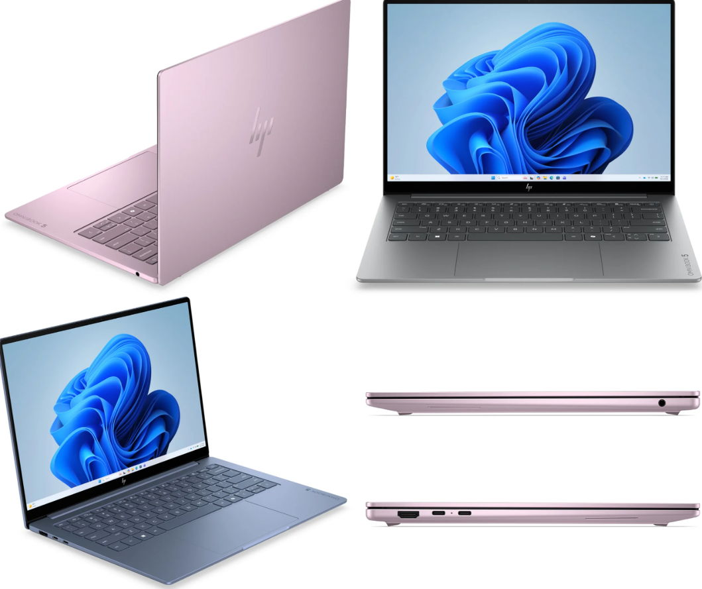

HP ha presentado el OmniBook 5, su nuevo portátil de gran consumo, un equipo de 14 pulgadas que apuesta por la pantalla OLED y un chasis metálico muy ligero para colocarse enfrente del MacBook Neo de Apple. Llega este mes de octubre a nivel internacional por 699 dólares, con Windows 11 preinstalado y con los procesadores Intel Wildcat Lake como plataforma.

El movimiento no es aislado: es la respuesta coordinada de los socios de Windows —ASUS, Dell, Acer, Lenovo y HP, con el respaldo de Intel y Microsoft— a un MacBook Neo que, pese a su hardware contenido, ha vendido muy bien. El OmniBook 5 quiere replicar la fórmula de movilidad y precio ajustado, pero con una baza que el modelo de Apple no tiene: una pantalla OLED en lugar de un panel LCD-IPS.

## Qué trae el HP OmniBook 5

La pantalla es el argumento principal. HP monta un panel OLED de 14 pulgadas con tecnología multitáctil, resoluciones nativas de hasta 2.5K y una bisagra que abre hasta 180 grados. El conjunto viaja en un chasis metálico de solo 11,77 mm de grosor y 1,1 kg de peso, cifras que lo sitúan en el terreno de la movilidad extrema en el que compite el Neo.

En el apartado de hardware, la configuración básica arranca con un Intel Core 5 315 de la familia Wildcat Lake, la gama que Intel diseñó precisamente para portátiles económicos, y escala hasta un Core 7 350. La memoria parte de 8 GB de RAM y un SSD de 256 GB, aunque el fabricante ofrecerá opciones superiores, entre ellas configuraciones con 12 GB de RAM.

En conectividad, el OmniBook 5 incluye dos puertos USB-C, salida HDMI, cámara infrarroja Full HD, un sistema de altavoces duales con DTS:X Ultra, un par de micrófonos, Wi-Fi 6E y Bluetooth 5.4. Se venderá en cuatro acabados de color.

## Por qué importa

La llegada del OmniBook 5 confirma que la gama de entrada de Windows ha dejado de competir solo por precio. La apuesta por OLED en un equipo básico es una ventaja tangible frente al panel LCD-IPS del MacBook Neo, sobre todo en cobertura de color y contraste, y es el tipo de detalle que se nota en uso real y no en una tabla de especificaciones.

El contexto, además, es exigente. La crisis de los semiconductores ha tensado los precios de los componentes, y Microsoft aún arrastra dudas sobre la adopción de Windows 11. En ese escenario, un precio de 699 dólares no es agresivo por sí solo: es el resultado de ajustar muy fino para no perder el tren del gran consumo.

Mención aparte merece la autonomía. HP anuncia hasta 42 horas en reproducción de vídeo local, una cifra de laboratorio que conviene leer con distancia: en uso intensivo será bastante menor. Aun así, si se acerca a la mitad en navegación y ofimática, estaríamos ante una de las baterías más solventes de su segmento.

[Microsoft descartó que Surface compita contra el MacBook Neo](/noticias/surface-vs-macbook-neo/), pero el resto del ecosistema Windows ha decidido lo contrario, y el OmniBook 5 es el ejemplo más reciente.

## Para quién es

El OmniBook 5 encaja en quien prioriza movilidad, pantalla y autonomía por encima de la potencia bruta: estudiantes, teletrabajo ligero, navegación, multimedia y algún juego ocasional. Con 1,1 kg y un perfil de 11,77 mm, es un equipo para llevar encima todos los días sin pensarlo.

También hay que ser honesto con los límites. La configuración de partida de 8 GB de RAM y 256 GB de SSD se queda corta para multitarea pesada, edición o muchos años de uso, así que conviene mirar las opciones con 12 GB. Y quien necesite rendimiento sostenido o GPU dedicada debería apuntar a otra gama: aquí el objetivo es aguantar el día, no exprimir el primer minuto de un benchmark.
