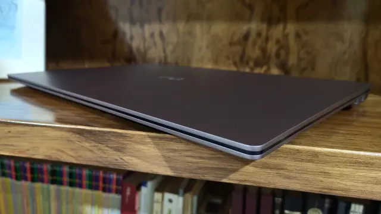
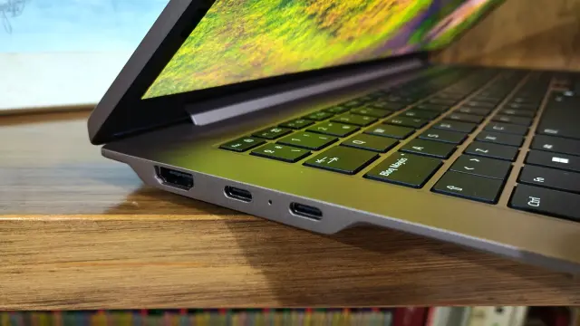
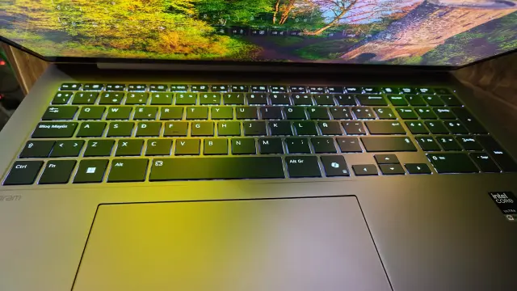
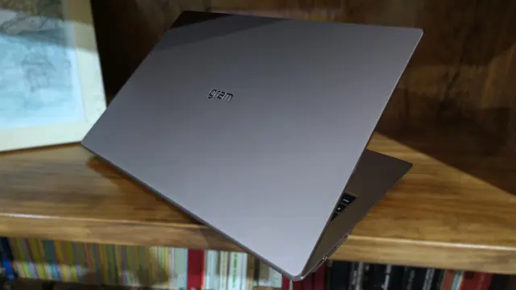

LG mantiene en el gram Pro 17 la receta que ha convertido a la familia gram en una referencia para quien trabaja lejos de un enchufe, pero la lleva a un tamaño que hasta hace poco obligaba a renunciar a la movilidad. En su análisis tras un mes de uso, ComputerHoy destaca justamente eso: una pantalla de 17 pulgadas montada en un cuerpo que se acerca a las medidas de un 16 y una autonomía que supera una jornada laboral completa. El precio, en cambio, arranca en 2.249 euros.

## La configuración del LG gram Pro 17

El equipo analizado es la variante de 17 pulgadas en acabado bronce, con esta ficha:

- Procesador Intel Core Ultra X9 388H: 16 núcleos, 16 hilos, hasta 5,1 GHz y una NPU de 50 TOPS.
- Gráficos integrados Intel Arc B390.
- 32 GB de memoria LPDDR5X de doble canal.
- Almacenamiento NVMe M.2 Gen 4 de 512 GB.
- Windows 11 Home, Wi-Fi 7 y Bluetooth 6.0.
- Puertos: 2x USB-C 4 (carga rápida, Thunderbolt 4 y DisplayPort), 2x USB-A 3.2 Gen 2x1, 1x HDMI 2.1 y 1x jack de 3,5 mm. La conexión por cable de red se resuelve con un adaptador RJ45.
- Doble micrófono, reconocimiento facial y altavoces estéreo con Dolby Atmos.

El chip es uno de los más avanzados que Intel presentó a principios de 2026: supera al Core Ultra X7 358H que montaba el gram Pro de este mismo año y que también aparece en equipos como el Samsung Galaxy Book 6 Pro. Esa potencia se apoya en una NPU de 50 TOPS, pensada para tareas de inteligencia artificial ejecutadas en local, como la búsqueda inteligente de archivos que LG integra en su software.

## Un 17 pulgadas que se transporta como un 16

El dato que sostiene toda la propuesta está en las medidas: 379,4 × 265,4 × 13,3 mm y 1.539 gramos. Con ese grosor, LG ha logrado meter un panel de 17 pulgadas —táctil y en formato 16:10, con resolución WQXGA (2.560 × 1.600 px), 60 Hz y 350 nits— sin renunciar al teclado numérico y sin que el conjunto se sienta aparatoso en la mochila. El acabado bronce, además, no acumula huellas como el negro y aguanta bien los arañazos propios del transporte diario.

El reparo está en el brillo. El medio señala que los 350 nits pueden bastar para un uso de oficina, pero que el panel agradecería un acabado antirreflejos: con la retroiluminación del teclado al máximo o en estancias muy iluminadas con el brillo al 75 %, la propia luz del teclado se refleja en la pantalla. La salida más sensata, apunta, sería subir el brillo máximo o apostar por un panel mate.

## Autonomía y rendimiento sostenido

Aquí conviene separar lo que anuncia el fabricante de lo que se midió. LG declara hasta 26,5 horas con la batería de 77 Wh, una cifra de laboratorio; en las pruebas de ComputerHoy, con el brillo al 75 % y tareas ofimáticas y reproducción de vídeo, el equipo superó las 8 horas de uso continuado. Se carga con un adaptador de 65 W del tamaño de un cargador de móvil, en torno a una hora y media.

El análisis también incide en la térmica: con tareas exigentes el portátil no se calienta en exceso, algo que el procesador debe en parte a su eficiencia energética. Es el tipo de comportamiento que se sostiene tras media hora de carga, y no solo en el primer minuto de un benchmark. En el lado del software, LG añade sus propias aplicaciones sobre Windows 11 para configurar el equipo sin salir de su ecosistema.

## ¿Para quién es y para quién no?

El gram Pro 17 se dirige a quien necesita productividad sin ataduras: un 17 pulgadas que pesa poco, con teclado completo, conexiones de sobra y batería para una jornada larga. Encaja en perfiles de oficina, creación ligera o estudio que además quieren mover el equipo a diario, y —como casi todo en esta gama— exige asumir un precio por encima de los 2.000 euros. Quien busque otro enfoque de gama alta puede comparar con el [Lenovo Yoga 9i 2026](/noticias/lenovo-yoga-9i-2026-review/), otro Intel de última generación con panel OLED.

Dicho esto, no es un portátil para todos. Quien juegue debe mirar otra cosa: aquí la gráfica es Intel Arc B390 integrada, sin GPU dedicada. Quien trabaje a la intemperie con sol directo echará en falta más nits y un panel antirreflejos. Y quien tenga el presupuesto ajustado encontrará alternativas más baratas, a costa de renunciar al formato de 17 pulgadas y a parte de la autonomía. Para el resto, el gram Pro 17 hace bien lo que promete: aguantar la jornada sin que se note el tamaño.
