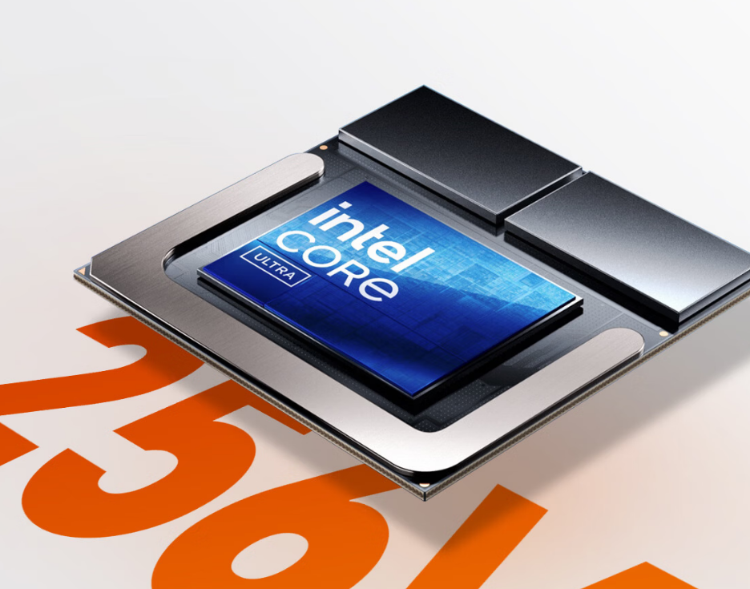
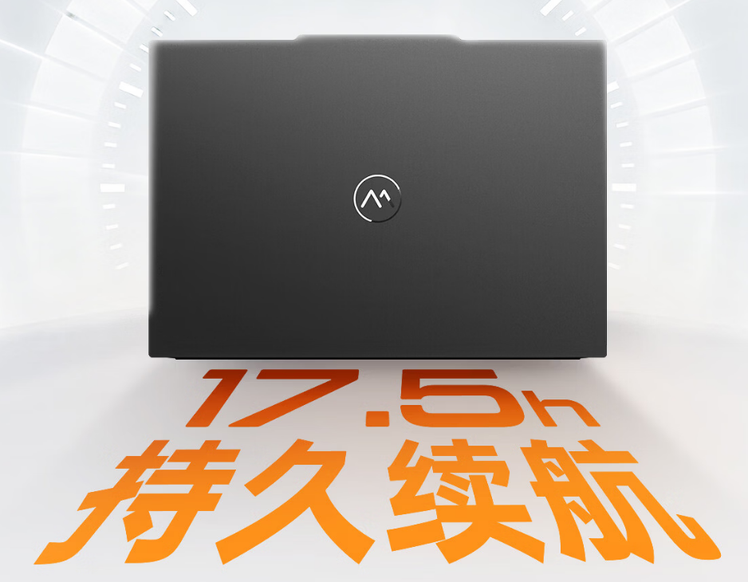

Machenike ha puesto a la venta en China el 14 Ultra, un portátil ligero cuya configuración con procesador Intel Core Ultra X7 358H, 32 GB de memoria y 1 TB de SSD ya se puede comprar. El precio de partida es de 8.499 yuanes (unos 1.030 euros al cambio) y baja a 7.224,15 yuanes (unos 875 euros) cuando se aplica la subvención nacional a este tipo de equipos.

## Qué trae el Machenike 14 Ultra: chasis de metal y 1,1 kg

El 14 Ultra se apoya en un chasis de metal: aluminio de grado aeronáutico en la tapa y magnesio en la cara C, con acabado anodizado. El conjunto se queda en torno a 1,1 kg de peso y 15,9 mm de grosor, cifras de movilidad que apuntan a llevarlo encima todo el día.

La pantalla es de 14 pulgadas, con resolución 2,8K (2.880 × 1.800), formato 16:10 y una tasa de refresco de 120 Hz. El fabricante declara 400 nits de brillo, atenuación por DC para evitar el parpadeo y reducción de luz azul a nivel de hardware.

## Autonomía, refrigeración y conectividad

La batería es de 70 Wh y admite carga rápida por USB-C PD de hasta 65 W. El material promocional del equipo anuncia hasta 17,5 horas de uso, una cifra de laboratorio que conviene tomar como referencia anunciada y no como autonomía medida en uso real.

Para la refrigeración, Machenike recurre a dos ventiladores y dos heat pipes, un diseño que busca mantener las temperaturas bajo control en cargas sostenidas. En conectividad, el 14 Ultra incorpora Thunderbolt 4 a 40 Gbps, además de USB-A y HDMI, de modo que se puede conectar un monitor, un disco externo o periféricos sin depender de adaptadores.

## Para quién es y para quién no

El 14 Ultra encaja en quien prioriza movilidad, una buena pantalla y una autonomía amplia para trabajar fuera de casa, y no necesita una GPU dedicada: es un ultraportátil para ofimática, navegación y creación ligera. Quien busque rendimiento sostenido para jugar o renderizar debería mirar otro tipo de equipo; aquí la apuesta es el consumo contenido, no el pico de potencia.

La propuesta recuerda a otros ligeros recientes que juegan la misma carta de peso y pantalla, como el [HP OmniBook 5](/noticias/portatiles/hp-omnibook-5-macbook-neo/), con el que comparte el objetivo de plantar cara a los portátiles ultraligeros de gama alta a un precio más bajo. Por ahora, el Machenike 14 Ultra solo se anuncia para el mercado chino.
