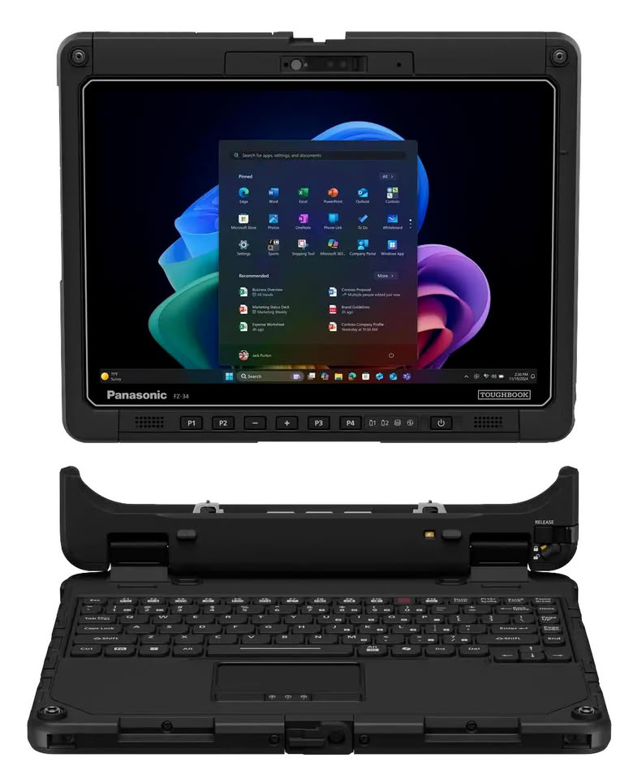
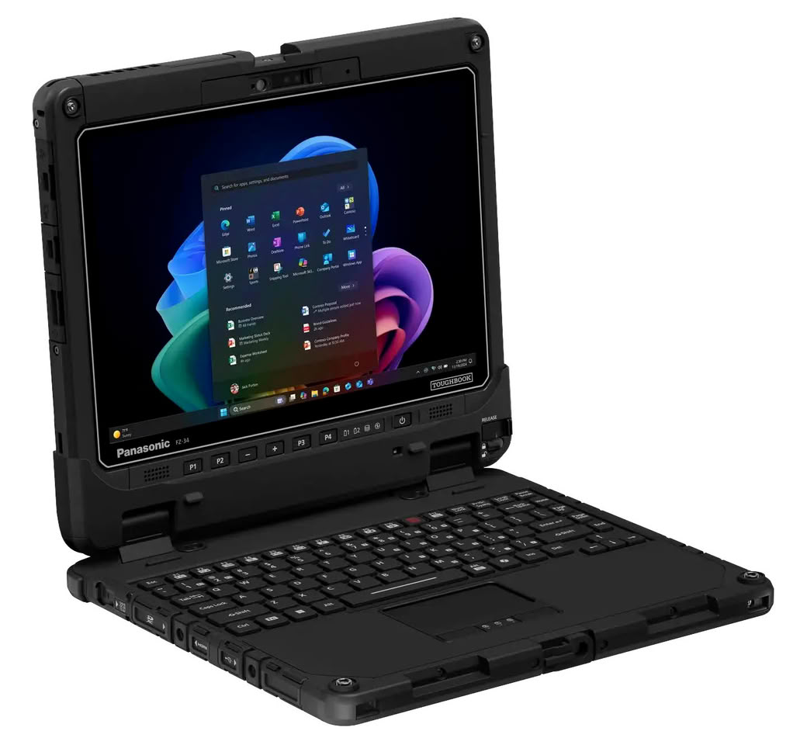
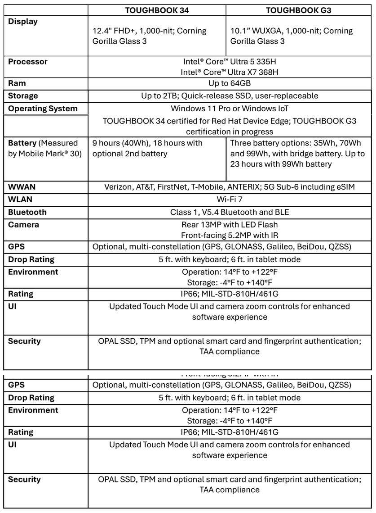
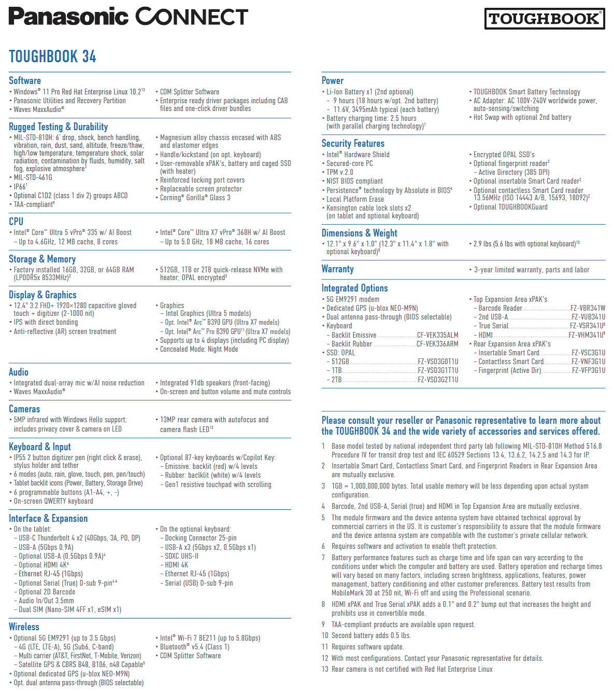

Panasonic Connect North America ha ampliado su catálogo de equipos reforzados con dos modelos 2 en 1 pensados para jornadas enteras lejos de un enchufe: el Toughbook 34 y el Toughbook G3. Ambos comparten procesadores Intel Core Ultra, conectividad 5G y Wi-Fi 7, y baterías que pueden cambiarse en caliente, pero llegan en dos formatos bien distintos: uno de 12,4 pulgadas, para trabajar dentro y fuera de vehículos o en centros de mando, y otro de 10,1 pulgadas, más ligero y compacto, para quien pasa el día en movimiento.

## Toughbook 34 y Toughbook G3: dos formatos, dos formas de trabajar

El Toughbook 34 es el mayor de los dos. Su pantalla crece hasta las 12,4 pulgadas en formato FHD+ (1920 × 1200), con 1.000 nits de brillo y cristal Corning Gorilla Glass 3. Panasonic mantiene cuatro áreas de expansión modulares, dos de ellas xPAK que el propio usuario puede sustituir, y ofrece una configuración opcional de doble batería intercambiable en caliente. La compañía lo sitúa tanto dentro como fuera de vehículos y en centros de mando, y su pantalla táctil detecta por sí sola si se usa el dedo o un guante.

El Toughbook G3 apuesta por lo contrario: un chasis de 10,1 pulgadas WUXGA (1920 × 1200), también con 1.000 nits, más ligero y delgado que el de generaciones anteriores. Conserva dos áreas de expansión con E/S configurable y tres opciones de capacidad de batería. Está pensado para quien trabaja en espacios reducidos, como personal de seguridad pública en vehículos pequeños, agentes federales que se llevan el equipo al campo o trabajadores de almacén y logística que gestionan inventario y envíos.

Los dos comparten la misma base: procesadores Intel Core Ultra 5 335H o Core Ultra X7 368H, hasta 64 GB de memoria LPDDR5x, SSD NVMe OPAL de hasta 2 TB con extracción rápida y Windows 11 Pro o Windows IoT. No es el primer equipo reforzado que aparece este mes: hace unos días repasábamos el [Durabook Z14I-DX3](/noticias/durabook-z14i-dx3-triple-screen-workstation/), un modelo de tres pantallas para el mismo tipo de usuario.

## Autonomía y pantalla: lo que aguanta la jornada

Aquí conviene leer la letra pequeña. Panasonic cifra la autonomía del Toughbook 34 en 9 horas con la batería de 40 Wh, medidas con MobileMark 30, y hasta 18 horas si se añade la segunda batería opcional. El Toughbook G3 ofrece tres baterías —35, 70 y 99 Wh— y llega a 23 horas con la de mayor capacidad. Son cifras del fabricante, tomadas con la prueba a 250 nits, con Wi-Fi apagado y en un escenario profesional: en uso real, con el brillo alto y trabajo continuo, bajarán.

El punto fuerte de ambos es la pantalla. Los 1.000 nits y el tratamiento antirreflejo están pensados para leer al sol, algo que en un portátil de oficina rara vez se necesita y que aquí marca la diferencia entre poder trabajar o no a plena luz. El peso también se nota: el Toughbook 34 arranca en unos 1,3 kg en modo tableta y sube a unos 2,5 kg con el teclado, mientras que el G3 se queda en 1,2 kg y 2,1 kg con teclado, respectivamente.

## Robustez y seguridad pensadas para flotas

Como era de esperar en esta gama, ambos superan las pruebas MIL-STD-810H y MIL-STD-461G, resisten caídas de 1,5 metros con teclado y 1,8 metros en modo tableta, funcionan entre −10 °C y 50 °C y cuentan con certificación IP66 frente al polvo y el agua. En seguridad incluyen SSD OPAL, TPM 2.0, lector de tarjeta inteligente y lector de huellas opcionales, cumplen con TAA y añaden un SSD de liberación rápida para aislar los datos.

Panasonic Connect fue el primer fabricante de equipos reforzados en lograr la certificación Red Hat Device Edge: el Toughbook 34 ya está certificado para ejecutar Red Hat Device Edge (RHEL) y el Toughbook G3 está en proceso. También hay opciones de lector de código de barras y RFID, compatibilidad con muchos accesorios de generaciones anteriores y una garantía de fábrica de tres años.

Dominick Passanante, vicepresidente sénior y director general del negocio de Movilidad de Panasonic Connect North America, resume el enfoque: «Quienes mantienen en marcha servicios e industrias críticos necesitan tecnología en la que puedan confiar en cualquier entorno. Los TOUGHBOOK 34 y TOUGHBOOK G3 están diseñados para responder a esas exigencias con el rendimiento, la conectividad y la fiabilidad de los que dependen a diario los trabajadores de primera línea. El resultado es un dispositivo que mantiene a las personas y a los equipos conectados, productivos y centrados en la tarea, ya sea en un vehículo, en una obra o respondiendo a una emergencia, sin renunciar a la fiabilidad y la seguridad a largo plazo».

## Para quién es (y para quién no)

Estos no son portátiles de consumo y no se venden como tales. Son herramientas de despliegue para flotas: encajan en servicios públicos, servicios de campo, seguridad pública, logística y automoción, o en cualquier equipo que necesite un ordenador capaz de aguantar golpes, polvo y agua y que el departamento de IT pueda gestionar y reparar sin complicaciones. La compatibilidad con accesorios de generaciones anteriores apunta en la misma dirección: aprovechar la inversión ya hecha.

Quien busque un portátil ligero para la oficina, con la mejor pantalla para ver series o el teclado más agradable, debería mirar otra cosa: aquí el compromiso es el peso y el grosor a cambio de resistencia. Y quien necesite saber precios y disponibilidad tendrá que esperar, porque la información publicada no detalla ni precio ni fecha de venta, más allá de las páginas de producto del fabricante.
