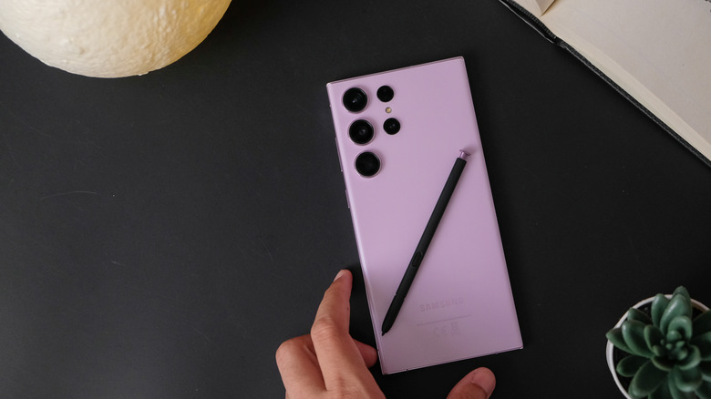

One UI 9, la capa de Samsung sobre Android 17, empezó a repartirse el 16 de septiembre y ya ha ido llegando a cada vez más dispositivos. Si tu Galaxy aparece en la lista de compatibles, puede que tengas la actualización disponible ahora mismo; si no, probablemente esté al caer. Esta guía reúne los pasos previos para instalar One UI 9 sin sorpresas: comprobar la compatibilidad, verificar si el paquete está disponible, liberar espacio, asegurar batería y conexión, y hacer una copia de seguridad antes de dar el paso.

Entre las novedades de One UI 9 hay un peso importante de funciones de inteligencia artificial, como el seguimiento de **My Fancam** o las sugerencias de **Now Nudge**, además de una mayor detección de estafas y avisos de privacidad mejorados con IA que vigilan posibles brechas de seguridad en segundo plano. Si te interesa probarlas, conviene preparar el teléfono con antelación.

## Requisitos previos

- Un Galaxy compatible con One UI 9: como mínimo la serie S23, o un plegable Z Flip o Z Fold que no sea más antiguo que los modelos 5.
- Conexión a una red Wi-Fi estable para descargar el paquete.
- Alrededor de 4 GB de almacenamiento libre, con margen adicional.
- Batería suficiente para afrontar la instalación, a ser posible con el cargador conectado.
- Una copia de seguridad de los archivos importantes, en un soporte físico o en la nube.

## Pasos para preparar tu Galaxy antes de One UI 9

### 1. Comprueba si tu equipo es compatible

Antes de nada, confirma que tu teléfono entra en el reparto. Si tienes al menos un Galaxy de la serie S23, o un Z Flip o Z Fold que no sea más antiguo que los modelos 5, estás cubierto para cuando llegue la actualización completa. La versión estable acaba de empezar a desplegarse en la serie S26, así que puede tardar en alcanzar al resto del ecosistema.

### 2. Verifica si la actualización está disponible

Para saber si el paquete ya está listo para tu terminal, entra en **Ajustes > Actualización de software > Buscar actualizaciones** (si el dispositivo no te ha avisado antes por su cuenta).

Desde **Actualización de software** también puedes acceder a **Descargar e instalar** para programar la descarga automática más tarde, por ejemplo mientras el teléfono se carga.

### 3. Libera espacio en el almacenamiento

La actualización ocupa cerca de 4 GB, de modo que conviene liberar esa cantidad de espacio y dejar algo de margen adicional para que el proceso trabaje con holgura.

### 4. Carga la batería y conecta el Wi-Fi

Asegúrate de que la batería está bien cargada antes de actualizar. Si programas la instalación para más tarde, comprueba que el teléfono tendrá carga suficiente y una conexión Wi-Fi activa durante ese intervalo.

### 5. Haz una copia de seguridad de tus archivos

Si te preocupa que algo salga mal durante la actualización, respalda los archivos importantes en un soporte físico o en la nube antes de continuar.

## Cómo verificar que la actualización se completó

Cuando el proceso termina, el teléfono se reinicia por sí solo y vuelve al escritorio con One UI 9 ya instalado. Para confirmarlo, regresa a **Ajustes > Actualización de software**: si ya no aparece ninguna actualización pendiente, la instalación se completó correctamente.

## Teléfonos que aún están en fase beta

No solo se está desplegando la versión estable: también avanzan nuevas betas para equipos más antiguos. La segunda beta acaba de lanzarse para los Galaxy A55 y A35, además de la serie S24. El paquete de los A55 y A35 comienza su reparto en Corea del Sur, mientras que la Beta 2 del S24 arranca en la India.

Los tamaños orientativos de estos paquetes son de unos 403,66 MB para el A55, alrededor de 500 MB para el A35 y unos 600,90 MB para el S24. Estas betas son menos estables, así que conviene aplicar las mismas precauciones anteriores. Además, para los A55 y A35 solo puedes acceder a ellas si tu dispositivo está inscrito en el programa beta de One UI 9 de Samsung.

## Advertencias y limitaciones

- El despliegue es escalonado: si tu equipo todavía no aparece, toca esperar. El reparto avanza primero en la serie S26 y luego hacia el resto.
- La actualización estable ocupa cerca de 4 GB; sin espacio suficiente, la descarga o la instalación pueden no completarse.
- Las versiones beta son menos estables que la estable y están limitadas a los dispositivos inscritos en el programa correspondiente.
- No todas las funciones de IA llegan a todos los Galaxy: las novedades más completas se reservan, como mínimo, a los modelos más recientes de las series S y Z.

Para conocer el estado del despliegue estable, puedes consultar la [llegada de One UI 9 a Europa](/noticias/one-ui-9-disponible/).
