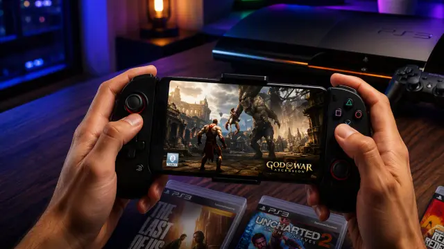

La PlayStation 3 ya se puede emular en un móvil Android. El proyecto que lo hace posible se llama ARMSX3: un port para dispositivos ARM64 del veterano emulador de PC RPCS3, disponible en su [repositorio oficial de GitHub](https://github.com/ARMSX2/ARMSX3). La noticia ha circulado esta semana en la prensa española a partir de las pruebas publicadas por el analista Dipan Saha en MakeUseOf, que ha medido su rendimiento real con varios títulos comerciales.

## Qué ha pasado

ARMSX3 adapta a Android el código más reciente de RPCS3, incluidas sus mejoras para la arquitectura ARM64, con una capa nativa para el sistema de Google. Detrás del proyecto está el equipo de ARMSX2, conocido por su emulador de PlayStation 2 para móviles, y se distribuye como software libre bajo licencia GPL-2.0, la misma que RPCS3. Su propio repositorio lo define como una prueba de concepto: funciona, pero sigue en una fase temprana de desarrollo.

El hito tiene mérito técnico. La PS3, lanzada en 2006, se construyó sobre el procesador Cell Broadband Engine, una arquitectura tan peculiar como difícil de trasladar a otros chips. ARMSX3 resuelve parte del problema ejecutando las instrucciones de forma nativa sobre los procesadores ARM que equipan los móviles actuales.

## Por qué importa

Hasta ahora, la emulación de PS3 era prácticamente territorio exclusivo del PC, donde [RPCS3 sigue avanzando a buen ritmo](/noticias/rpcs3-nvidia-driver-performance/). Que un móvil ejecute estos juegos, aunque sea con limitaciones, confirma que la gama alta actual ya tiene potencia bruta suficiente para una de las consolas más complicadas de emular. No es el primer intento —convive con alternativas como aPS3e—, pero sí el que más directamente sigue el desarrollo oficial de RPCS3, por lo que sus mejoras futuras podrían trasladarse al móvil con rapidez.

## Qué cambia si quieres emular PS3 en el móvil

Lo primero, los requisitos: no vale cualquier teléfono. El mínimo documentado ronda un chip de gama media como el MediaTek Helio G99, pero la experiencia razonable empieza en un Snapdragon 8 Gen 2 o superior, con 8 GB de RAM como mínimo y 12 GB como configuración recomendada. Además, el consumo gráfico es tan elevado que el terminal se calienta notablemente en sesiones largas, por lo que se aconseja algún tipo de refrigeración externa.

Lo segundo, las expectativas. En las pruebas de MakeUseOf, realizadas en una tableta con Snapdragon 8 Gen 3 y 12 GB de RAM, *God of War III* alcanza 60 FPS estables en menús e introducción, pero cae por debajo de los 10 FPS en combate y muestra fallos visuales leves. *GTA V* logra renderizar su mundo abierto, aunque con errores gráficos que impiden jugar con normalidad, y *The Last of Us* ni siquiera muestra imagen. Los títulos 2D o de baja carga gráfica son, por ahora, los que mejor funcionan.

Y una advertencia legal imprescindible: el emulador no incluye ni juegos ni firmware. Para funcionar necesita el software del sistema oficial de Sony y copias de juegos propias. ARMSX3 es una herramienta prometedora y todavía inestable, no una forma de conseguir juegos gratis.
