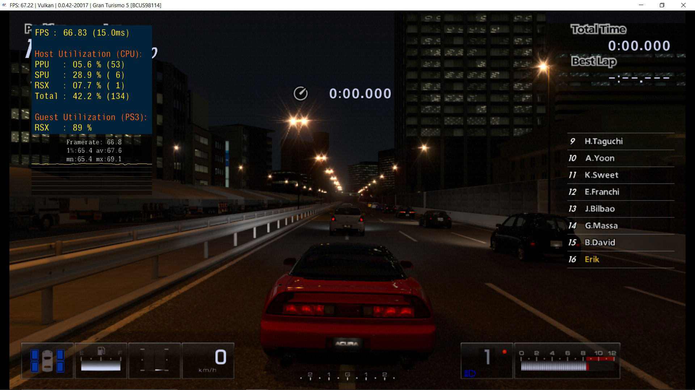

Los desarrolladores del emulador de código abierto **RPCS3** han encontrado un rodeo a
un bug de los controladores de **NVIDIA** que lastraba el rendimiento de la emulación de
**PlayStation 3** en PC. El proyecto lo ha celebrado en redes sociales con nuevas
mediciones: en algunas configuraciones, el cambio se traduce en **hasta un 37 % más de
FPS**. No es un ajuste menor, porque no nace de optimizar el emulador, sino de esquivar
un problema del propio driver.

El hallazgo lo firma el desarrollador **Yahfz**. La clave es que el cuello de botella no
estaba en el código de RPCS3, sino en cómo responde el controlador de NVIDIA ante
determinadas cargas gráficas. Ya [cubrimos la primera tanda de pruebas sobre el bug en
las GeForce](/noticias/rpcs3-nvidia-driver-performance/); ahora llegan mediciones nuevas,
con más juegos analizados y la reacción de la compañía.

## Las pruebas de RPCS3: hasta un 37 % en Gran Turismo 5

El primer escenario que el proyecto hizo público fue una escena de *Red Dead Redemption*
centrada en los muelles de Blackwater, con una ruta de cámara estable y efectos de agua
que sirven como referencia repetible. Sobre esa misma escena, dos equipos muy distintos
midieron mejoras claras:

| Configuración | Mejora de FPS |
| --- | --- |
| Core i9-13900K + GeForce RTX 3080 | 20 % |
| Ryzen 7 9800X3D + GeForce RTX 5090 | 25 % |

Los datos de seguimiento confirman que *Red Dead Redemption* no es una excepción: según
los desarrolladores, la mayoría de los juegos se ven afectados por el cuello de botella.
El caso más llamativo es *Gran Turismo 5*, que pasó a moverse un **37 % más rápido**;
además, el uso de VRAM cayó de **7,1 GB a 4,8 GB** tras aplicar el rodeo. Los equipos
modestos también lo notan: *Saints Row IV* sobre una **GeForce GTX 1060** mejoró en torno
a un **20 %**.

## AMD no se beneficia: el bug es del driver

Conviene subrayarlo: la mejora no convierte a las GeForce en tarjetas intrínsecamente más
rápidas. Lo que hace el parche es eliminar una penalización que solo aparece al ejecutar
RPCS3 con los controladores de NVIDIA. Por eso los usuarios con **GPU AMD no ven ningún
cambio**: sus drivers no arrastran este bug, según el propio equipo del emulador. La
naturaleza exacta del fallo no se ha detallado públicamente, pero que afecte a un solo
fabricante apunta a una causa de software, no de hardware.

## NVIDIA mueve ficha tras la petición de diálogo

Aprovechando el descubrimiento, RPCS3 ha pedido a NVIDIA un **canal de comunicación
directo** para reportar bugs de controladores. El proyecto asegura que en el pasado
intentó dar a conocer problemas por los foros para desarrolladores de la compañía y no
obtuvo respuesta. Esta vez la historia es distinta: **Manuel Guzman**, responsable de QA
de software en NVIDIA, ha respondido públicamente al mensaje. No hay un compromiso
cerrado ni un plazo, pero el diálogo se ha abierto, algo que el proyecto llevaba tiempo
reclamando sin éxito.

## Qué cambia para el jugador

La lectura práctica es doble. Si juega a emulación de PS3 con una tarjeta NVIDIA, es
probable que las próximas versiones de RPCS3 rindan mejor sin cambiar de hardware, y con
un consumo de VRAM más bajo que deja margen para texturas de mayor calidad. Queda por ver
si el mismo fallo afecta también al rendimiento en juegos nativos, una pregunta que el
hallazgo deja abierta. De momento, NVIDIA no ha confirmado que vaya a corregirlo en sus
controladores.
