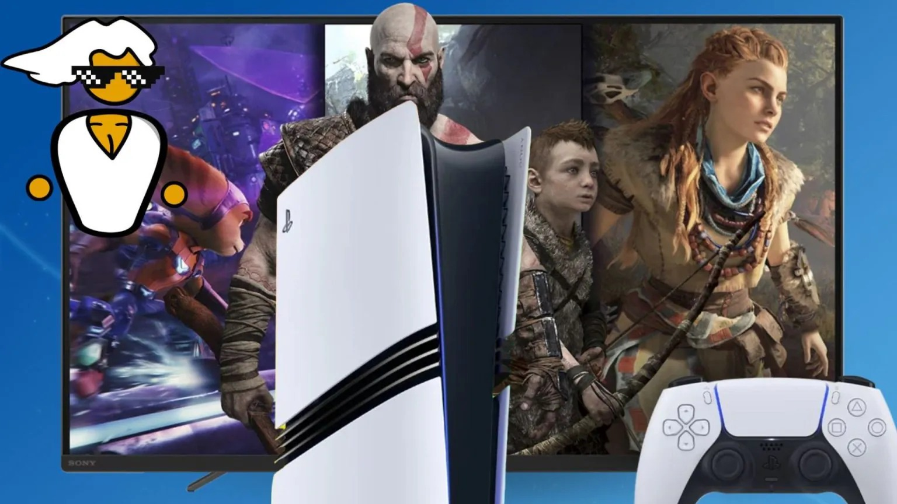
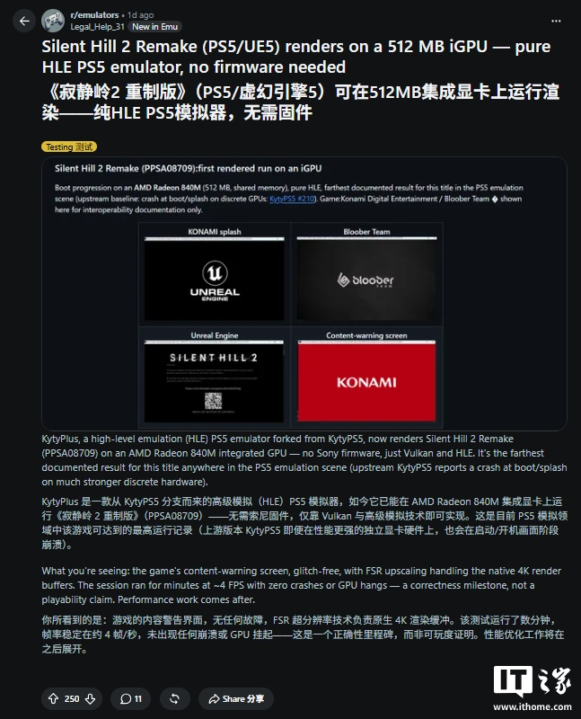

La emulación de PlayStation 5 ha vuelto a dar un paso técnico en apenas unos
días. Según recoge el medio chino **ITHome**, una versión experimental del
emulador **KytyPlus** —un derivado de **KytyPS5**— ha logrado renderizar
*Silent Hill 2 Remake* sobre una GPU integrada AMD Radeon 840. Se trata de una
configuración muy modesta para un título de Unreal Engine 5, y aunque la imagen
ya se dibuja, la tasa de fotogramas se queda en unos 4 FPS.

## Un hito para la emulación de PS5 sobre hardware muy limitado

El avance se documenta con capturas del juego en las que ya aparecen la pantalla
de advertencia de contenido y los logotipos de Konami, Bloober Team y Unreal
Engine. El equipo responsable de la prueba señala que el render se completa sin
errores gráficos ni cuelgues de la GPU, algo relevante porque la rama principal
de KytyPS5 todavía se bloquea en el arranque sobre hardware dedicado mucho más
potente. El mérito, por tanto, corresponde a la bifurcación KytyPlus.

La clave está en el enfoque del proyecto: es un emulador de alto nivel (HLE)
que no requiere firmware de Sony y que se apoya en Vulkan, de modo que buena
parte de la carga recae en la CPU en lugar de exigir una tarjeta gráfica
dedicada.

## Por qué importa más que otros avances

Lo llamativo no es la cifra en sí —4 FPS está muy lejos de ser jugable—, sino el
tipo de juego y el hardware sobre el que corre. *Silent Hill 2 Remake* es una
producción de Unreal Engine 5, una de las más exigentes de la generación, de
modo que verla renderizar en una GPU integrada es un hito de correctitud, no de
rendimiento.

ITHome enmarca el logro en una racha que ya venía encadenando avances muy
rápidos, desde [el remake de *Demon's Souls*](/noticias/demons-souls-remake-ps5-emulator-30fps/)
hasta [*Astro's Playroom*](/noticias/astros-playroom-kyty-ps5/). Esa progresión
es la que permite pensar en los 60 FPS como un objetivo más cercano de lo que
parecía hace apenas unas semanas.

## Qué cambia para quien juega en PC

- **Es un avance de correctitud, no de rendimiento.** Los 4 FPS no permiten
  jugar; el valor está en que el emulador ya produce imagen donde antes había un
  bloqueo.
- **No hace falta firmware de la consola.** El enfoque HLE elimina una barrera
  habitual, aunque no exime de aportar los juegos de forma legal.
- **La barrera del hardware baja.** Que una GPU integrada, y no una tarjeta
  dedicada, complete el render abre la puerta a equipos modestos cuando el
  rendimiento mejore.
- **El ritmo manda.** Como ha ocurrido con otros títulos de PS5, el rendimiento
  suele mejorar rápido una vez superado el arranque.

Por ahora conviene leer el anuncio como un paso técnico dentro de un proceso en
desarrollo y no como una vía lista para jugar. La pregunta que queda abierta,
apunta ITHome, es cuánto tardará la emulación de PS5 en alcanzar un nivel
realmente utilizable.
