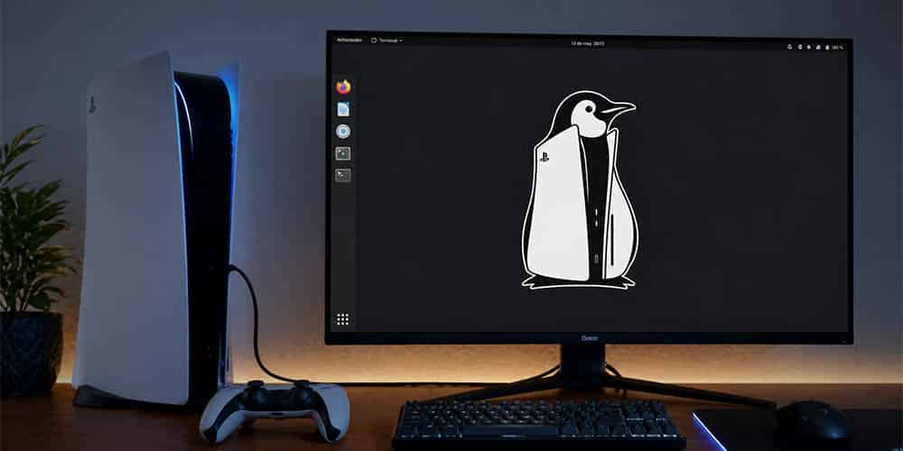

**Andy Nguyen**, conocido en la escena de la consola como **TheFloW**, anunció que
abandona el desarrollo de **PS5 Linux** y que deja la escena de PlayStation 5. El
proyecto había logrado convertir determinadas **PS5** y **PS5 Slim** en equipos
capaces de arrancar Linux y ejecutar Steam, y su autor tenía previsto completar el
soporte para **PS5 Pro** con vistas a un lanzamiento en 2027. Ese trabajo queda
ahora en suspenso.

El detonante no ha sido un problema técnico, sino una decisión ajena: un grupo de
investigadores comunicó a Sony, a través de su programa de recompensas, una
vulnerabilidad del hipervisor de la consola que Nguyen ya conocía y que prefería
mantener en privado.

## Una vulnerabilidad del hipervisor llamada Slopervisor

El fallo está relacionado con el **hipervisor de la PS5**, una de las capas de
seguridad más importantes del sistema y, precisamente, uno de los componentes que
PS5 Linux necesita controlar para ejecutar otro sistema operativo aprovechando todo
el hardware. El exploit fue bautizado como **Slopervisor** y se probó sobre el
firmware **10.00**, aunque sus desarrolladores sostienen que también afecta a
versiones posteriores, aparentemente **hasta el firmware 13.60**.

Nguyen afirma que él ya había encontrado esa misma vulnerabilidad y que había
decidido no comunicarla todavía a Sony: su intención era conservarla **hasta el
lanzamiento de GTA 6**, de modo que los usuarios pudieran actualizar la consola lo
suficiente para comprar y jugar el título legalmente sin perder la opción de
instalar Linux. Según su versión, pidió expresamente a los demás investigadores
que esperasen y estos aceptaron en un primer momento; al día siguiente, siempre
según su relato, cambiaron de opinión y reportaron el fallo a Sony.

## Divulgación responsable frente a retención privada

El episodio deja una tensión que la escena arrastra desde hace años: **no es lo
mismo guardar un fallo para uno mismo que divulgarlo de forma coordinada**. Sony
mantiene un **programa de recompensas** gestionado a través de HackerOne que premia
la comunicación responsable de vulnerabilidades, y no hay confirmación pública del
importe que podría pagar por este hallazgo. Reportar el fallo permite que la
compañía lo corrija, pero a cambio cierra la ventana que el proyecto necesitaba.

La publicación de Nguyen también incluyó una crítica a una parte de la comunidad.
Según él, la escena de PlayStation, antes formada por investigadores con amplios
conocimientos técnicos, se ha ido llenando de lo que llama **"slop kiddies"**: un
juego de palabras con el término clásico *script kiddies* que describe a
desarrolladores que generan código y exploits con ayuda de **modelos de lenguaje**
sin comprender del todo lo que hacen. Sus mensajes generaron además respuestas
críticas de usuarios que cuestionaron que hubiera mantenido el fallo en privado
mientras otros no lo hacían.

Conviene ser claros en un punto: una vulnerabilidad de este tipo no es un producto
que se pueda conservar ni una herramienta que convenga replicar. Sea cual sea el
bando que se elija, la decisión de cuándo y cómo se hace pública afecta a la
seguridad de todos los usuarios, y es ahí donde el episodio tiene más que ver con
la ética profesional que con la técnica.

## Qué cambia para quien sigue PS5 Linux

El proyecto no desaparece por completo. Todo el código publicado hasta ahora sigue
disponible bajo **licencia GPL 3.0** y permite aprovechar vulnerabilidades ya
parcheadas para ejecutar Linux en **PS5 Phat** y **PS5 Slim** con firmware
compatible **hasta la versión 7.61**. La lista de funciones incluye salida de vídeo
HDMI hasta **4K a 60 Hz**, acceso al SSD M.2, puertos USB, Bluetooth, Ethernet y la
posibilidad de emplear la CPU y la GPU de la consola para ejecutar juegos y
emuladores.

El problema es que, sin su autor principal, tendrá que ser **otro desarrollador**
quien continúe el trabajo a partir del código existente. Para los usuarios que ya
disfrutan de Linux en la consola, la disyuntiva que se abre es concreta: mantener
esa instalación o actualizar el firmware para poder jugar a GTA 6. Y como cualquier
método que dependa de un fallo sin corregir, su continuidad está sujeta al próximo
parche de Sony.

Este medio no detalla el procedimiento para reproducir la vulnerabilidad: se trata
de un fallo de seguridad y su explotación queda fuera del alcance de esta
información.
