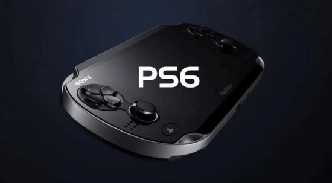

Un nuevo rumor apunta a que la futura consola portátil de Sony, conocida en las filtraciones como PSP 3 o Project Canis, equiparía una pantalla OLED de gama alta con resolución 1080p, tasa de refresco de hasta 120 Hz y soporte de frecuencia de actualización variable (VRR). La información **no está confirmada por Sony** y debe tomarse como lo que es: una filtración sin verificación oficial.

La cadena de la filtración merece explicarse: MyDrivers recoge la noticia de GamerSky, que a su vez cita como origen al medio especializado GameGPU. Ninguno de estos eslabones aporta una confirmación de Sony, por lo que todos los datos que siguen pertenecen al terreno del rumor.

## Qué dice la filtración sobre la pantalla de la PS6 portátil

Según la información publicada, la portátil adoptaría un diseño de pantalla completa sin marcos con panel OLED, lo que le daría mayor contraste, negros más profundos y tiempos de respuesta más rápidos que un LCD convencional.

En el plano técnico, el rumor habla de un panel OLED de nueva generación, con la posibilidad de una arquitectura tándem de doble capa. Las cifras que se mencionan son un brillo máximo de unos 1000 nits en modo HDR y alrededor de 600 nits en SDR, con cobertura completa del espacio de color DCI-P3. Además, el nuevo panel consumiría supuestamente en torno a un 25 % menos de energía que la solución anterior, un dato relevante en un dispositivo donde la batería manda.

La resolución nativa sería de 1080p, con refresco máximo de 120 Hz y soporte de VRR, la tecnología que sincroniza la pantalla con la tasa de fotogramas del juego para evitar tirones y desgarros de imagen.

## Por qué importa una OLED de este nivel en una portátil

Si la filtración resultase cierta, Sony estaría apostando por la calidad de imagen como argumento diferencial frente a sus rivales en el juego portátil. Una OLED de alto brillo con 120 Hz y VRR es exactamente la combinación que más se nota en juegos de acción rápida, y encaja con la idea de una máquina pensada para ejecutar de forma nativa títulos de PS5, tal como apuntan otras filtraciones sobre [los chips de PS6 y Xbox Helix](/noticias/ps6-xbox-helix-chips-taped-out/).

El otro elemento clave del rumor es el software: la portátil recurriría a una nueva versión de la tecnología de superresolución de Sony, PSSR 3.0, con generación de fotogramas basada en redes neuronales. La idea sería renderizar el juego a 30 o 60 fotogramas por segundo y reconstruirlo hasta los 60 o 120 Hz de la pantalla, ganando fluidez sin disparar el consumo. Es el mismo enfoque que ya usan soluciones como el DLSS de Nvidia en PC y portátiles, y tendría sentido en un chasis con batería limitada.

## Qué cambia para el lector y qué conviene tomar con cautela

De confirmarse, el mensaje para el jugador sería claro: Sony prepararía una portátil premium, con pantalla a la altura de los mejores móviles y una estrategia de escalado por inteligencia artificial para sostener altas tasas de refresco. El lanzamiento se situaría, siempre según las filtraciones, junto a la PS6 de sobremesa en 2027.

Pero la cautela es obligada. No hay confirmación oficial de Sony sobre la existencia del dispositivo, su fecha, sus especificaciones ni sobre PSSR 3.0. Las cifras de brillo, consumo y refresco provienen de una cadena de filtraciones (GameGPU vía GamerSky y MyDrivers) y podrían cambiar o no existir en el producto final. Hasta que Sony hable, todo lo anterior es rumor.
