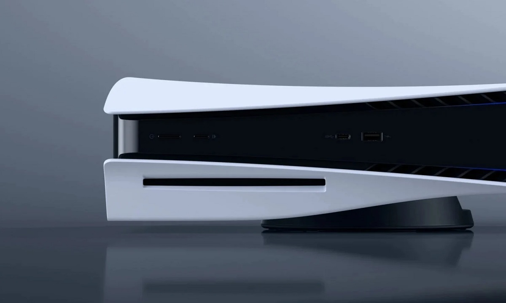

Sony todavía no ha fijado oficialmente la fecha de lanzamiento de PlayStation 6, pero
los rumores que circulan desde hace meses empiezan a converger en una ventana concreta:
la **campaña navideña de 2027**, es decir, entre noviembre y diciembre de ese año. No hay
nada confirmado, y conviene leer todas estas informaciones con la cautela habitual en este
tipo de filtraciones.

## ¿Cuándo llegaría PS6?

La horquilla de finales de 2027 encaja, según los analistas citados por MuyComputer, por
varias razones. La primera es económica: para entonces **la crisis de la DRAM debería haber
empezado a remitir**, lo que permitiría a Sony reducir el coste de fabricación de la consola
sin comprometer su configuración de memoria.

La segunda es técnica. La APU de la consola estaría basada en núcleos **Zen 6c y Zen 6 LP**
de AMD, acompañados de una GPU **RDNA 5**. Una ventana de lanzamiento cercana a 2027 mantendría
esas arquitecturas lo bastante frescas como para no quedar «obsoletas» en el momento del debut.

La tercera es comercial: estrenar la consola en plena temporada de regalos la convertiría en el
producto estrella de esas fiestas y daría un impulso natural a las ventas iniciales.

Algunas informaciones apuntaban a un posible lanzamiento en **2028**, pero esa opción pierde
fuerza: un retraso tan marcado restaría impacto a las novedades tecnológicas de la máquina y
devaluaría el interés de sus arquitecturas de CPU y GPU.

## El precio, la gran incógnita

El otro interrogante es cuánto costará. Según los últimos rumores recogidos por MuyComputer,
el coste de fabricación de PS6 **habría alcanzado los 1.000 dólares**, una cifra que deja a Sony
ante tres escenarios posibles:

- **Vender al precio de coste**, sin pérdidas ni beneficios por unidad, y compensar con software
  y servicios. En ese caso la consola se situaría en torno a **999,99 dólares** (999,99 euros en España).
- **Asumir una pequeña pérdida por unidad**, recuperándola después con juegos y servicios. El precio
  quedaría entre **699,99 y 899,99 dólares**, una horquilla que se trasladaría de forma similar a euros.
- **Vender por encima del coste**, obteniendo margen en el hardware. Es, según el análisis de la fuente,
  la opción menos probable, porque dispararía el precio final por encima de los 1.000 dólares.

La conclusión que se extrae de este abanico es que Sony intentará mantener el precio de lanzamiento
**entre los 799 y los 999 dólares-euros**, aunque por ahora todo sigue siendo especulación. Habrá que
esperar a un anuncio oficial para dar por buenas tanto la fecha como el precio.
