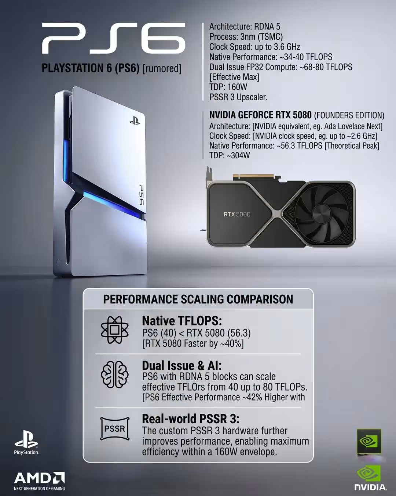

En los últimos días circuló una comparación según la cual la futura PlayStation 6 de
Sony superaría en potencia bruta a una GeForce RTX 5080 de NVIDIA. La cifra que sostenía
esa conclusión —hasta **80 TFLOPS en precisión simple**— tendría un problema de origen:
un análisis técnico posterior sostiene que el cálculo contó dos veces el mismo rasgo del
núcleo gráfico de AMD. No es un dato oficial de Sony, sino una estimación de terceros que
ahora queda en entredicho.

## De dónde salía la cifra de 80 TFLOPS

La comparación partía de las especificaciones filtradas de la consola: una GPU basada en
**RDNA 5**, con 52 unidades de cómputo y 64 procesadores de flujo por unidad. A partir de
esas cifras, varios cálculos elevaron el rendimiento teórico en precisión simple hasta un
rango de **68 a 80 TFLOPS**, por encima de los 56,3 TFLOPS que NVIDIA declara para la RTX
5080. Ese resultado alimentó titulares que daban por superada a la tarjeta de escritorio.

Conviene recordar que Sony no ha confirmado la arquitectura final de la consola ni ninguna
cifra oficial de rendimiento. Los rumores sobre la fecha y el precio de PS6 siguen, por
tanto, en el terreno de la especulación, como ya recogimos al hablar de
[la posible ventana de lanzamiento y su coste](/noticias/ps6-release-date-price-rumor/).

## En qué consiste el doble conteo que infló a la PS6

El punto discutido es el **doble despacho** (*dual issue*), una característica que la
arquitectura RDNA de AMD incorpora desde su primera generación. Permite que un mismo
procesador de flujo ejecute dos operaciones en un solo ciclo de reloj, y ya forma parte del
rendimiento base que se calcula a partir de las unidades de cómputo.

Según el análisis recogido por MyDrivers, la estimación original tomó una cifra que **ya
incluía esa ganancia** y volvió a multiplicarla por dos. El doble despacho se contó, en la
práctica, dos veces. Al corregir la operación con las mismas especificaciones filtradas —52
unidades de cómputo, 64 procesadores de flujo cada una y doble despacho—, la GPU de la PS6
rendiría unos **34,6 TFLOPS teóricos a 2,6 GHz**.

Incluso llevando la frecuencia hasta los **3,0 GHz**, el pico en precisión simple se quedaría
en unos **39,9 TFLOPS**, todavía cerca de un **30 % por debajo** de los 56,3 TFLOPS nominales
de la RTX 5080.

## Por qué conviene desconfiar de estas comparaciones

Medir una consola que aún no existe contra una tarjeta gráfica ya a la venta es un ejercicio
lleno de trampas. Los TFLOPS son un indicador teórico y no describen por sí solos cómo se
comportará un juego: importan la arquitectura, el ancho de banda de la memoria, la
refrigeración o el presupuesto energético. La propia comparación difundida situaba a la PS6
en un sobre de **160 W**, frente a los alrededor de 304 W de la RTX 5080, una diferencia que
cambia por completo la lectura del dato.

A eso se suma que el origen de estas cifras son filtraciones y no documentación oficial. El
mismo análisis señala que la predicción anterior de una PS6 entre un 70 % y un 100 % más
rápida que una RX 9070 XT en *path tracing* carece de base factual. La conclusión es sencilla:
hasta que Sony presente la consola, cualquier comparación de rendimiento debe leerse como lo
que es, un cálculo de terceros discutido y no una cifra confirmada.
