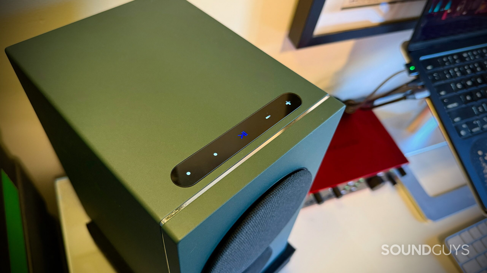
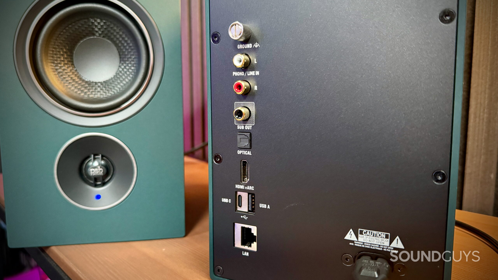

PSB es una firma canadiense con más de medio siglo de recorrido, aunque el analista de SoundGuys admite que no la conocía antes de probar los **iQ2**, un par de altavoces activos de 1.399 dólares que apuestan por reunir amplificación, streaming y conectividad en un único producto. El análisis, publicado el 29 de septiembre de 2026, concluye que son unos altavoces versátiles y bien resueltos, con la aplicación BluOS como peaje casi inevitable del día a día.

## Un sistema activo que no necesita amplificador, DAC ni streamer

Cada unidad de los iQ2 integra un woofer de 4 pulgadas y un tweeter de cúpula de aluminio de 0,75 pulgadas, cada uno con su propia amplificación Clase D; PSB cifra el conjunto en **270 W**. Con unas medidas de aproximadamente 145 × 246 × 192 mm por altavoz, encajan sin problema en un escritorio, y la marca ofrece **siete acabados**, entre ellos el verde Boreal de la unidad analizada, además del rojo Ember, el beige Sandstone y el nogal. Las rejillas magnéticas incluidas permiten un aspecto más discreto cuando se prefieren tapadas.

Conviene subrayar una ventaja práctica: los dos altavoces se comunican **de forma inalámbrica** entre sí, así que no hace falta tirar ningún cable entre el canal izquierdo y el derecho. Cada uno solo necesita un enchufe para alimentarse, lo que da libertad para colocarlos, aunque obliga a tener dos tomas de corriente a mano.

En la cara superior del altavoz principal hay controles táctiles para reproducir, cambiar de fuente mediante presets y ajustar el volumen. El analista los considera bien situados para un uso de escritorio, pero reconoce que sigue echando mano del mando de volumen físico de su interfaz de audio: los controles táctiles quedan elegantes en un sistema de este precio, pero a veces un buen mando de toda la vida es difícil de superar.

## Conectividad: HDMI eARC, USB-C, fono y más

El apartado de conexiones es, probablemente, lo que más justifica la etiqueta de todoterreno. Entre las entradas físicas hay una **RCA estéreo que puede funcionar como línea o como fono**, de modo que un tocadiscos compatible se puede conectar directamente sin necesidad de un preamplificador de fono externo. También ofrece **USB-C** para enganchar un ordenador sin interfaz de audio, **HDMI eARC** para un televisor compatible, **óptica** como alternativa, un puerto **USB-A** para discos externos en FAT32 o NTFS, **Ethernet** para quien prefiera red cableada y una **salida dedicada de subwoofer** con controles de cruce en BluOS para ampliar el sistema a 2.1.

En el plano inalámbrico están **AirPlay 2**, que el analista usa a diario para enviar música desde el móvil sin tocar el ordenador ni cambiar cables, y **Bluetooth con aptX Adaptive**, además de Wi-Fi o Ethernet como requisito de red para BluOS. El ecosistema de streaming reproduce hasta **24 bits/192 kHz** y suma Spotify Connect, TIDAL Connect y AirPlay 2, con la posibilidad de integrar los altavoces en una instalación multiroom junto a otros productos BluOS.

## Cómo suenan los PSB iQ2

En música, la review describe un sonido **claro y detallado**, con buena anchura entre los dos altavoces. Con «Home at Last» de Steely Dan por AirPlay, el analista distinguía detalles como la reverberación de la grabación sin perder de vista el resto de los instrumentos en la imagen estéreo. Con «Sunset» de The Midnight, el bombo llegaba con pegada y el sistema alcanza un volumen suficiente para una reunión interior de tamaño medio o grande.

El punto que más destaca SoundGuys es lo poco que sintió la necesidad de retocar nada: el iQ2 ofrece un sonido completo, sin carencias evidentes en graves, medios o agudos, y las herramientas de ecualización de BluOS quedaron prácticamente sin usar para escuchar música. Con películas, conectados al televisor, aguantó bien la contundencia de escenas de acción de *The Terminator* y *The Dark Knight*, y ofreció más anchura de izquierda a derecha que una barra de sonido al disponer de dos altavoces separados. Aun así, en algunos pasajes de *The Dark Knight* echó en falta algo más de agudos para seguir los diálogos, algo que resolvió subiendo los agudos desde la aplicación.

En videojuegos, con *Star Wars Outlaws*, el analista valoró la claridad y la amplitud, con detalles ambientales fáciles de distinguir mientras exploraba Tatooine y el zumbido de la nave audible en los tramos más tranquilos.

## Precio, veredicto y para quién tiene sentido

A 1.399 dólares, los iQ2 son una inversión seria y no tienen mucho sentido para quien solo quiera escuchar música desde el portátil. Para justificar el precio hay que aprovechar lo que los diferencia, y ahí SoundGuys encuentra margen de sobra: suenan claros y completos, suben de volumen sin problema y se integran en casi cualquier configuración doméstica. Pueden vivir en un escritorio de producción conectados a una interfaz de audio, engancharse a un ordenador por USB-C, anclar un equipo de tocadiscos o sustituir a una barra de sonido delante del televisor.

El principal debe es su naturaleza **centrada en la aplicación**: BluOS concentra buena parte de las funciones, así que conviene tener el móvil a mano para bucear en los ajustes. Asignar las fuentes más usadas a los presets táctiles reduce esas visitas, pero no las elimina. Para quien busque mejorar su audio inalámbrico en el día a día, la evolución de los códecs y plataformas como [Snapdragon Sound](/noticias/qualcomm-snapdragon-sound-elite-gen-2/) marca el contexto en el que se mueve este tipo de producto.

SoundGuys señala que la unidad fue facilitada por el fabricante y que la review se adelantó como parte de una colaboración pagada con PSB, manteniendo en todo momento la independencia editorial: la marca no revisó ni aprobó el artículo.
