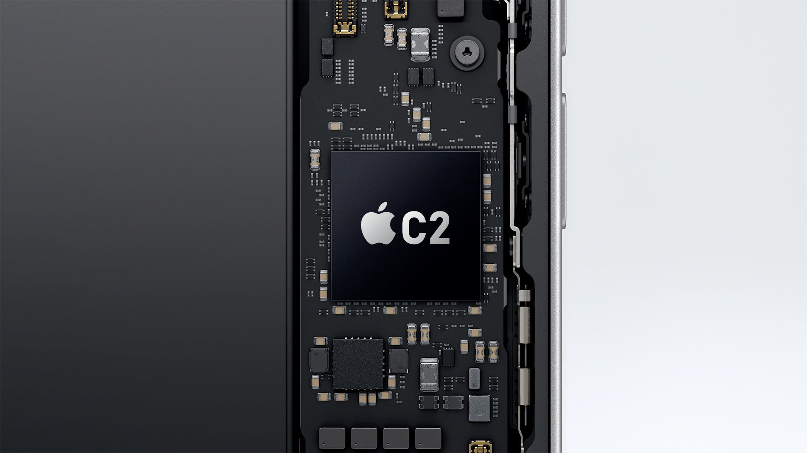

Qualcomm ha anunciado oficialmente que ha renovado su acuerdo global de licencias de patentes con Apple. El nuevo contrato entra en vigor el 1 de abril de 2027 y mantiene el pago de regalías por parte de Apple por el uso de tecnología inalámbrica. Ninguna de las dos compañías ha desvelado cuál será la duración del acuerdo ni sus condiciones económicas.

John Han, vicepresidente ejecutivo y director general de Qualcomm Technology Licensing (QTL), el brazo de licencias de la empresa, aseguró en la nota que la compañía se alegra de prolongar el acuerdo con Apple. El comunicado no añade más detalles sobre el contenido del contrato.

## Una prórroga que aleja el vencimiento

La renovación se apoya en la opción de prórroga de dos años que Qualcomm ya venía aplicando y que situaba el final del acuerdo actual el 31 de marzo de 2027. El nuevo contrato arranca justo al día siguiente, el 1 de abril, de modo que no deja un hueco entre ambos textos.

La relación entre las dos empresas no siempre fue cordial. Apple y Qualcomm se enfrentaron en los tribunales por disputas de patentes en varios países y regiones del mundo, hasta que en abril de 2019 alcanzaron un acuerdo que incluía una licencia global de patentes de seis años, con efectos desde el 1 de abril de ese mismo año. Poco después, Apple activó la mencionada prórroga de dos años para llevar el contrato hasta marzo de 2027.

## La licencia no es lo mismo que los módems

Conviene no confundir este acuerdo con el suministro de módems (la baseband o banda base) que Qualcomm vende a Apple. Son dos contratos distintos. El de suministro ya estaba confirmado para los iPhone de 2024, 2025 y 2026, mientras que el de patentes es independiente y solo cubre el uso de tecnología protegida.

Esa distinción importa porque Apple lleva tiempo sustituyendo el módem de Qualcomm por un diseño propio. El primer paso conocido fue el iPhone 16e, el primer modelo con la baseband C1 desarrollada por la compañía. La estrategia apunta a reducir la dependencia del proveedor en el apartado del hardware de comunicaciones.

## Por qué importa aunque Apple fabrique su propio módem

Aunque Apple llegue a montar únicamente módems de diseño propio, seguirá necesitando la licencia de patentes de Qualcomm. La razón es que la firma californiana acumula una amplia cartera de patentes esenciales (conocidas como SEP) en el ámbito de las comunicaciones celulares, un terreno en el que es muy difícil operar sin pasar por su porfolio.

Por eso esta renovación se lee como una señal de continuidad: incluso en un escenario en el que todos los iPhone usaran módems de Apple, la compañía tendría que seguir pagando regalías a Qualcomm. Es el tipo de acuerdo que no se nota en el precio de un teléfono concreto, pero que condiciona la estructura de costes de cada generación.

Este movimiento se produce en un contexto de gran actividad para Qualcomm, que también ha presentado recientemente sus chips de [Snapdragon 8 Elite Extreme Gen 6](/noticias/qualcomm-snapdragon-8-elite-extreme-gen-6-oficial/) de 2 nm para la próxima hornada de móviles Android.

## Qué cambia para el usuario

En el día a día, nada. El acuerdo no altera funciones, precios ni disponibilidad de los iPhone actuales. Su efecto se verá, como mucho, en la letra pequeña de los costes que Apple asume por cada dispositivo que vende con conectividad celular, y en la tranquilidad de que la disputa legal entre ambas empresas no volverá a abrirse por esta vía.
