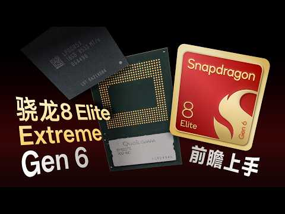

Jugar títulos de PC en un móvil Android ha dependido hasta ahora de trucos: capas de
traducción, emuladores de terceros y, muy a menudo, controladores gráficos no oficiales.
Según recoge Android Authority a partir del análisis del canal técnico Geekerwan, Qualcomm
trabajaría en cambiar esa situación desde dentro, con mejoras para la emulación de juegos
de PC en Android a través de sus propios controladores de GPU.

El punto de partida es una prueba con el **Snapdragon 8 Elite Gen 6**. Geekerwan ejecutó
*Cyberpunk 2077* y *Black Myth: Wukong* en un teléfono con ese chip y ambos títulos
funcionaron correctamente en modo DirectX 12 mediante una capa de traducción. El YouTuber
afirma además que la compañía estaría considerando llevar a Android controladores con
soporte real para DirectX 12.

## Por qué importa para la emulación en Android: el lastre de los drivers no oficiales

Hoy, muchos emuladores de PC y de consola en Android solo rinden bien si el usuario
instala por su cuenta controladores **Turnip**, la alternativa de código abierto al
controlador Vulkan de Qualcomm. Es un paso que exige conocimientos, rompe la garantía de
una experiencia «lista para usar» y deja fuera a buena parte de los usuarios. Si Qualcomm
integra mejoras equivalentes en sus drivers oficiales, el rendimiento y la compatibilidad
dejarían de depender de parches comunitarios.

El segundo frente es igual de relevante. Los chips Snapdragon de gama alta recientes no
incluían soporte DirectX, de modo que los emuladores debían traducir las llamadas de
DirectX a Vulkan por su cuenta. Un soporte nativo de DirectX 12 en el controlador oficial
podría traducirse en más estabilidad y menos errores gráficos en juegos que en PC usan esa
API.

## Qué cambia para el usuario (y qué falta por saber)

Conviene ser prudente: se trata de un plan filtrado por un tercero, no de un anuncio de
Qualcomm, que de momento no ha confirmado nada. Quedan además dos dudas importantes sin
resolver.

1. **Alcance del hardware.** No está claro si estas mejoras exigirán un dispositivo con la
   serie Snapdragon 8 Elite Gen 6 o si llegarán a equipos ya vendidos mediante una
   actualización de controladores.
2. **Fecha y disponibilidad.** Tampoco hay calendario ni lista de regiones o modelos.

Para el usuario, la consecuencia práctica es que la emulación de PC en Android podría dar
un salto de calidad sin las soluciones caseras que hoy hacen falta. Proyectos como
[GameNative](/noticias/gamenative-steam-android-gta5/) o
[Winlator](/noticias/winlator-11-2/) serían los primeros beneficiados, y se sumarían a
otras iniciativas de Qualcomm para apretar el rendimiento gráfico del móvil, como las que
ya vimos en
[Adreno Neural Fusion](/noticias/qualcomm-adreno-neural-fusion-android/).

Android Authority asegura haber preguntado a Qualcomm por estas mejoras y por la
posibilidad de un soporte DirectX 12 en Android, y promete actualizar la información
cuando la compañía responda.
