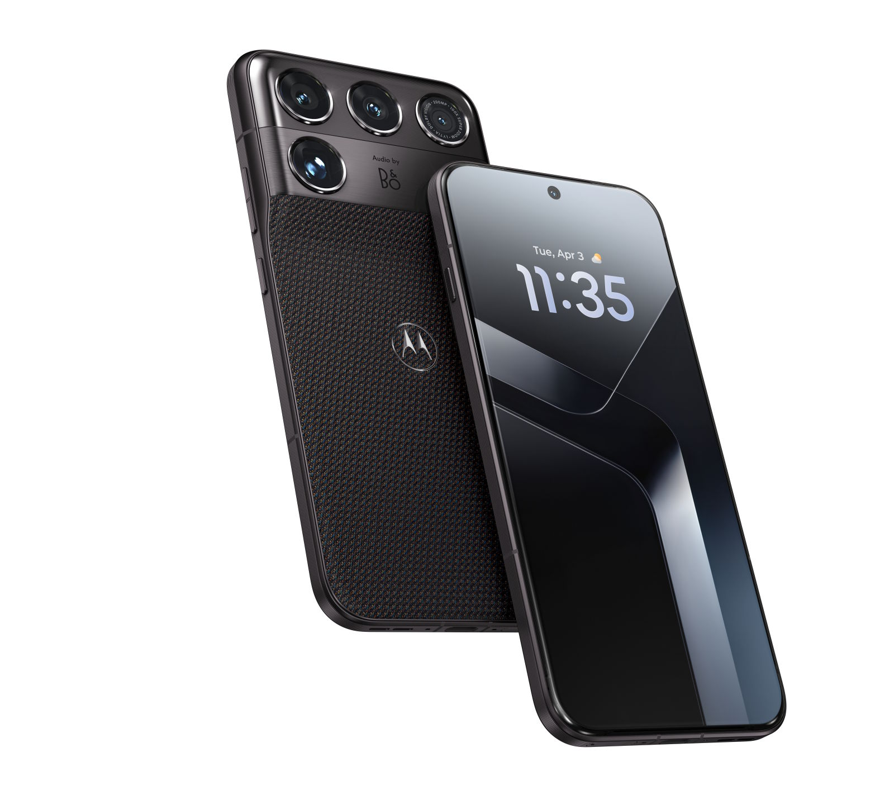
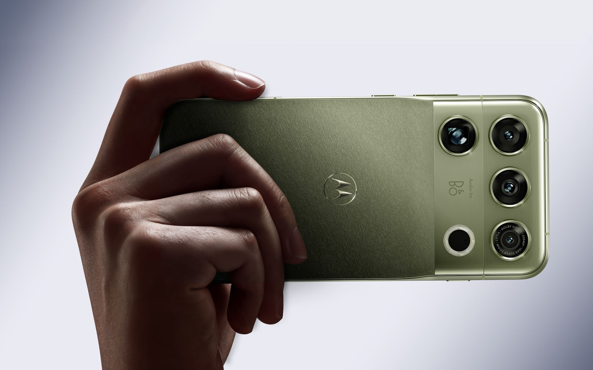

Qualcomm ha presentado su plataforma de gama alta para los buques insignia que llegarán entre el último trimestre de 2026 y mediados del próximo año. Lo ha hecho en el marco de su cumbre anual y con un titular que la compañía no dudó en señalar como un hito: por primera vez, sus procesadores para móviles superan la barrera de los 5 GHz. La firma ha dividido la nueva familia en dos modelos, el Snapdragon 8 Elite Gen 6 y el Snapdragon 8 Elite Extreme Gen 6, que comparten base tecnológica pero se dirigen a segmentos distintos.

## Dos versiones con reloj por encima de los 5 GHz

El salto más comentado es la frecuencia. Ambos chips se apoyan en una CPU asimétrica de ocho núcleos: seis Oryon Performance y dos Oryon Prime que alcanzan los 5,01 GHz, todos de cuarta generación. En el modelo Elite, los núcleos Performance se reparten en dos grupos, uno de tres a 4,03 GHz y otro a 3,74 GHz. La caché L2 se mantiene en 16 MB, aunque ahora es de tipo Oryon FlexCache, con asignación libre entre todos los núcleos para que uno solo pueda usar toda la memoria si la carga lo exige.

En memoria, la plataforma admite LPDDR6, y el almacenamiento interno da el salto a chips UFS 5.0. Son cambios de base que no se ven en la ficha comercial, pero que marcan cuánto puede exprimirse el resto del sistema sin cuellos de botella.

## Más músculo gráfico y pruebas que se acercan al iPhone 18 Pro

La GPU Adreno es, según Qualcomm, el apartado donde la mejora respecto a la generación anterior supera el salto habitual. La compañía cifra en un 49 % la ventaja en algunas pruebas de 3DMark, y deja caer que en ciertos test el modelo Elite llega a adelantar ligeramente al iPhone 18 Pro, aunque lo normal es un empate técnico. Es una comparación interesante para el lector, porque los diseños de Apple llevaban tiempo en otro nivel.

La inteligencia artificial también cambia de enfoque. Qualcomm ha diseñado el chip pensando en la IA agéntica y prioriza el trabajo en una CPU optimizada antes de derivarlo a la NPU. La idea es que el procesador "mastique" la pregunta o el prompt y se lo entregue ya preparado al modelo, de forma que la respuesta llegue antes.

## El Motorola Signature 27, primer móvil con el Snapdragon 8 Elite Extreme Gen 6

A diferencia de otras citas en las que Qualcomm monopoliza el escenario, en esta ocasión la compañía se ha dejado acompañar por Motorola, que estrenará la variante Extreme en su Signature 27. El teléfono se encuadra en la línea de gama alta de la marca, orientada a móviles "ultraprémium", y llega con una cámara de evaporación ArcticMesh: gel térmico con partículas de diamante, metal líquido y una malla de cobre para reducir el *throttling* sin recurrir a refrigeración activa.

El apartado de sonido va firmado por Bang & Olufsen, y la cámara combina varios sensores capitaneados por un Sony LYTIA 910 de 50 MP, al que se suma un teleobjetivo de 200 MP. Según la información disponible, estos sensores contarán con un sistema de estabilización física más capaz que el de modelos anteriores, aunque el detalle no está confirmado.

Motorola no ha detallado todavía ni el resto de especificaciones ni el precio, que se intuye elevado: apunta a lo más alto no solo por el chip, sino por acabados que incluyen opciones con apariencia textil y de material compuesto.

## Qué cambia para el comprador

La lectura práctica del anuncio es que la gama alta de Android se prepara para un curso con dos velocidades. El [Snapdragon 8 Elite Extreme Gen 6 completo ya se presentó](/noticias/qualcomm-snapdragon-8-elite-extreme-gen-6-oficial/) como el primero de Qualcomm fabricado en 2 nm, y ahora llega el turno de los teléfonos que lo llevarán. El propio [Motorola Signature 27](/noticias/motorola-signature-27-snapdragon-8-elite-extreme/) es la primera muestra de hacia dónde va ese segmento, con foco en disipación de calor, cámara y acabados de lujo.

Para quien esté pensando en renovar su móvil, la recomendación de siempre: las cifras de mejora proceden del fabricante y se comparan con la generación anterior, así que conviene esperar a las pruebas independientes. Y el precio, que aún no es público, será el factor decisivo para saber si este salto de generación se traduce en una compra real o solo en una vitrina tecnológica.
