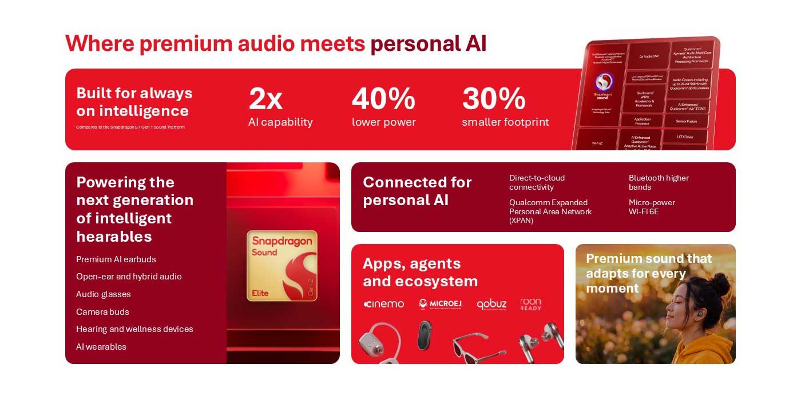

Qualcomm ha presentado **Snapdragon Sound Elite Gen 2**, una plataforma de audio pensada para auriculares y dispositivos ponibles que la compañía describe como su primera plataforma premium de audio diseñada específicamente para la IA personal. El anuncio, dado a conocer durante la cumbre Snapdragon Summit, pone el foco menos en la reproducción de sonido y más en la capacidad de procesar inteligencia artificial en el propio dispositivo, incluso en auriculares con cámara.

## Qué es Snapdragon Sound Elite Gen 2

El nuevo sistema en chip (SoC) está concebido para «hearables», el término que Qualcomm usa para los dispositivos ponibles de audio. Frente a la generación anterior, la compañía promete hasta el doble de rendimiento de IA en el propio dispositivo y una reducción del consumo energético de hasta el 40 %, una combinación que busca que los modelos de IA locales y en la nube exijan recargas menos frecuentes.

La plataforma mantiene las bases de la familia Snapdragon Sound: compatibilidad con los códecs aptX y con XPAN para mejorar la calidad de audio y el alcance del Bluetooth. A esto suma conectividad Wi-Fi 6E, lo que abre la puerta a que los fabricantes ofrezcan funciones de IA tanto a bordo como en la nube.

## ANC adaptativo: la IA puesta al servicio del sonido

Más allá de la potencia bruta, Qualcomm usa la IA para sostener la cancelación activa de ruido (ANC). Según explican desde la compañía, se trata de un sistema de ANC adaptativo que responde de forma continua a los cambios de ajuste, movimiento y ruido ambiental, de manera que mantiene la cancelación sin que el usuario tenga que tocar nada.

La promesa es una mejora en escenarios difíciles, como el ruido de baja frecuencia o los diseños abiertos, y una gestión más automática del salto entre cancelación de ruido y modo transparencia. Sarah McMurray, responsable de marketing de producto en Qualcomm, resumió la idea en una presentación recogida por TechRadar: «No se trata de poner un chatbot en tu oído, sino de crear dispositivos que entiendan lo que ocurre a tu alrededor».

## Auriculares con cámara y el debate de la privacidad

Qualcomm contempla entre los posibles usos los auriculares con cámara, capaces de reconocer el entorno. Esa posibilidad conecta con una discusión que ya afecta a las gafas inteligentes: cómo se captura y se procesa lo que ocurre alrededor del usuario. La compañía asegura que sus chips pueden detectar rostros para ofuscarlos sin necesidad de reconocerlos y que apuesta por el procesamiento en el dispositivo para reducir el intercambio de datos.

Ziad Asghar, vicepresidente sénior y director general de XR, Wearables e IA personal de Qualcomm, defendió ese enfoque y citó una encuesta propia según la cual hasta el 70 % de los usuarios quiere funciones avanzadas de IA en sus dispositivos ponibles. Aun así, la firma no ha anunciado ningún producto concreto que vaya a usar Snapdragon Sound Elite Gen 2, y Qualcomm no fabrica dispositivos de consumo: licencia su tecnología a terceros como Bose o Bowers & Wilkins.

## Qué cambia para el usuario

Por ahora, el anuncio no se traduce en un auricular concreto que se pueda comprar. Su efecto es indirecto: marca hacia dónde irán los próximos modelos de gama alta, con más IA local, cancelación de ruido que se ajusta sola y un formato —el de los auriculares con cámara— que todavía tiene que demostrar que la privacidad está bajo control. El portal ya ha analizado cómo se está gestionando ese asunto en el caso de las gafas inteligentes en [la cámara que vendió las gafas inteligentes y se ha vuelto su mayor problema](/noticias/smart-glasses-camera-privacy-opinion/). Quien siga la hoja de ruta de Qualcomm puede comparar esta plataforma con [los Snapdragon 8 Elite Gen 6 que la compañía presentó el día anterior](/noticias/qualcomm-snapdragon-8-elite-extreme-gen-6-oficial/).
