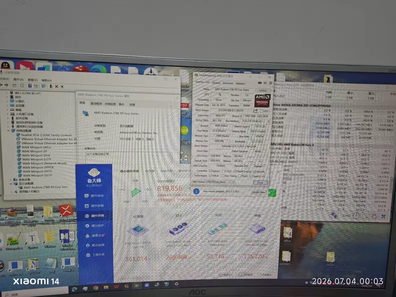
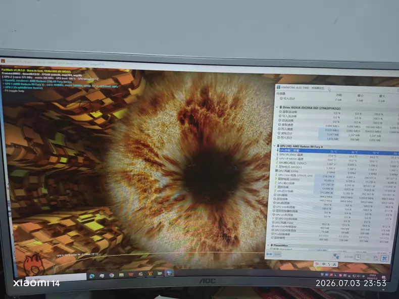

Un usuario ha comprado en el mercado de segunda mano una Radeon R9 Fury por unos 300 yuanes y la ha vuelto a poner a prueba. La tarjeta se lanzó en 2015, hace once años, y sigue siendo un objeto de culto por un motivo muy concreto: fue la primera tarjeta gráfica de consumo de la historia en incorporar memoria HBM, bajo el nombre en clave "Fiji". Su bus de memoria de 4096 bits multiplica por ocho el de la actual insignia de Nvidia, la RTX 5090, que se queda en 512 bits.

## 4096 bits: por qué la HBM sigue siendo especial

La clave no está en la frecuencia, sino en cómo se coloca la memoria. Gracias al apilado 3D de la HBM, los chips de memoria pueden empaquetarse directamente junto al núcleo de la GPU. Ese diseño no solo permitió alcanzar un ancho de banda de 512 GB/s, sino también ahorrar mucho espacio en la PCB, algo impensable con la memoria GDDR convencional de la época.

El contraste con su rival directa lo deja claro: la GTX 980, su competidora de entonces, se quedaba en un bus de 256 bits y, aun con memorias más rápidas, su ancho de banda apenas llegaba a la mitad del que ofrecía la Fury. Es una buena muestra de hasta qué punto la HBM fue un salto de arquitectura y no una simple mejora incremental.

## Rendimiento once años después

En una plataforma equipada con un procesador 9600X y memoria DDR5 a 6000 MHz, la unidad analizada —una Sapphire R9 Fury Nitro+— alcanza 4917 puntos en Time Spy. La cifra supera en torno a un 12 % a la GTX 980 de su misma generación y en un 13 % a la RX 580, una de las tarjetas más populares entre los jugadores de PC durante años. En la prueba de Master Lu, el resultado ronda los 260 000 puntos, señal de que la arquitectura GCN todavía conserva capacidad de cálculo.

El apartado térmico también sorprende: en la prueba de carga, el núcleo se mantiene como máximo en 59 °C. Eso sí, el TDP oficial es de 275 W, por lo que conviene contar con una fuente de alimentación solvente. El modelo analizado recurre a un disipador de tres ventiladores, cinco heat pipes de 8 mm y una base con cámara de vapor, además de un chasis de metal y un backplate de refuerzo. En conectividad ofrece un HDMI, tres DisplayPort y un DVI, con alimentación mediante dos conectores de 8 pines y un botón de cambio de BIOS en el lateral para alternar entre distintos límites de consumo.

## Lo que frena a esta reliquia

El problema no es el rendimiento, sino la supervivencia. Las cuatro pastillas de HBM de 1 GB ocupan una superficie minúscula y van integradas en el propio encapsulado, de modo que, si una falla, la tarjeta es prácticamente irrecuperable. Esa fragilidad explica que hoy queden muy pocas unidades en circulación. A ello se suma que AMD dejó de actualizar sus drivers en junio de 2022: algunos juegos nuevos avisan de que la versión del controlador es demasiado antigua.

Aun así, el usuario consigue mover *Cyberpunk 2077* a 1080p con calidad alta y más de cien fotogramas por segundo activando el modo de rendimiento de FSR y la generación de fotogramas. Para el lector hispanohablante, la historia es una mezcla de nostalgia y advertencia. La R9 Fury demostró hace una década que la HBM era el futuro de la memoria gráfica —hoy es la base de las GPU de centros de datos—, pero comprar una hoy por muy poco dinero implica asumir dos riesgos serios: la falta de soporte y la casi nula reparabilidad. Como pieza de colección o banco de pruebas tiene su encanto; como tarjeta principal, es una apuesta arriesgada.
