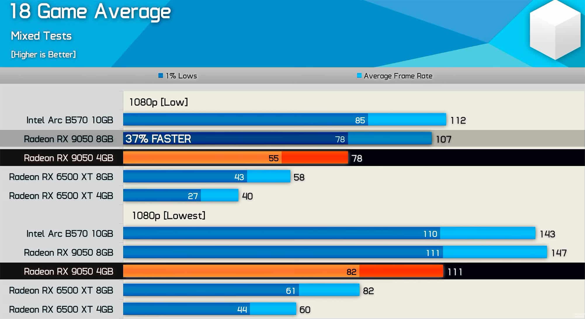
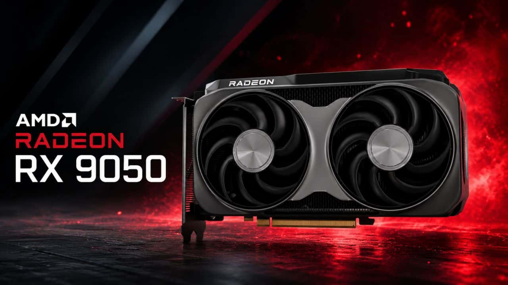
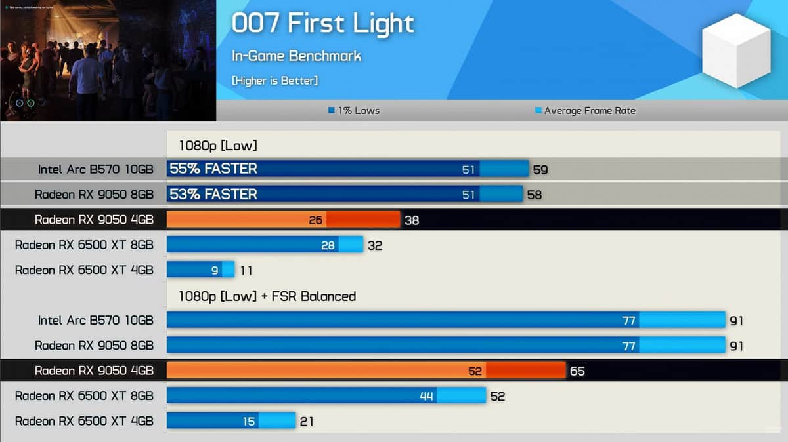
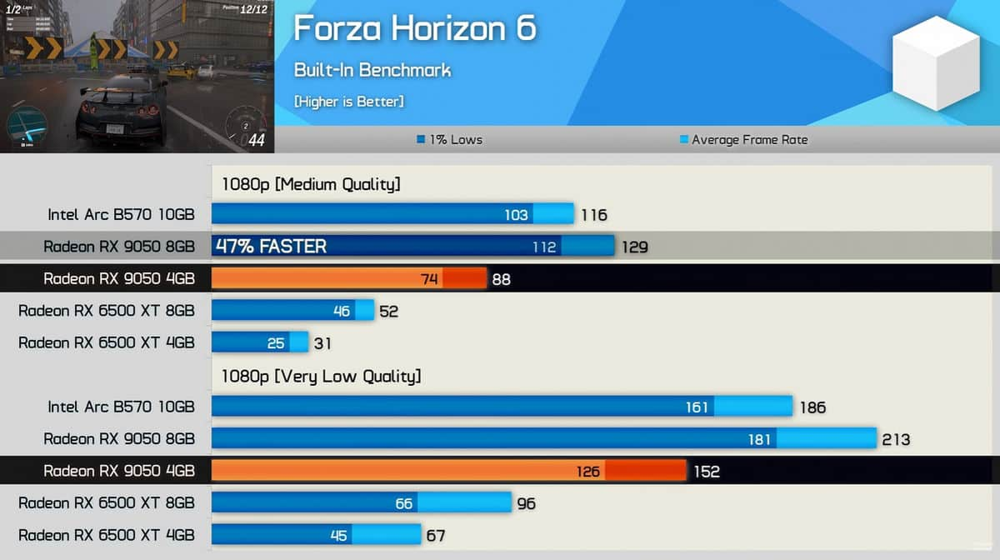

La AMD Radeon RX 9050 se lanzó en dos versiones con el mismo nombre y una diferencia de rendimiento que, hasta ahora, nadie había medido en público. El canal especializado Hardware Unboxed ha conseguido una unidad de la variante de 4 GB —exclusiva del mercado OEM, es decir, solo disponible dentro de equipos preensamblados— y la ha enfrentado a la de 8 GB en una batería de 18 juegos a 1080p. El resultado es una brecha que llega a superar el 50 % en los casos más extremos.

La comparación importa porque AMD no facilitó muestras de la versión de 4 GB a los medios ni a los creadores de contenido para que la analizaran, de modo que hasta ahora las reseñas publicadas de la RX 9050 correspondían casi siempre al modelo de 8 GB. Un comprador que buscara el nombre del producto podía dar por sentado que ambos comparten comportamiento, algo que las pruebas desmienten.

## Qué cambia además de la capacidad de memoria

Las dos tarjetas parten del mismo chip Navi 44, con 16 unidades de cómputo, 1.024 procesadores de flujo, 16 aceleradores de rayos, 32 aceleradores de IA, frecuencias de hasta 2.600 MHz y un consumo oficial idéntico de 92 W. La diferencia real aparece en el subsistema de memoria, y no se limita a recortar la VRAM a la mitad.

La RX 9050 de 8 GB usa GDDR6 a 18 Gbps con un bus de 128 bits, lo que arroja un ancho de banda de 288 GB/s. En la de 4 GB, AMD reduce la interfaz a 64 bits, con lo que el ancho de banda cae hasta los 144 GB/s, exactamente la mitad. A eso se suma que la Infinity Cache pasa de 32 MB a 16 MB. En la práctica, el subsistema completo queda recortado a la mitad, no solo la capacidad.

Esto explica por qué los 4 GB de VRAM se convierten en un lastre mayor de lo que sugiere la cifra. Los propios controladores de AMD reconocen que títulos como Cyberpunk 2077 recomiendan un mínimo de 6 GB de VRAM, y buena parte de los lanzamientos actuales pide entre 6 y 8 GB. La falta de memoria obliga a jugar con los ajustes gráficos al mínimo para mantener la fluidez.

## Hasta un 53 % de diferencia en títulos concretos

En el promedio de 18 juegos a 1080p con ajustes bajos, la RX 9050 de 4 GB se queda en 78 FPS de media y 55 FPS en los mínimos del 1 %, mientras que la de 8 GB alcanza 107 FPS de media y 78 FPS en los mínimos. En términos relativos, la versión de 8 GB rinde de media un 37 % más.

Las distancias se agrandan al mirar juegos exigentes. En 007 First Light, la de 4 GB registra 38 FPS frente a los 58 FPS de la de 8 GB: la variante de 8 GB rinde un 53 % más, lo que equivale a decir que la de 4 GB se queda un 35 % por debajo. En Forza Horizon 6 la brecha es de 88 FPS frente a 129 FPS, y en Assassin's Creed Black Flag Resynced, de 41 FPS frente a 60 FPS. En The Last of Us Part II la diferencia es algo menor, pero sigue siendo notable: 77 FPS frente a 101 FPS.

| Juego (1080p) | RX 9050 4 GB | RX 9050 8 GB |
| --- | --- | --- |
| 007 First Light (bajo) | 38 FPS | 58 FPS |
| Forza Horizon 6 | 88 FPS | 129 FPS |
| Assassin's Creed Black Flag Resynced | 41 FPS | 60 FPS |
| The Last of Us Part II | 77 FPS | 101 FPS |
| Promedio de 18 juegos (bajo) | 78 FPS | 107 FPS |

La posición de la tarjeta empeora si se amplía la mirada al resto de la gama de entrada. En la misma prueba a 1080p con ajustes bajos, una Intel Arc B570 alcanzó 112 FPS de media, alrededor de un 44 % más que los 78 FPS de la RX 9050 de 4 GB, e incluso por delante de la variante de 8 GB.

## Qué debe mirar el comprador

El problema de fondo no es técnico, sino de comunicación al consumidor. Al tratarse de un componente destinado a integradores de sistemas, la caja de un equipo preensamblado puede anunciar simplemente una «Radeon RX 9050» sin aclarar de qué versión se trata, pese a que el rendimiento difiere de forma sustancial. Por eso conviene revisar con atención las especificaciones de cualquier PC de gran superficie antes de comprarlo y confirmar si la gráfica monta 4 GB u 8 GB.

La buena noticia es que la variante de 4 GB no se vende por separado en tiendas, así que el riesgo se concentra en los equipos ya montados. Para quien arme su propio PC, la recomendación implícita es clara: hoy los 8 GB de VRAM son el punto de partida razonable para jugar, y un modelo con la mitad de memoria y la mitad de ancho de banda no debería venderse bajo la misma denominación que su hermano mayor.

