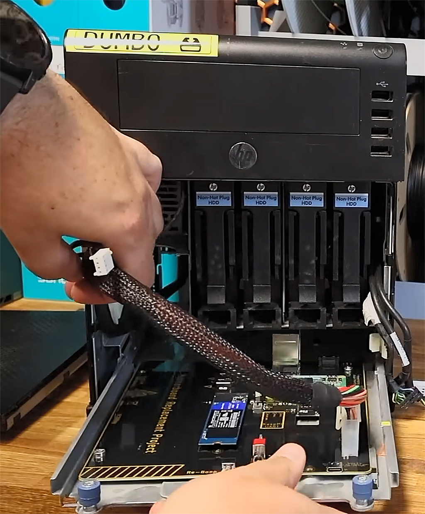

Reciclar un servidor antiguo suele chocar con un obstáculo difícil de salvar: cuando la placa base se queda demasiado atrás o falla, no hay repuesto razonable en el mercado. El creador de contenido EastMakes decidió esquivar ese problema y diseñó su propia placa base para un HP ProLiant N40L de unos 15 años, tomando como base un Raspberry Pi Compute Module 5 (CM5). El resultado conserva la caja original del equipo, añade una ranura NVMe y dos puertos USB 3.0, y funcionó en el primer intento.

## Un servidor que se quedó atrás

El HP ProLiant N40L es un micro-servidor de torre que, con 15 años a cuestas, arrastra limitaciones evidentes para el uso actual: no tiene ninguna ranura NVMe, sus puertos USB se quedan en la generación 2.0 y su consumo ya no resulta atractivo frente al de un equipo moderno. A eso se suma un procesador AMD Turion II integrado cuyo rendimiento queda muy por debajo del de cualquier placa actual, incluida una Raspberry Pi del mismo tamaño.

Deshacerse del equipo, sin embargo, supone tirar una caja, una fuente de alimentación y una bahía de discos que siguen siendo perfectamente utilizables. Ese fue el punto de partida del proyecto: conservar la carcasa y sustituir únicamente el cerebro.

## Una placa base propia a partir del Raspberry Pi CM5

El Compute Module 5 es, en esencia, una Raspberry Pi 5 sin puertos: está pensado para acoplarse a placas portadoras que aportan los conectores. El autor partió de la placa de E/S oficial, pero aprovechó que el proyecto Raspberry Pi publica sus diagramas y su documentación en abierto para elaborar su propia variante.

El nuevo diseño alarga la placa hasta ocupar la superficie de la original del N40L. Para acertar con la posición exacta de los conectores y de los agujeros de los tornillos, imprimió antes un prototipo de plástico en 3D. Después llegaron los ajustes: dejó un único puerto HDMI, agrupó el conector Ethernet con dos USB 3.0 de tipo A, añadió la ranura NVMe para el disco de sistema y cuidó la longitud de las pistas para que todas coincidieran y no aparecieran problemas de temporización.

Para el acabado recurrió al configurador personalizado de PCBWay y eligió un esquema amarillo sobre negro, además de incorporar los interruptores Boop y Reboop. También mantuvo el conector ATX de 24 pines original.

## Qué cambia para quien recicla hardware

La placa encajó en la caja del N40L y arrancó sin incidencias, y el autor comprobó además la velocidad de los puertos USB y de la conexión Ethernet. Quedó pendiente, eso sí, el puerto SFF-8087 que da servicio a la bahía de discos, de modo que el almacenamiento masivo del servidor original todavía tiene margen de mejora.

La historia encaja en una tendencia que se ha reforzado con el encarecimiento de la memoria: reutilizar el hardware que ya se tiene en lugar de comprar una plataforma nueva. En ese mismo terreno, [reciclar un portátil antiguo como servidor doméstico](/noticias/old-laptop-home-server/) es otra vía que gana adeptos cuando los precios de la RAM suben y las placas compactas dejan de ser la opción barata.
