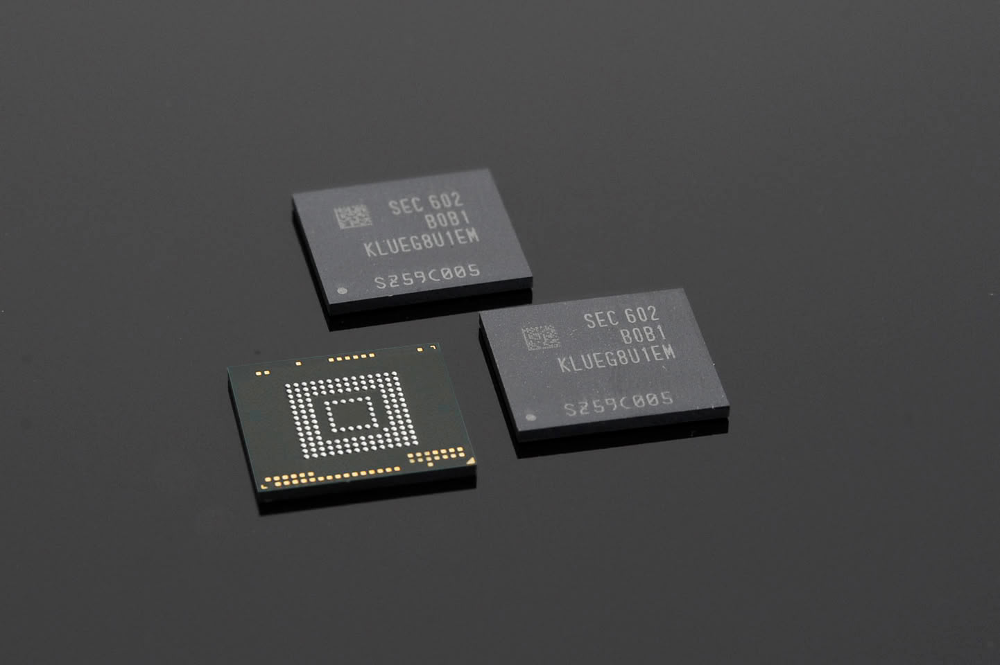

Raspberry Pi ha confirmado que sus placas quedan fijadas por firmware a la memoria que traen de fábrica, lo que cierra una vía muy popular entre los aficionados: ampliar la RAM soldando un chip de mayor capacidad. La confirmación llegó en el foro oficial de la compañía, de la mano de un ingeniero y moderador del foro, después de que un usuario intentara sin éxito que una Raspberry Pi reconociera una memoria de 4 GB recién soldada sobre un Compute Module 5. La respuesta fue recogida por TechPowerUp y Tom's Hardware.

## Una respuesta del foro oficial que zanja el debate

El encargado de aclararlo fue PhilE, ingeniero de Raspberry Pi y moderador de sus foros. Al hilo en el que un usuario contaba que su chip de 4 GB no aparecía tras el montaje, respondió que la compañía lleva tiempo «fijando los dispositivos a su tamaño de RAM original», en una traducción de sus palabras. El mensaje deja claro que no se trata de una limitación anecdótica: quien intente sustituir el chip por uno de otra capacidad se encontrará con que el sistema no lo reconoce.

La restricción **no es nueva ni responde a la actual escasez de memoria**. Los bloqueos por firmware empezaron a desplegarse en actualizaciones a finales de 2024, bastante antes de que los precios de la RAM se dispararan por la demanda de los centros de datos de inteligencia artificial. Tampoco alcanza solo a las ampliaciones: el firmware también graba otros atributos del dispositivo ligados a la pieza de memoria, de modo que incluso un cambio por otra del mismo tamaño puede no funcionar. El propio ingeniero lo resume con un consejo directo a quien piense en reparar o mejorar la memoria a mano: «no pierdas el tiempo intentándolo, no va a funcionar».

## Por qué Raspberry Pi bloquea la memoria

El motivo que esgrime la compañía es el fraude de algunos revendedores. Según explica el ingeniero en el hilo, el procedimiento consistía en comprar placas con poca memoria, sustituir el chip por otro de mayor capacidad «de origen dudoso» y revender el conjunto como si fuera un modelo de fábrica con más RAM. Como esas placas nunca pasaron por las pruebas de Raspberry Pi, los compradores acababan con un equipo poco fiable y las reclamaciones terminaban recayendo sobre el fabricante.

> Si la mano de obra es lo bastante barata, puede haber una ganancia económica menor en comprar una pieza de 2 GB, cambiarla por una de 8 GB de origen dudoso y revenderla como un dispositivo de 8 GB. Sin embargo, eso añade un riesgo para el usuario —la placa no la hemos probado nosotros— y supone una posible carga de soporte para nosotros. Por eso eliminamos el incentivo comercial fijando los dispositivos a su tamaño de RAM original.

Fijar cada placa a la memoria con la que salió de fábrica elimina ese incentivo: manipular el chip deja de tener sentido comercial si el sistema no lo va a reconocer. El problema, señala parte de la comunidad, es que el remedio también castiga al usuario legítimo que solo quería reparar una placa averiada o experimentar con su hardware.

## Qué cambia para quien compra o repara la memoria de su Raspberry Pi

Para el comprador, la lectura práctica es sencilla: **la memoria de una Raspberry Pi ya no es algo que se pueda ampliar después**. Si la idea es montar un servidor doméstico, un equipo de escritorio ligero o cualquier proyecto que gane con más RAM, conviene elegir de entrada el modelo con la capacidad necesaria, porque no habrá una segunda oportunidad soldando un chip más grande.

La reparación también se complica. Cambiar un chip de memoria dañado por otro de idéntica capacidad puede no bastar si el firmware no reconoce los atributos de la nueva pieza, así que la sustitución de la RAM deja de ser una vía realista para alargar la vida de una placa averiada. En la práctica, el taller de barrio pierde una de sus bazas habituales y el reemplazo pasa por adquirir una unidad nueva.

La comunidad no ha recibido la medida con entusiasmo. Voces conocidas del ecosistema Raspberry Pi han propuesto alternativas menos drásticas, como un «bit de garantía» o una marca de firmware que anule el soporte en las placas modificadas pero deje hacer al usuario, en lugar de bloquear el hardware de raíz. Es un equilibrio incómodo para una compañía que construyó su reputación sobre la idea de un ordenador barato y manipulable: cuanto más se cierra la puerta al *tinker*, más se parecen sus placas a las de fabricantes que siempre fueron menos flexibles.

La noticia llega además en un contexto de precios de memoria al alza, lo que hace más tentador reciclar o ampliar lo que ya se tiene. En ese terreno, [una placa casera para revivir un servidor antiguo con un Compute Module 5](/noticias/raspberry-pi-cm5-server-motherboard/) muestra el tipo de proyecto que la comunidad sí puede seguir acometiendo, siempre que la memoria venga ya decidida de fábrica.

