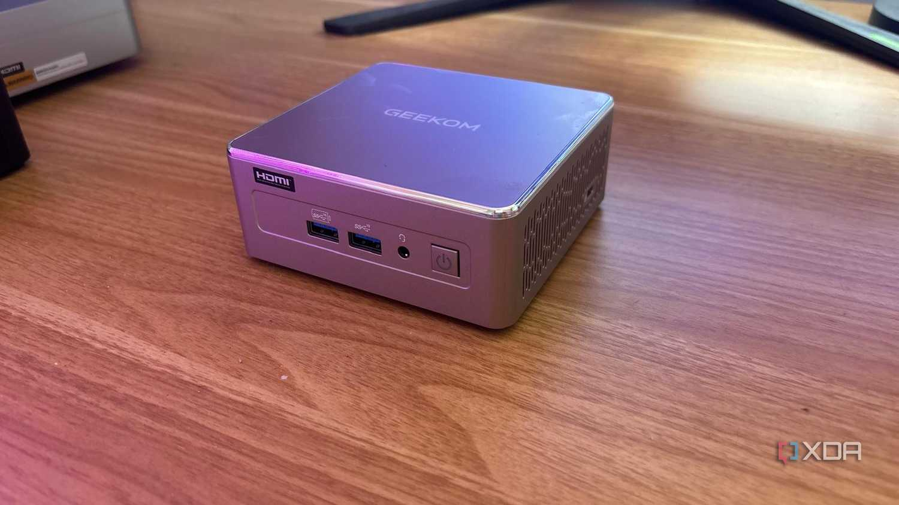
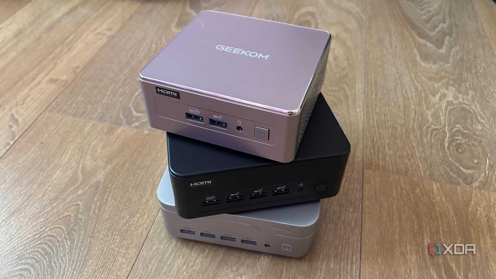

Muchos aficionados empiezan con una Raspberry Pi con la idea de montar un clúster, una nube doméstica o la automatización del hogar, pero al escalar —varios contenedores Docker, compilaciones pesadas o transcodificación de medios con Plex— el almacenamiento se convierte en un muro. Según un análisis de XDA Developers, el cuello de botella del almacenamiento de la Raspberry Pi es peor de lo que parece, y la salida pasa por cambiar a un mini PC con NVMe nativo.

## El almacenamiento, el punto débil de la Raspberry Pi como servidor

Las placas de Raspberry Pi dependen de tarjetas microSD o de puentes PCIe/USB de un solo carril para el almacenamiento. Bajo cargas con escrituras intensas de base de datos, como Home Assistant o la indexación en segundo plano de Immich, los IOPS se desploman, lo que deriva en tarjetas corruptas y tiempos de respuesta lentos, describe el análisis.

Al problema técnico se suma el económico: el llamado coste oculto de la Raspberry Pi. Fuente de alimentación oficial, adaptadores micro HDMI, carcasas metálicas y tarjetas microSD A2 de gama alta pueden elevar una placa de 35 dólares hasta acercarla a cientos de dólares. A ello se añade la limitación térmica bajo carga sostenida, que recorta el rendimiento justo cuando el servidor doméstico más lo necesita.

## Por qué un mini PC rinde más en el laboratorio doméstico

El salto a un mini PC aporta almacenamiento NVMe nativo, más margen de memoria RAM y arquitectura x86 de serie. Esto último tiene una consecuencia práctica: desaparece la búsqueda de variantes ARM64 de imágenes Docker y los errores de compilación de utilidades autoalojadas poco comunes, según el análisis.

Para comprobarlo, la autora probó tres equipos de perfiles distintos. El GEEKOM A5 2027, con un AMD Ryzen 5 7430U de 6 núcleos y 12 hilos y un perfil de consumo en reposo de entre 15 y 25 W, se presenta como el punto dulce de precio y rendimiento para pilas Docker con varios contenedores, Home Assistant y servidores multimedia ligeros, aunque se queda corto en IA local. El GEEKOM IT13 Max, con un Intel Core Ultra 9 185H de 16 núcleos y 22 hilos, doble puerto de red de 2,5 GbE y Wi-Fi 7, apunta a usuarios exigentes con virtualización intensiva, transcodificación 4K de Plex y entornos de desarrollo. El VZMORE AX9 Max, con un AMD Ryzen AI 9 HX 470 de arquitectura Zen 5 y una NPU de hasta 55 TOPS, está orientado a inteligencia local en el borde: modelos de lenguaje con Ollama o LM Studio, videovigilancia con Frigate y flujos de trabajo de agentes, a cambio de un precio sensiblemente mayor.

## Cuándo sigue teniendo sentido la Raspberry Pi

El análisis no propone jubilar la placa en todos los casos. La Raspberry Pi sigue siendo la opción adecuada para computación física, prototipado de sensores por GPIO, controladores de iluminación LED o rastreadores de red remotos de bajo consumo, donde el tamaño y los pines de conexión mandan.

La recomendación práctica para saber si conviene el cambio es auditar los cuellos de botella actuales: revisar la carga media de CPU y los tiempos de espera de E/S en Home Assistant para localizar dónde se atasca la placa. Y la migración puede ser directa: exportar los archivos Docker Compose y levantar Proxmox o un Linux limpio en el nuevo mini PC para redesplegar los contenedores. Para quien use la Pi como servidor doméstico central —Home Assistant, Plex o Jellyfin, Immich o servicios de red 24/7—, el mini PC ofrece rendimiento de servidor real en un formato apenas mayor que una baraja de cartas, concluye XDA Developers.
