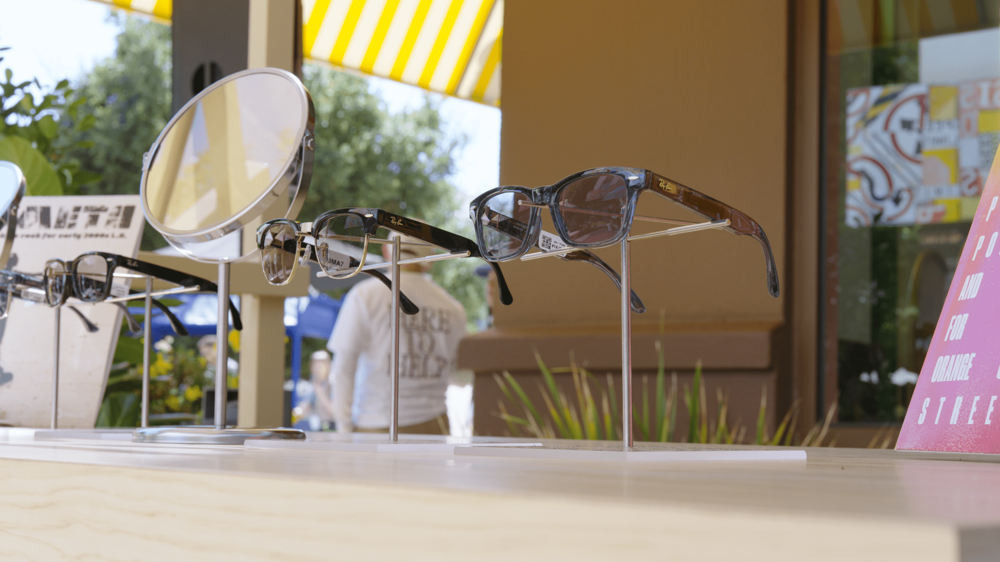
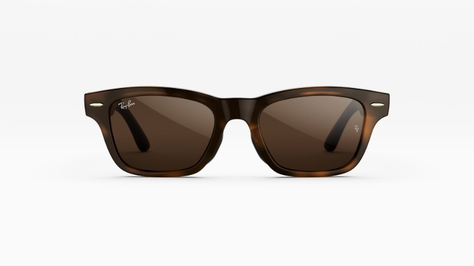
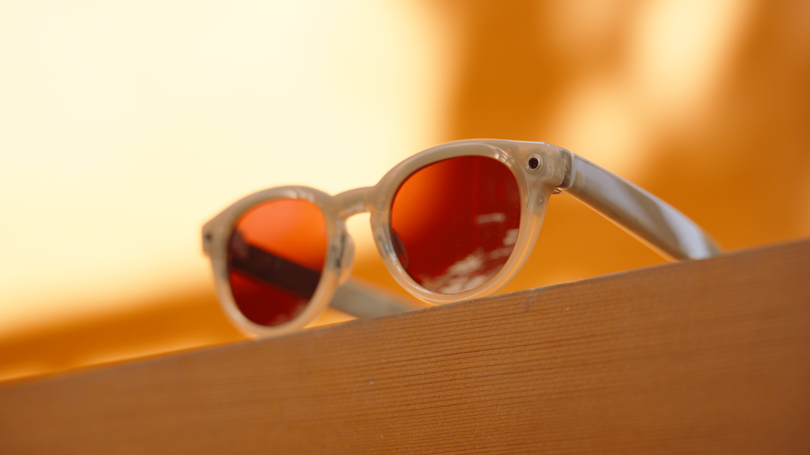
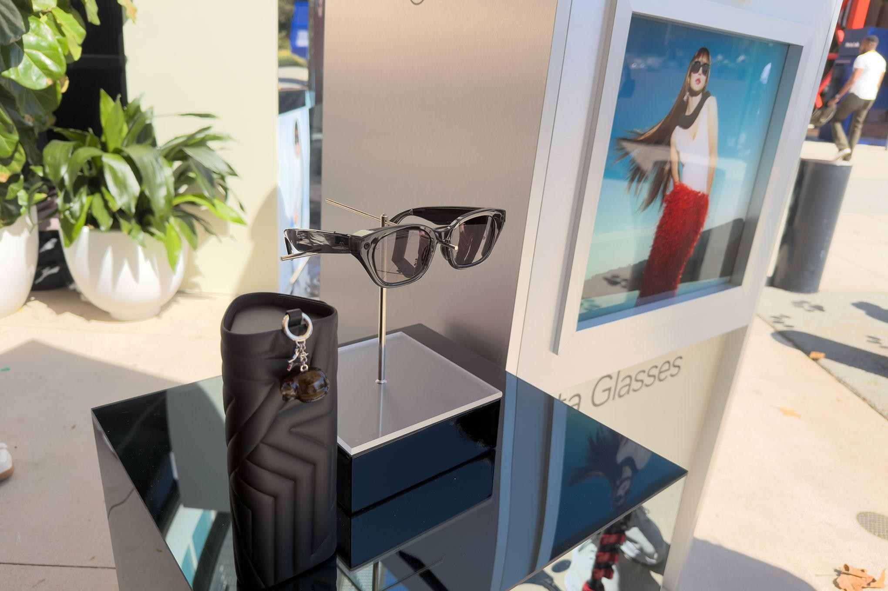

Meta ha presentado en su evento Meta Connect 2026 las **Ray-Ban Meta Audio**, las primeras gafas inteligentes de la compañía que renuncian por completo a la cámara. El anuncio llega después de un verano marcado por el rechazo público a las gafas con sensor de imagen, y Meta insiste en que la decisión no responde a esa polémica, sino a que el audio siempre ha sido la función más utilizada de sus gafas. Saldrán a la venta el 13 de octubre con un precio de partida de 349 dólares.

## Qué son las Ray-Ban Meta Audio

Según la toma de contacto de The Verge, al eliminar la cámara Meta pudo rediseñar la montura. El modelo arranca en 43 gramos, por debajo de los 49,2 gramos de las Ray-Ban Meta Optics y de los 69 gramos de las Meta Ray-Ban Display, y sus patillas son más finas. Se ofrecen en dos estilos — la retro *Clubmaster* y la rectangular *Burbank* — con 23 combinaciones de color y lente, además de ajustes como patillas extensibles, varillas regulables y almohadillas nasales intercambiables, los mismos que ya empleaba la línea Optics. Meta afirma que admiten una amplia gama de graduaciones.

El repertorio de funciones es deliberadamente corto: interactuar con Meta AI, responder mensajes con la voz, hacer llamadas y reproducir música o pódcast sin aislar al usuario de su entorno. No hay grabación posible. Alex Himel, vicepresidente de wearables de Meta, lo resume así: "No graban. Lo único que hacen, igual que un dispositivo Alexa en casa, es escuchar una palabra de activación concreta". La batería es otro de los puntos fuertes: Meta estima 12 horas de uso por carga y 48 horas adicionales gracias al estuche de carga.

## Privacidad: el apodo que Meta no menciona

El lanzamiento se produce en plena oleada de restricciones. Las gafas con cámara han sido vetadas en oficinas, locales, piscinas, gimnasios, tribunales y escuelas, y el apodo despectivo "pervert glasses" se ha popularizado en el debate público. No es una sorpresa: ya adelantamos que Meta preparaba [una gama sin cámara](/noticias/meta-smart-glasses-without-camera/) para esquivar esa polémica.

Meta no vinculó en ningún momento el nuevo modelo a esas críticas. Sí anunció dos cambios menores en privacidad: llevará a los wearables su sistema de "procesamiento privado", ya usado en WhatsApp, y permitirá desactivar el uso de datos visuales para entrenar inteligencia artificial, aunque las consultas de audio seguirán empleándose con ese fin. El propio Himel reconoce que ese procesamiento privado protege sobre todo los datos de quien lleva las gafas, no los de las personas que tiene delante. Ninguna de las dos medidas ataca la preocupación central, la grabación encubierta en espacios públicos. Para entender el contexto, sirven nuestro repaso de [la expansión de las prohibiciones en Australia](/noticias/australia-smart-glasses-ban-expansion/) y el análisis de [por qué la cámara se ha vuelto un lastre](/noticias/smart-glasses-camera-privacy-opinion/).

## Qué cambia para el comprador

Para quien dudaba de comprarse unas gafas inteligentes por culpa de la cámara, las Meta Audio son la propuesta más discreta del catálogo: pesan menos, parecen gafas normales y cuestan 349 dólares (319 libras / 529 dólares australianos), 30 dólares menos que las Ray-Ban Meta Gen 2 del año pasado. El precio incluye una mejora de audio con soporte de Dolby Atmos, que según TechRadar permite a los micrófonos captar mejor el sonido envolvente y a los altavoces reproducirlo con más inmersión.

El sacrificio es evidente: sin cámara, la inteligencia artificial no recibe contexto visual, así que funciones como traducir un cartel o describir lo que se tiene delante quedan fuera. Meta sigue vendiendo, en paralelo, sus modelos con cámara.

## Más opciones en el mismo catálogo

Meta no ha abandonado la cámara. En el mismo evento presentó las Ray-Ban Meta Gen 3, con un sexto micrófono, nueve horas de batería, Dolby Atmos y un precio de partida de 449 dólares, por encima de los 379 del año anterior. También amplió la línea Meta Glasses con dos estilos nuevos, Capri y Nova, y ediciones con la cantante Lisa, de Blackpink, y con Kylie Jenner, ambas a 399 dólares. Según la compañía, a finales de año superará las 100 versiones distintas de gafas.

