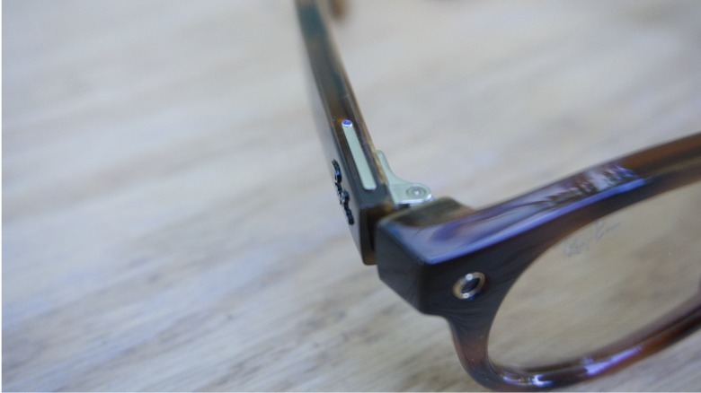

Meta ha presentado en su evento Meta Connect las Ray-Ban Meta Gen 3, la tercera generación de sus gafas inteligentes con cámara. La compañía promete hasta nueve horas de autonomía, un diseño más fino y un total de seis micrófonos, pero también un precio de salida más alto: desde 449 dólares en Estados Unidos.

## Ray-Ban Meta Gen 3: más batería, más micrófonos y un diseño más fino

El cambio más importante no se ve a simple vista. Según Meta, las Gen 3 alcanzan las nueve horas de uso, una hora más que la generación anterior, y mantienen la funda de carga para recargarlas sobre la marcha. La firma también añade un micrófono más hasta sumar seis, un ajuste que, asegura, ayuda a reducir el ruido de fondo para que el asistente o la persona al otro lado de una llamada escuchen con más claridad.

En el plano del diseño, la montura es más ligera y delgada, e incorpora el botón de acción programable que ya aparecía en la línea de gafas con graduación, personalizable para lanzar un comando de Meta AI, activar el modo de captura o cualquier otra función. Las varillas ajustables heredadas de esas mismas gafas buscan además mejorar el ajuste.

La cámara se mantiene: fotos de 12 megapíxeles y vídeo en 3K, con soporte de Dolby Atmos y sonido espacial en las grabaciones, además de un modo de foto dinámica que captura varias tomas para elegir la mejor. La grabación en horizontal, una petición recurrente, llegará más adelante y se extenderá también a modelos anteriores.

## Tres monturas nuevas y hasta 27 combinaciones

La tercera generación debuta con tres estilos de montura: la aviador, la angular Zena y una versión renovada de la clásica Wayfarer. Contando colores y tipos de lente, la firma ofrece 27 combinaciones, con opción de lentes graduadas o transitions por un coste adicional. Es una apuesta por ampliar el catálogo: Meta sostiene que, sumando sus distintas líneas, superará los 100 estilos y variaciones de color antes de que termine el año.

## Precio más alto y dudas de privacidad que siguen ahí

El otro titular de la generación es el precio. Las Ray-Ban Meta Gen 3 arrancan en 449 dólares en Estados Unidos, una subida respecto a las anteriores, y la compañía aún trabaja en confirmar las tarifas para Reino Unido y Australia. Es un movimiento que tensiona la propuesta: las gafas inteligentes siguen ganando popularidad, pero cada vez cuesta más justificar el desembolso a medida que sube el precio.

A la pregunta por la privacidad, Meta insiste en su anillo LED, que se ilumina cuando se graba y que la empresa ha protegido con nuevas trabas contra quienes intentan desactivarlo o taparlo. Aun así, las dudas persisten y han acompañado a toda la categoría: el recelo hacia las cámaras llevó a Meta a lanzar en paralelo unas Ray-Ban Meta Audio sin cámara, y es el eje de nuestra reflexión sobre [por qué la cámara que vendió estas gafas se ha vuelto su mayor problema](/noticias/smart-glasses-camera-privacy-opinion/).

Las Gen 3 ya se pueden reservar en la tienda de Meta, en Ray-Ban y en otros distribuidores autorizados. El desembolso, en cualquier caso, ya no es el de unas gafas al uso.
