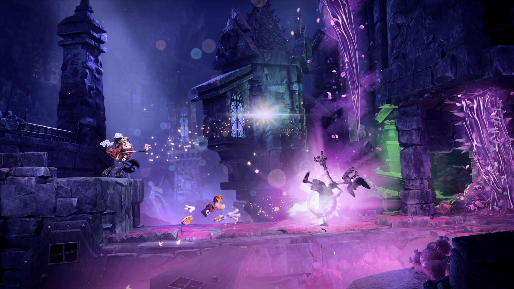

**Rayman Legends Retold** ya tiene requisitos para PC, y la ficha publicada por Ubisoft deja una cifra que ha llamado la atención: alcanzar los **4K a 60 fps** en calidad Ultra exige una **GeForce RTX 4080** o una **Radeon RX 7900 XTX**. La exigencia resulta llamativa porque el mismo título también llegará a **Nintendo Switch 2**, una consola con una capacidad gráfica muy inferior a la de esas tarjetas de gama alta.

## Qué pide Rayman Legends Retold en PC

La tabla oficial se divide en varios escalones y, en todos ellos, el reescalado debe fijarse en modo **Calidad** (DLSS, FSR o XeSS). El procesador y la memoria se mantienen razonables; el salto está en la tarjeta gráfica, que pasa de una GTX 1660 en el mínimo a una RTX 4080 en la cúspide.

| Escalón | Resolución y preset | Procesador | Tarjeta gráfica | Memoria |
| --- | --- | --- | --- | --- |
| Mínimo | 1080p / 60 fps / Bajo | Intel Core i3-8100 o AMD Ryzen 3 3100 | GeForce GTX 1660 (6 GB), Radeon RX 5500 XT (4 GB) o Intel Arc A580 (8 GB) | 8 GB |
| 2K | 1440p / 60 fps / Alto | Intel Core i5-8400 o AMD Ryzen 5 3600 | GeForce RTX 3070 (8 GB), Radeon RX 6750 XT (12 GB) o Intel Arc B580 (12 GB) | 16 GB |
| 4K | 2160p / 60 fps / Ultra | Intel Core i5-9400 o AMD Ryzen 5 3600 | GeForce RTX 4080 (16 GB) o Radeon RX 7900 XTX (24 GB) | 16 GB |

En el resto de apartados la ficha es modesta: **33 GB** de espacio libre en un SSD, Windows 10 de 64 bits para el mínimo y Windows 11 de 64 bits a partir de ahí. La memoria, además, debe montarse en configuración de doble canal.

## Por qué chirrían estas cifras

Lo que desentona no es el procesador —un veterano Core i5 de novena generación basta para 4K— sino la tarjeta gráfica. Pasar de una RTX 3070 en 1440p a una RTX 4080 en 4K es un salto enorme para un juego de plataformas en 2D, y la comparación con la versión de Switch 2 lo hace aún más visible. El propio medio que dio a conocer la tabla, **Wccftech**, interpreta que es el **trazado de rayos** el que está detrás de esas exigencias tan altas, y señala que podrían revisarse antes del lanzamiento que la propia Wccftech sitúa en diciembre, después de un retraso desde principios de octubre.

El contraste con otras versiones es notable. Según explicó a VGC **Fabien Delpiano**, asesor técnico de Ubisoft Montpellier (recogido por Wccftech), la versión de Switch 2 busca **60 fps con trazado de rayos** en todas las plataformas, con salida a **4K en modo dock** y 1080p en portátil, apoyándose en DLSS y bajando resolución cuando hace falta. Es decir, la misma tecnología que encarece la ficha de PC se está ejecutando en una consola híbrida.

El caso recuerda, por oposición, a otros lanzamientos recientes. Títulos como [Gears of War: E-Day](/noticias/gears-of-war-e-day-pc-requirements/) también exigen trazado de rayos por hardware, pero se conforman con una RTX 5070 Ti para 4K, mientras que juegos mucho más pesados como [Control Resonant](/noticias/control-resonance-rtx-5090-4k/) sí exprimen la gama alta sin discusión. Rayman Legends Retold no parece estar en la liga de ninguno de los dos.

## Qué cambia para el jugador de PC

- **4K queda fuera del alcance de la gama media.** Con una RTX 3070 o similar, el objetivo sensato es 1440p; quien aspire a 2160p a 60 fps tendrá que plantearse una RTX 4080, una RX 7900 XTX o una solución de gama alta equivalente.
- **El trazado de rayos parece ser la clave.** Si la optimización evoluciona antes del estreno, es probable que las recomendaciones bajen, pero conviene prepararse para una carga gráfica por encima de lo habitual en un plataformas 2D.
- **La ficha todavía puede cambiar.** La propia cobertura apunta a que Ubisoft ajuste las cifras antes de la fecha de lanzamiento prevista, algo frecuente cuando un juego goza de más tiempo de pulido.
