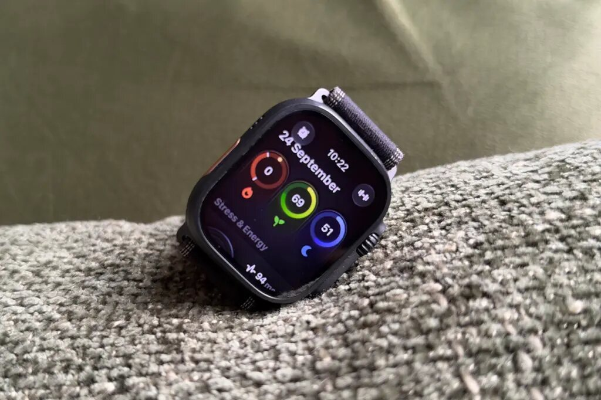
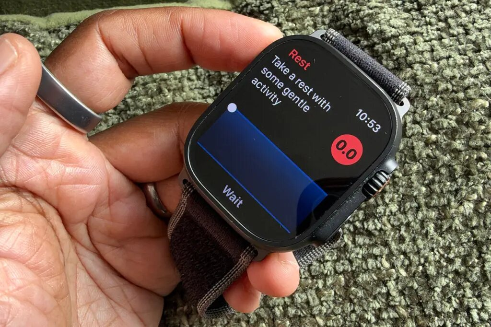
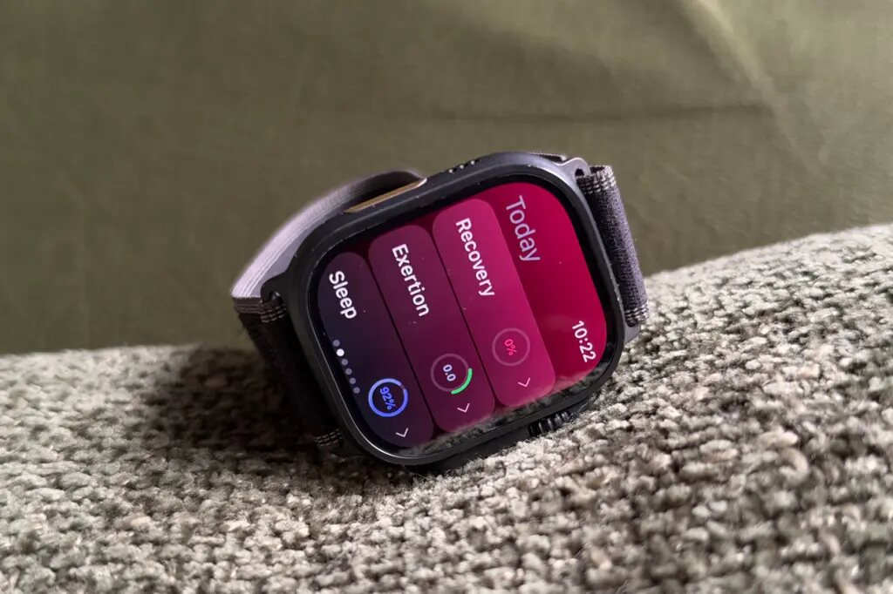
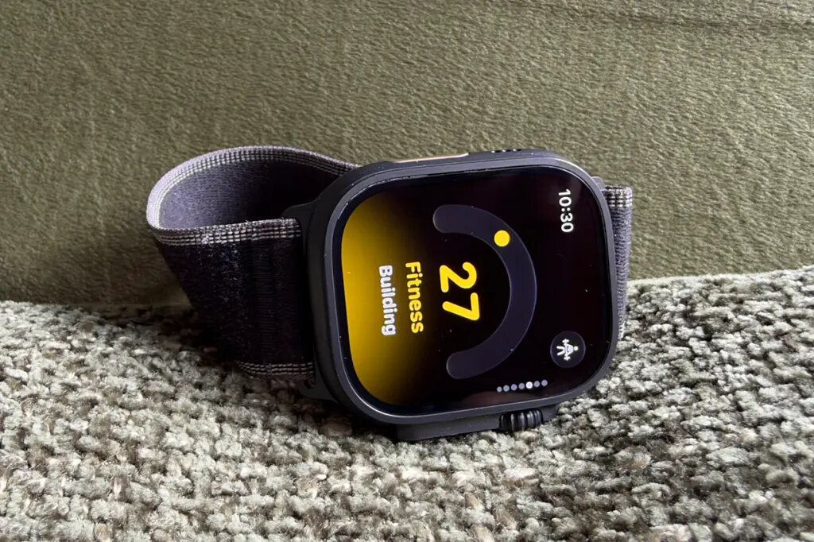

Apple reservó su puntuación de Readiness para el Watch Series 12 y el Ultra 4, ligada a su nuevo sistema de sensores de salud. Si tienes un modelo anterior y no piensas renovarlo, esta guía es para ti: explica cómo conseguir una puntuación de readiness equivalente cada mañana con cuatro apps compatibles con relojes antiguos. Todas son gratuitas, aunque la mayoría ofrece suscripciones opcionales dentro de la app.

## Requisitos previos

- Un Apple Watch anterior al Series 12 o al Ultra 4, enlazado con tu iPhone.
- La app Salud de Apple con permiso para compartir tus datos con apps de terceros.
- Llevar el reloj puesto por la noche: las puntuaciones necesitan datos de sueño y de frecuencia cardiaca para calcularse.
- Conexión a internet para descargar las apps desde la App Store.

## Paso 1: instala Bevel y revisa tu recuperación

[Bevel](https://apps.apple.com/us/app/bevel-ai-health-coach/id6456176249) sincroniza los datos de salud y actividad de varios dispositivos, incluido el Apple Watch, y los resume en tres bloques: carga sobre el cuerpo, recuperación y sueño.

1. Descarga Bevel desde la App Store e inicia sesión.
2. Conecta o sincroniza tus datos de salud y actividad, incluidos los del Apple Watch.
3. Abre el bloque de estado de recuperación: funciona de forma parecida a la puntuación de Apple, ya que combina la variabilidad de la frecuencia cardiaca y la frecuencia cardiaca en reposo con otras métricas para calcular tu porcentaje de recuperación.
4. Lee el consejo de entrenamiento que acompaña a la puntuación: indica si tu recuperación ha sido buena o mala.

No hace falta pagar para obtener esta información: el plan de pago añade sobre todo el acceso a un entrenador con IA, prescindible si solo buscas la puntuación de readiness.

## Paso 2: calcula tu disposición a entrenar con Training Today

Training Today es una app muy orientada al ejercicio que calcula el RTT (Readiness to Train, disposición a entrenar) a partir de las mediciones de variabilidad de la frecuencia cardiaca.

1. Descarga Training Today desde la App Store.
2. Durante la configuración, autoriza el acceso a las métricas clave de frecuencia cardiaca: sin ese permiso no verás las puntuaciones RTT.
3. Registra también tus datos de sueño junto a los de frecuencia cardiaca; la app ajusta la puntuación según tu deuda de sueño acumulada si no llegas a las 8 horas recomendadas.
4. Si quieres, lleva la recomendación de intensidad de entrenamiento a la esfera como complicación.

La suscripción opcional añade gráficos de tendencias, el historial de puntuaciones RTT y un widget dedicado para la pantalla de inicio del iPhone.

## Paso 3: consulta tu porcentaje de recuperación con Athlytic

[Athlytic](https://apps.apple.com/app/athlytic-fitness-recovery/id1543571755) usa datos muy parecidos a los de Apple: variabilidad de la frecuencia cardiaca, frecuencia cardiaca en reposo, calidad del sueño e historial de entrenamientos.

1. Descarga Athlytic desde la App Store.
2. Conecta la app con Apple Salud para que pueda leer tus métricas.
3. Consulta cada mañana tu porcentaje de recuperación junto con el consejo de recuperación que lo acompaña.
4. Usa la app del iPhone, con una presentación muy visual, para ver si tus datos de recuperación mejoran y qué los está impulsando.

El acceso es de pago, pero puedes probarlo gratis durante una semana antes de decidir si es la app con la que te quedas.

## Paso 4: obtén tu puntuación de readiness sobre 100 con Incredible

[Incredible](https://apps.apple.com/app/incredible-readiness-hrv/id6761727962) lee y analiza tus datos de Apple Salud con una app centrada en widgets que pone la puntuación de readiness en primer plano.

1. Descarga Incredible desde la App Store y permite el acceso a tus datos de Apple Salud.
2. Mira tu puntuación de readiness, expresada sobre 100 (Apple usa una escala de 1 a 10).
3. Profundiza en el detalle para ver qué está mejorando tu puntuación y qué la está bajando.
4. Revisa el desglose de constantes como la temperatura y la frecuencia cardiaca en reposo, y compáralo con los totales del día anterior.
5. Si quieres, activa el entrenador opcional o registra entrenamientos de planes de entrenamiento, cuyos datos se envían directamente a la app.

Su tono es amable para principiantes, útil si las estadísticas del reloj te resultan abrumadoras. Si dudas entre renovar el reloj o no, también puedes consultar [la guía para decidir si conviene actualizar al Ultra 4](/noticias/apple-watch-ultra-2-vs-ultra-4-guide/).

## Cómo verificar que funcionó

A la mañana siguiente, abre la app elegida: deberías ver una puntuación de recuperación o readiness calculada con los datos de sueño y frecuencia cardiaca de la noche. Si aparece vacía, comprueba que el reloj registró el sueño y que la app tiene permiso para leer Apple Salud. Repite un par de días para confirmar que la cifra se actualiza a diario.

## Advertencias

- Todas las apps son gratuitas con compras opcionales dentro de la app; algunas funciones avanzadas (entrenador IA, gráficos de tendencias, la propia Athlytic tras la prueba) requieren suscripción.
- Ninguna de estas apps reproduce el algoritmo nativo de Apple: cada una calcula su propia puntuación con sus propios criterios.
- Las puntuaciones orientan, no diagnostican: [un análisis de la evidencia científica](/noticias/wearable-readiness-scores-evidence-gap/) recuerda que aún no está probado que seguir estos consejos mejore la salud.
- Lleva el reloj bien ajustado por la noche: sin datos de sueño y de frecuencia cardiaca fiables, la puntuación pierde sentido.
