Realme puso a la venta en India la **Realme 16 Pro 5G Harry Potter Edition** y los **Buds T500 Pro Harry Potter Edition**, los dos productos nacidos de su colaboración con Warner Bros, y ambos se agotaron en la tienda online de la compañía en menos de 24 horas desde su lanzamiento. La firma los había presentado apenas unos días antes y el stock disponible desapareció en cuestión de horas.

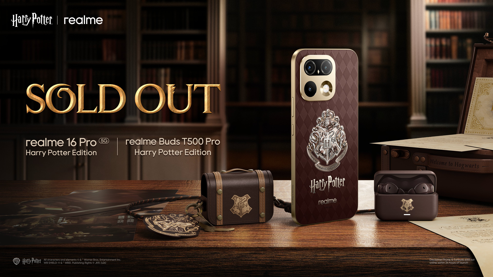

El agotamiento afecta por igual al teléfono y a los auriculares. Quien quiera hacerse con alguno de los dos tendrá que buscar suerte en tiendas físicas y confiar en que quede alguna unidad en el mostrador. No es un patrón aislado de demanda alta en un lanzamiento: a mediados de septiembre el iPhone 18 Pro también repartió [30.000 unidades en su primera hora de venta en China](/noticias/iphone-18-pro-china-first-hour-sales/), aunque allí la cifra correspondía a un solo distribuidor y a un mercado mucho mayor.

## Qué hace especial a la Realme 16 Pro Harry Potter Edition

La edición se apoya en un acabado muy reconocible: un panel trasero marrón con textura que imita el cuero y un patrón de rombos inspirado en el ajedrez mágico de las películas. El marco y la isla de cámaras van rematados en dorado, un contraste que le da un aire claramente Gryffindor.

El detalle estrella es el escudo de Hogwarts del dorso, con relieve y profundidad. Realme lo presenta como la primera trasera con cambio de color «quadra light sensing» del mundo: al recibir luz ultravioleta, el escudo muestra a la vez los colores de las cuatro casas. El efecto es gradual, de modo que con luz fuerte gana intensidad y en interiores se ve apagado o gris.

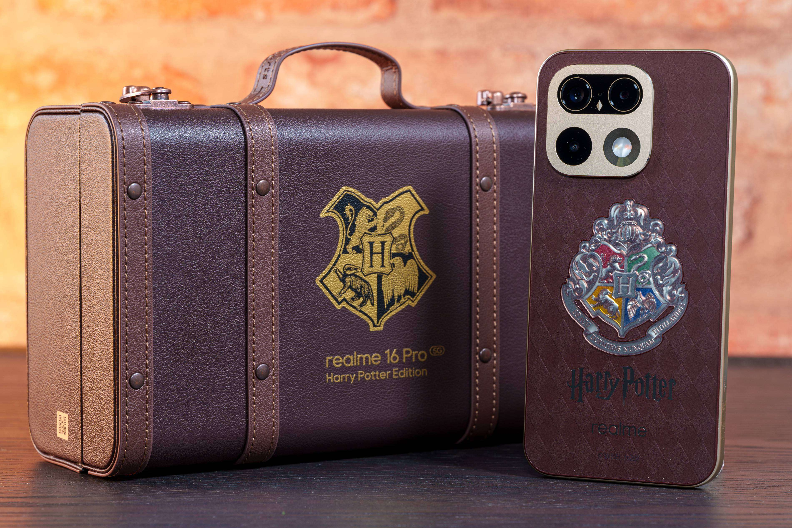

La isla de cámaras guarda otro guiño: un pequeño rombo dorado entre los dos objetivos principales que, visto con atención, dibuja una lechuza inspirada en Hedwig.

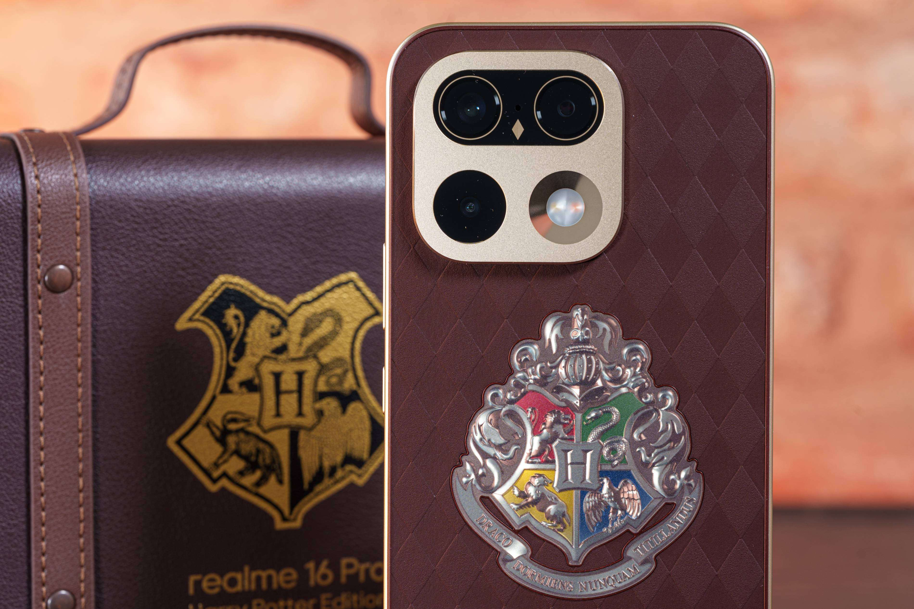

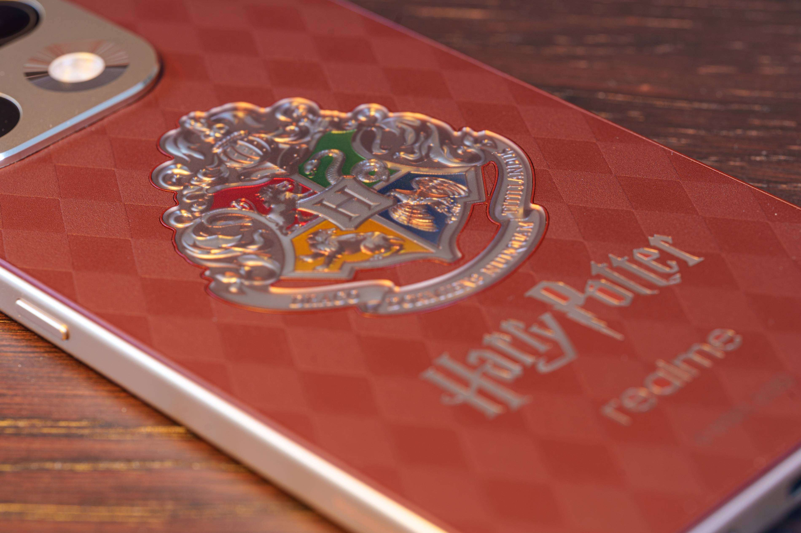

La personalización llega también al sistema: el castillo de Hogwarts es el fondo de pantalla, hay más de 30 iconos propios y hasta animaciones personalizadas, como un arranque con ambientación de la saga y una animación de huella que imita el sello de lacre de una carta. Fuera de la pantalla de inicio, eso sí, se vuelve a la Realme UI 7.0 basada en Android 16.

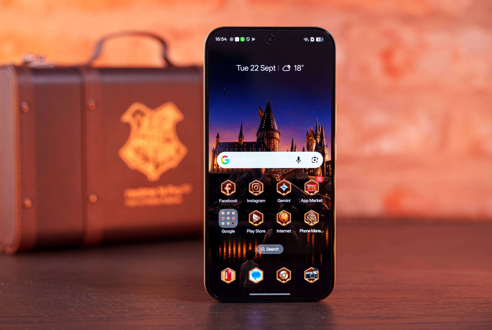

## Un unboxing con la maleta de Hogwarts

El packaging es tan parte del producto como el propio teléfono. Todo llega dentro de una pequeña maleta de la escuela de Hogwarts, junto al teléfono, un cargador de 80 W, un cable USB, una funda, una carta de invitación a Hogwarts, marcapáginas de las cuatro casas —Slytherin, Ravenclaw, Hufflepuff y Gryffindor— y varios folletos de la primera película.

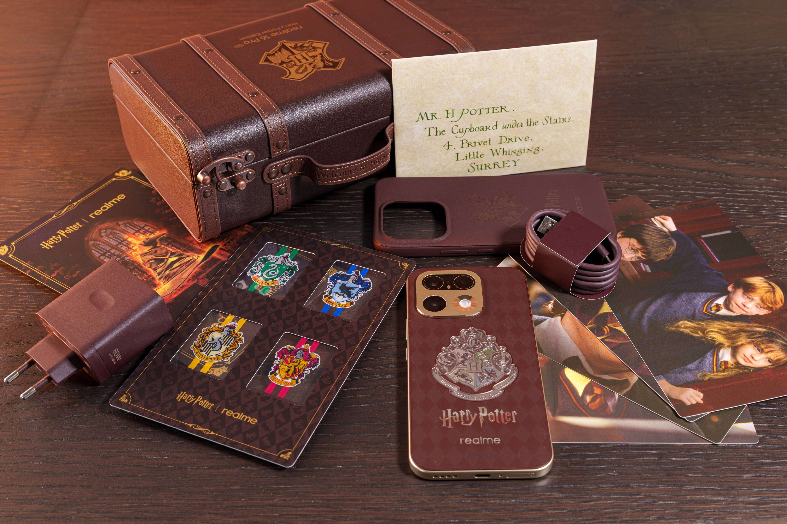

La funda, aunque tapa el acabado del teléfono, está bien coordinada en color y conserva el escudo de Hogwarts en el centro.

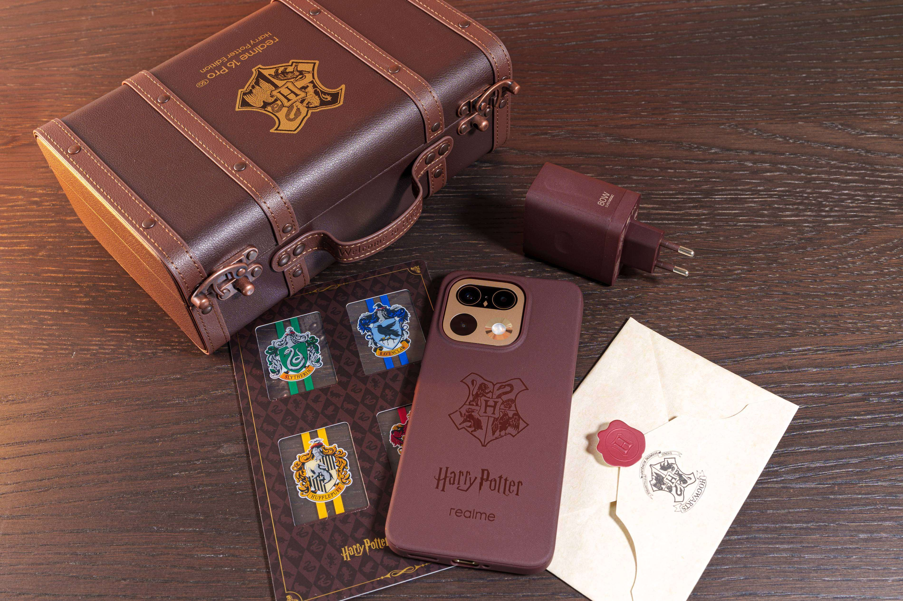

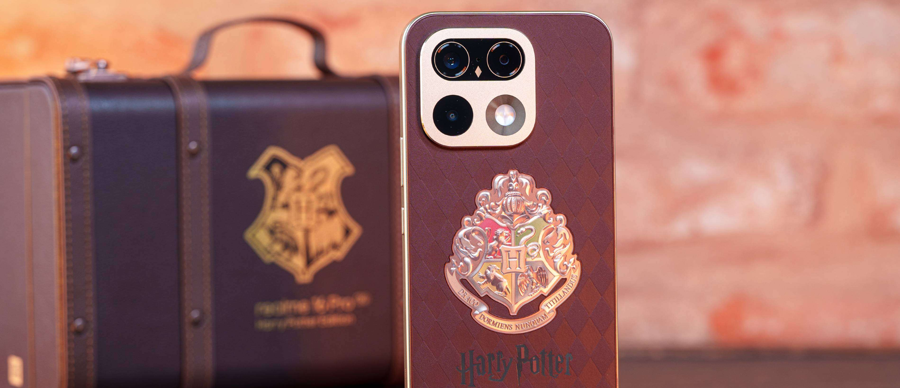

## Misma ficha técnica y precio que la Realme 16 Pro, si la encuentras

En lo técnico, la edición Harry Potter es idéntica a la Realme 16 Pro 5G estándar. Monta una pantalla AMOLED de 6,78 pulgadas con resolución 1272x2772, refresco de 144 Hz y un pico de brillo de 6.500 nits, con el chip Dimensity 7300 Max como cerebro.

En las cámaras apuesta por un sensor principal de 200 MP con estabilización óptica, acompañado de un ultra gran angular de 8 MP y una cámara frontal de 50 MP. La batería sube hasta los 7.000 mAh y admite carga por cable de 80 W.

Realme la vende en una única configuración de 12 GB de RAM y 256 GB de almacenamiento por 62.999 rupias. Ese tamaño de pantalla y de batería hacen que el teléfono se sienta grande en la mano, algo a tener en cuenta si se busca un móvil compacto.

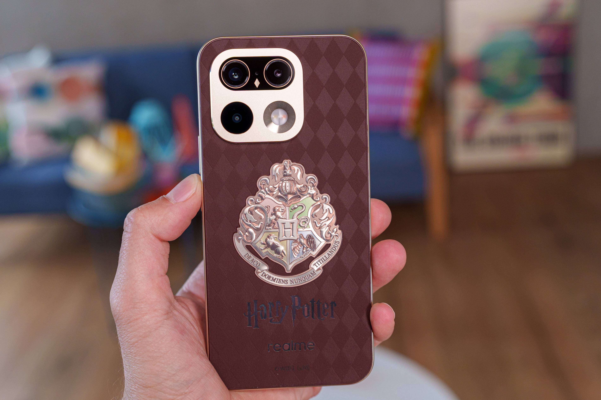

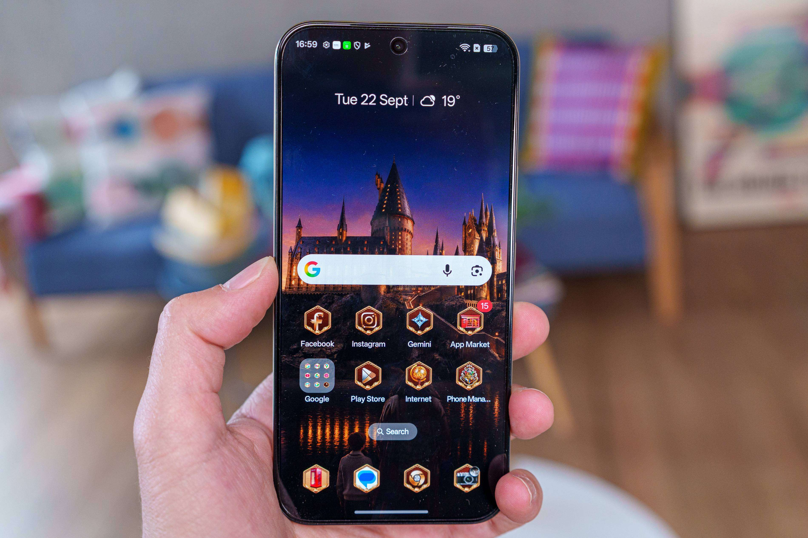

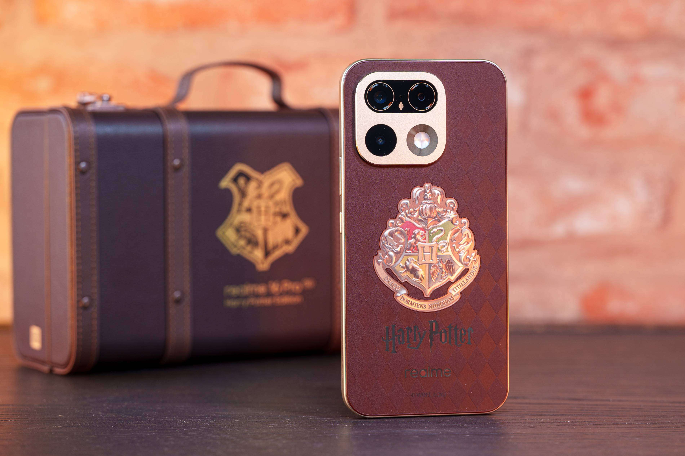
