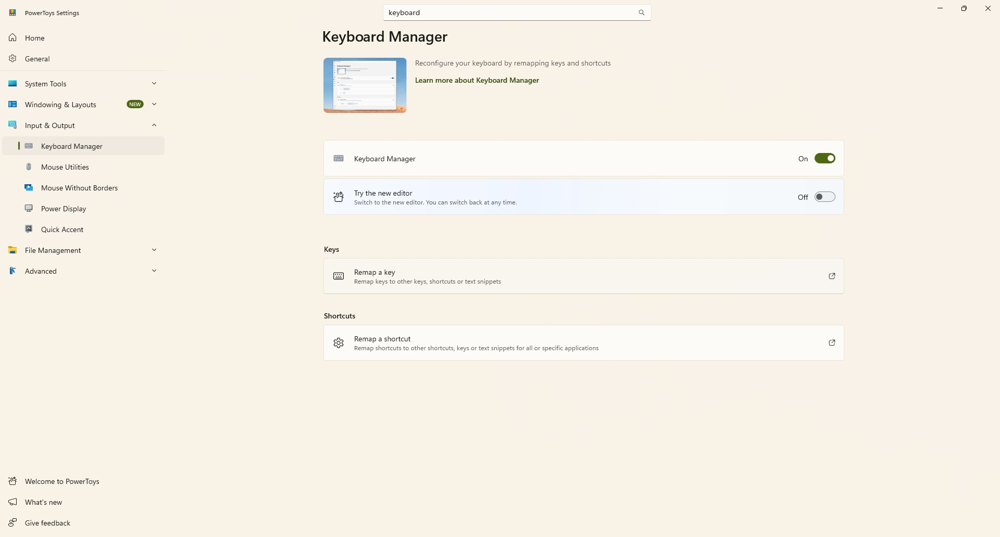

Microsoft ha decidido abandonar la marca Copilot+ PC. Los nuevos Surface Pro de 12 pulgadas y Surface Laptop de 13 pulgadas ya no se anuncian con ese nombre, aunque siguen cumpliendo los requisitos técnicos para llevarlo. El resultado deja a más de un usuario en una posición incómoda: muchos compraron un Copilot+ PC porque era la única forma de acceder a determinados modelos de portátil, y ahora se encuentran con una tecla Copilot que no utilizan.

La buena noticia es que **reasignar la tecla Copilot en Windows 11** es posible. Microsoft permite cambiar qué hace esa tecla desde los ajustes del sistema, aunque con opciones limitadas; si se busca un control más fino, PowerToys cubre el resto.

## Requisitos previos

- Un equipo con Windows 11 actualizado. La opción de reasignar la tecla Copilot desde los ajustes llegó al sistema este año, así que conviene instalar las últimas actualizaciones antes de empezar.
- Si se opta por la vía avanzada, PowerToys instalado (es gratuito).

## Paso 1: reasignar la tecla desde los ajustes de Windows 11

Es la opción más sencilla, pero también la más limitada: solo permite tres destinos.

1. Abre la aplicación **Configuración** (Settings).
2. Entra en **Bluetooth y dispositivos** (Bluetooth & devices).
3. Selecciona **Teclado** (Keyboard).
4. Despliega el menú junto a **Personalizar la tecla Copilot del teclado** (Customize Copilot key on keyboard).
5. Elige una de las tres opciones disponibles: **Buscar** (Search), **Copilot** o **Abrir una aplicación** (Open an app).

## Paso 2: reasignar la tecla con PowerToys

Si quieres que la tecla haga algo distinto de abrir Buscar, Copilot o una aplicación, necesitas una herramienta aparte. PowerToys incorpora un Administrador de teclado (Keyboard Manager) que resuelve el problema.

Un detalle clave: Windows 11 trata la tecla Copilot como un **atajo**, no como una tecla suelta, por lo que hay que usar la opción de reasignar un atajo.

1. Instala **PowerToys**.
2. Abre **PowerToys**.
3. Entra en la herramienta **Administrador de teclado** (Keyboard Manager).
4. Comprueba que el Administrador de teclado está activado.
5. Selecciona **Reasignar un atajo** (Remap a shortcut).
6. Pulsa **Agregar reasignación de atajo** (Add shortcut remapping).
7. Define el atajo como **Windows + Shift + Ctrl + F23**.
8. Asigna la acción que quieras, por ejemplo **Ctrl (derecha)**.

Como pocos teclados tienen una tecla F23, el proceso resulta más cómodo con el editor clásico del Administrador de teclado: basta con desactivar la opción **Try the new editor**. El hallazgo de que la tecla Copilot es en realidad un atajo construido sobre F23 corresponde a los compañeros de Tom's Hardware.

## Paso 3 (opcional): tapar el logo de la tecla

Aunque reasignes la tecla, el logotipo de Copilot seguirá impreso en el teclado. Si te molesta que una tecla no coincida con lo que escribe, puedes cubrirla con una pegatina.

La dificultad depende del color del teclado. Encontrar pegatinas en blanco o negro es sencillo, pero si tienes un Surface con teclado gris o un Type Cover de color, puede costar dar con el tono exacto. En esos casos conviene buscar en eBay o Etsy, donde hay opciones personalizadas, aunque al no ser productos estandarizados no hay un conjunto concreto que recomendar.

## Cómo verificar que funcionó

Pulsa la tecla Copilot y comprueba que ejecuta la acción elegida: abrir Buscar, lanzar Copilot, iniciar la aplicación seleccionada o enviar el atajo que hayas definido en PowerToys. Si la tecla sigue abriendo Copilot por defecto, revisa que el cambio se haya guardado y que el Administrador de teclado de PowerToys permanezca activado.

## Advertencias y limitaciones

- La vía de los ajustes de Windows 11 solo ofrece tres destinos (Buscar, Copilot o una aplicación); para cualquier otra función hay que pasar por PowerToys.
- La personalización desde los ajustes exige un equipo actualizado; en versiones antiguas la opción no aparece.
- La reasignación de PowerToys está ligada a la configuración de ese equipo: si desinstalas la herramienta o cambias de dispositivo, la tecla recupera su comportamiento original.
- No todos los teclados con tecla Copilot pertenecen a un Copilot+ PC: existen equipos y teclados convencionales que también la incorporan.
- Cubrir el logo no es una solución universal: en teclados de colores poco habituales puede no existir una pegatina que combine.

Si usas otros ajustes de personalización en Windows 11, en nuestra guía sobre el [modo oscuro automático de Windows 11](/noticias/windows-11-auto-dark-mode/) encontrarás cómo controlar el tema del sistema sin depender de herramientas externas.
