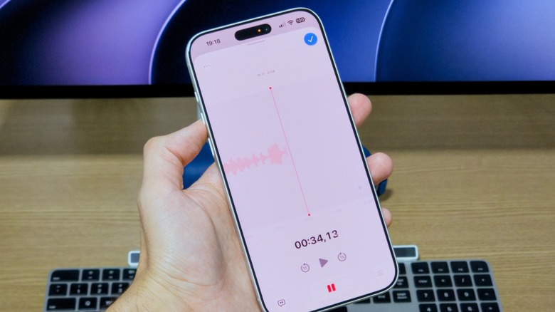
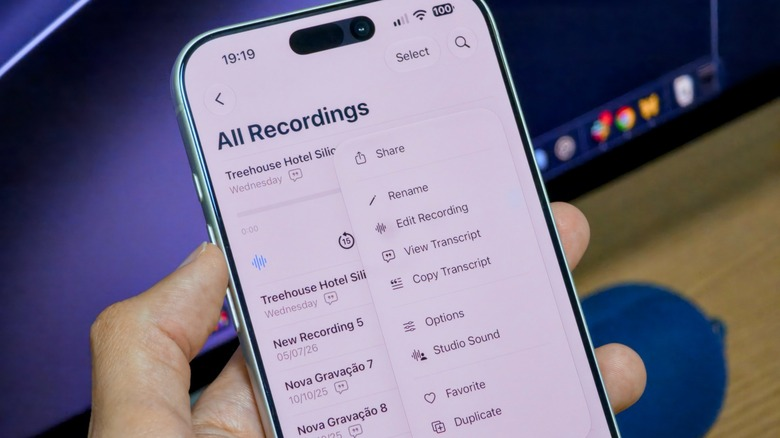

Grabar una entrevista, una clase o una reunión no requiere instalar nada nuevo en el iPhone. Apple incluye **Voice Memos** (Notas de voz) dentro de iOS, y la app funciona en todos los iPhone modernos sin coste adicional. Además de grabar, permite transcribir lo dicho, recortar fragmentos y editar secciones concretas sin salir de la aplicación.

Esta guía recorre el flujo completo: desde abrir la app y hacer la primera grabación hasta ajustar la calidad del audio, consultar la transcripción y sincronizar las notas entre dispositivos con iCloud.

## Requisitos previos

- Un iPhone con iOS actualizado, en el que la app **Voice Memos** ya viene instalada.
- Si la app fue eliminada en el pasado, puede reinstalarse gratis desde la App Store.
- Para la grabación multipista con el botón **Plus** hace falta un iPhone 16 Pro o posterior.

## Pasos

### 1. Abre la app Voice Memos

Busca el icono negro con ondas de sonido en la pantalla de inicio. Si no lo encuentras, desliza el dedo hacia abajo para usar la búsqueda del sistema. Si la habías desinstalado, vuelve a descargarla desde la App Store.

### 2. Realiza la primera grabación

Dentro de la app, pulsa el **botón rojo** para empezar a grabar. Al pulsarlo de nuevo, la grabación se detiene y se guarda automáticamente.

### 3. Aprovecha la interfaz ampliada durante la grabación

Mientras grabas, desliza hacia arriba desde la tarjeta de grabación para desplegar una interfaz a pantalla completa con controles de **pausa** y **rebobinado**. El rebobinado no solo sirve para repasar un punto clave: también permite reemplazar un tramo anterior con audio nuevo. Por ejemplo, si te equivocas al hablar o aparece un ruido de fondo repentino, puedes volver a grabar solo esos segundos.

El botón **Plus** añade grabación multipista, pensada para combinar varias pistas de audio. Como se indicó en los requisitos, esta función exige un iPhone 16 Pro o posterior.

### 4. Elige el modo de grabación

Antes de acumular muchas notas, conviene revisar este ajuste: ve a **Ajustes > Apps > Voice Memos** y, en **Recording Mode** (Modo de grabación), elige entre **Mono**, **Stereo** y **Spatial**. La opción Spatial, disponible en los modelos compatibles, produce un audio "3D" que parece llegar desde todas las direcciones.

### 5. Transcribe y recorta el audio

De vuelta en la pantalla de grabación verás varios botones, uno en cada esquina. El botón de **tres puntos** situado arriba a la izquierda abre la opción **Copy Transcript**, que permite pegar lo dicho en otras aplicaciones como Notas o Mensajes. La opción **Trim** (Recortar) sirve para eliminar los fragmentos de audio que no necesitas.

### 6. Consulta la transcripción en tiempo real

El botón de abajo a la izquierda, con forma de burbuja de diálogo, muestra la transcripción completa del audio. El texto se actualiza en tiempo real a medida que continúa el habla, y al tocar una palabra la reproducción salta a ese punto concreto de la grabación.

### 7. Ajusta la reproducción y la calidad del sonido

El botón de abajo a la derecha, con tres deslizadores, controla la **velocidad de reproducción**. En las grabaciones en mono o estéreo aparece un interruptor **Skip Silence** (Omitir silencios) y la opción **Enhance Recording**, que reduce el ruido de fondo y el eco. En las grabaciones espaciales, en su lugar verás **Studio Sound** junto con un deslizador para regular su intensidad, que hace que la voz suene como grabada en un estudio.

Cuando termines, usa el **botón azul** para aplicar los ajustes elegidos y vuelve a pulsarlo para guardar la nota de voz.

### 8. Cambia el nombre de la nota

Si tienes activados los servicios de ubicación, la nota tomará el nombre de tu ubicación actual. Para cambiarlo, selecciona el nombre y edítalo.

## Cómo escuchar y organizar tus grabaciones

La app ordena las notas por orden de grabación, con las más recientes arriba. Toca una para escucharla o usa el botón de **tres puntos** para desplegar opciones como compartirla con otra aplicación, renombrarla, añadirla a favoritos o ver su transcripción.

Si acumulas muchas grabaciones, el icono de **búsqueda** localiza coincidencias dentro de las transcripciones. Con la **flecha** de arriba a la izquierda puedes explorar las grabaciones por tipo e incluso crear carpetas para organizarlas mejor.

## Sincronización con iCloud

Las notas de voz se sincronizan entre tus dispositivos Apple a través de iCloud. Para confirmar que está activo, ve a **Ajustes > [tu nombre] > iCloud > Saved to iCloud** y verifica que **Voice Memos** figure habilitado en la lista.

Conviene recordar que iOS cuenta con una función nativa para grabar llamadas, más cómoda que usar Voice Memos en un segundo dispositivo.

## Cómo verificar que funcionó

Abre la app y comprueba que la grabación aparece en la lista, ordenada por fecha. Tócala y confirma que se escucha correctamente. Si activaste la transcripción, el botón con forma de burbuja debe mostrar el texto y, al tocar una palabra, la reproducción saltará a ese punto del audio.

## Limitaciones y advertencias

- La grabación **multipista** con el botón Plus solo está disponible en iPhone 16 Pro o modelos posteriores.
- El modo **Spatial** depende del modelo: no todos los iPhone lo admiten.
- La transcripción y las opciones de edición descritas corresponden a las versiones recientes de iOS; en versiones antiguas puede que no aparezcan o cambien de nombre.
- La sincronización depende de que iCloud esté configurado y con espacio disponible.
