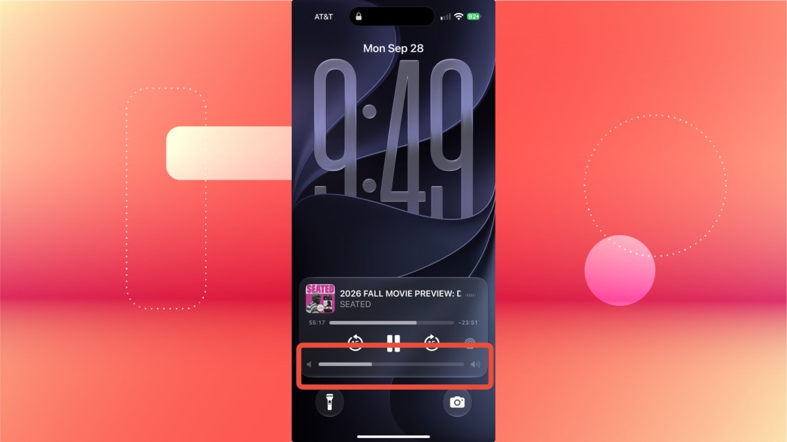

Si escuchas música o un pódcast en el iPhone, los botones físicos del lateral sirven para subir o bajar el volumen sin desbloquear el teléfono, pero obligan a elegir entre un nivel demasiado alto o demasiado bajo. La barra de volumen de la pantalla de bloqueo resuelve ese problema porque permite un ajuste más fino sin abrir el dispositivo.

El inconveniente es que Apple retiró esa barra de la pantalla de bloqueo con iOS 16, en 2022. No fue hasta 2024 cuando volvió a ofrecer la opción de recuperarla, al añadirla con iOS 18.2. Esta guía explica cómo devolverla paso a paso en un iPhone actualizado, incluido iOS 27.

## Requisitos previos

- Un iPhone con **iOS 18.2 o posterior**. La opción para mostrar siempre el control de volumen llegó con iOS 18.2, así que en versiones anteriores el interruptor no aparece.
- No hace falta desbloquear el teléfono ni instalar nada adicional: es un ajuste del sistema.

> **Nota sobre los nombres de los ajustes:** la ruta se indica con el nombre en inglés tal como aparece en las capturas de la fuente original. La denominación exacta puede variar ligeramente según la versión de iOS y el idioma configurado en el iPhone.

## Cómo llegar al ajuste de volumen en Accesibilidad

1. Abre **Ajustes** (Settings).
2. Toca **Accesibilidad** (Accessibility).
3. Dentro del apartado **Hearing**, entra en **Audio & Visual**.

## Cómo activar la barra de volumen

4. Activa el interruptor **Always Show Volume Control**.

Con el interruptor activado, la barra queda disponible en la pantalla de bloqueo. La próxima vez que escuches música o un pódcast, podrás ajustar el volumen con el deslizador sin desbloquear el equipo.

## Cómo verificar que funcionó

Bloquea el iPhone y reproduce música o un pódcast. Si la barra deslizante aparece sobre los controles de reproducción en la pantalla de bloqueo, el ajuste se aplicó correctamente.

## Advertencias y limitaciones

- Si el interruptor **Always Show Volume Control** no aparece en tu iPhone, comprueba primero la versión instalada en **Ajustes > General > Información** y actualiza a iOS 18.2 o posterior.
- El ajuste no afecta al comportamiento de los botones físicos: siguen funcionando igual, la barra solo añade un control más preciso.
- La ruta y el nombre exactos del ajuste pueden cambiar entre versiones de iOS y según el idioma del sistema.

Si quieres seguir afinando el sistema, la guía [Cómo revertir los ajustes más molestos de iOS 27](/noticias/ios-27-settings-rollback/) repasa otros controles que conviene revisar tras actualizar.
