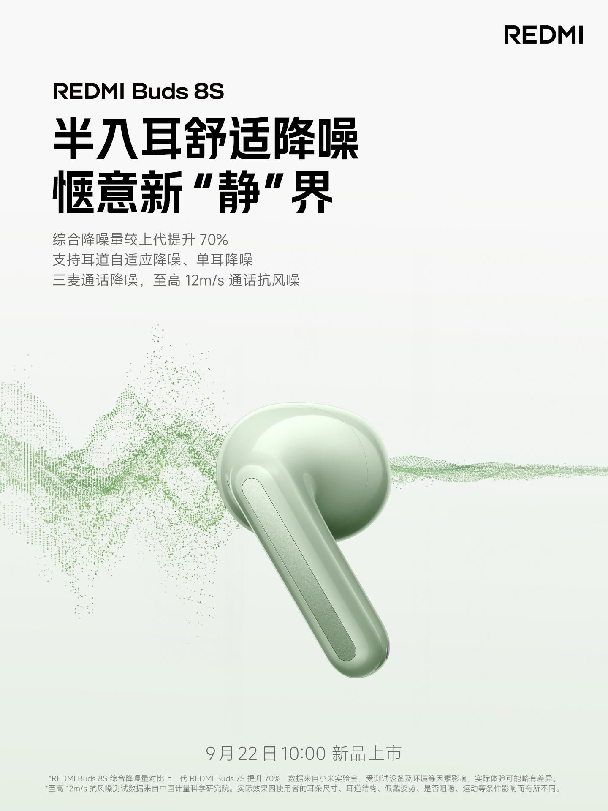

Xiaomi ha desvelado parte de las especificaciones de los **Redmi Buds 8S**, sus próximos auriculares inalámbricos, que saldrán a la venta el **22 de septiembre a las 10:00 (hora local china)**. La compañía no ha confirmado todavía el precio ni la disponibilidad en otros mercados, pero sí ha detallado las claves técnicas de esta generación.

## Un formato semi-in-ear de 4,2 gramos por auricular

El nuevo modelo apuesta por un diseño **semi-in-ear** (semiabierto) de cuerpo ligero, con un desarrollo ergonómico que, según Xiaomi, se ha validado con datos de nubes de puntos de orejas a escala de millones de registros. El resultado es un auricular que pesa **solo 4,2 gramos por unidad**, una cifra pensada para que llevarlo durante horas resulte discreto y no fatigue el oído.

Este enfoque contrasta con el de los auriculares de tipo intraural cerrado, que aíslan más de forma pasiva pero suelen resultar más invasivos. El formato semiabierto de los Buds 8S busca un equilibrio entre comodidad y sujeción, apoyándose en la cancelación activa para compensar la menor obturación del canal auditivo.

## Driver de 11 mm y ajuste de sonido en cinco perfiles

En el apartado acústico, los Redmi Buds 8S incorporan un **driver dinámico de 11 mm** con un diseño de circuito magnético amplio, además de una membrana compuesta de varias capas y un domo de alta resistencia. La compañía acompaña el hardware con **cinco perfiles de ecualización predefinidos** y un ajuste personalizado de hasta diez bandas, de modo que el usuario pueda adaptar la respuesta a su gusto.

El material promocional del producto incluye los sellos **Hi-Res Audio Wireless** y **LHDC-V5**, dos referencias habituales en la gama alta de audio inalámbrico y que apuntan a una reproducción de mayor resolución cuando el dispositivo de origen es compatible.

## Cancelación de ruido un 70 % superior y llamadas con triple micrófono

El fabricante asegura que el nuevo algoritmo de cancelación de ruido **mejora el rendimiento un 70 % respecto a la generación anterior**, gracias también a una revisión de la estructura interna. El sistema admite además **cancelación adaptativa según el canal auditivo** y funcionamiento con un solo auricular, algo útil para quien necesita mantener un oído atento al entorno.

Para las llamadas, los Buds 8S recurren a **tres micrófonos con reducción de ruido asistida por IA** y resisten vientos de hasta **12 m/s**, una cifra que apunta a conversaciones más estables en exteriores. Son las prestaciones que suelen marcar la diferencia en el día a día, más que las cifras de laboratorio.

## Qué cambia en los Redmi Buds 8S respecto a los Buds 8

La comparación con la generación anterior es obligada: los **Redmi Buds 8** llegaron al mercado el pasado mes de abril con cancelación de hasta 50 dB, driver de 11 mm y un precio de referencia de **229 yuanes**. Los Buds 8S mantienen el tamaño del driver y suben la apuesta en cancelación, aunque habrá que esperar al anuncio completo para conocer el precio y si esas mejoras se trasladan a los mercados internacionales.

Xiaomi mantiene así su ritmo de lanzamientos dentro de la familia Redmi, que estos días también ha dejado ver el [Redmi K100 con una batería de 10.000 mAh](/noticias/redmi-k100-large-battery/). Los Buds 8S se enfrentan, además, a un segmento cada vez más poblado: la reciente [remesa de auriculares de PlayStation con drivers planares](/noticias/playstation-pulse-headsets/) confirma que los fabricantes buscan diferenciarse en acústica y no solo en conectividad.
