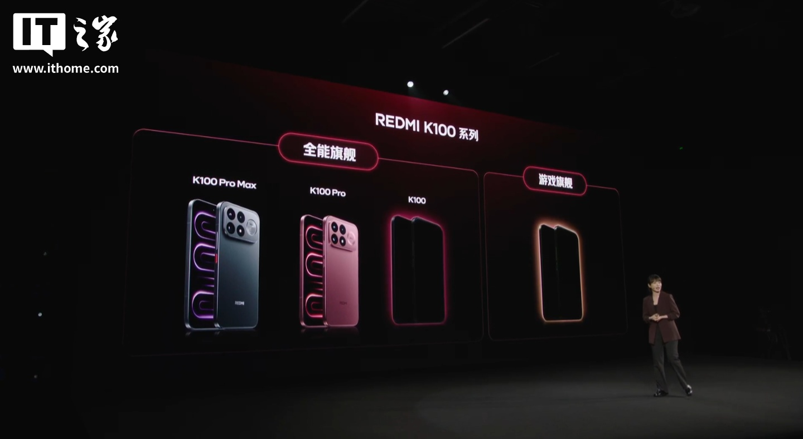
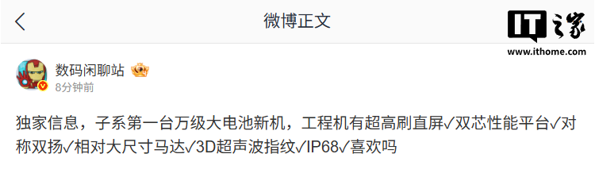

El regulador de telecomunicaciones de China registró el 18 de septiembre un teléfono de Xiaomi
con el número de modelo **M786BC**. Según el medio chino ITHome, que fue el primero en detectar
el trámite, el aparato correspondería a la **versión estándar del Redmi K100**, el modelo que
queda por debajo de los K100 Pro y K100 Pro Max ya presentados. La pieza no confirma
especificaciones: es una certificación, no un anuncio de producto.

El registro aparece en la base de datos del Ministerio de Industria y Tecnología de la
Información (MIIT) de China con el número de aprobación 2026-21168, solicitado por Xiaomi
Communications Technology. La ficha recoge compatibilidad con redes GSM, WCDMA, TD-LTE, LTE FDD
y 5G, además de Wi-Fi y Bluetooth, lo que sitúa al dispositivo en la gama alta de conectividad
del fabricante.

## Qué confirma la certificación y qué no

Conviene separar lo verificable de lo que solo son indicios. Lo que consta en el registro es
limitado pero sólido:

- El modelo **M786BC** superó el trámite regulatorio chino con fecha de emisión del 18 de septiembre.
- El solicitante es **Xiaomi Communications Technology**, la filial habitual de la compañía para este tipo de trámites.
- La conectividad incluye **5G**, Wi-Fi y Bluetooth, sin detalle sobre el procesador, la memoria o la batería.

A partir de ahí, todo lo demás es interpretación. La certificación no menciona capacidad de
batería, pantalla ni chip, así que cualquier cifra que circule sobre esas características
procede de filtraciones y no de este documento.

## Un rumor de batería de cinco cifras

El interés de la noticia está en el contexto que la acompaña. El 11 de agosto, durante la
presentación de la serie Redmi K100 Pro, la responsable de marketing de Xiaomi en China, Wei
Siqi, mostró la hoja de ruta de la familia: además de los K100 Pro Max y K100 Pro, la compañía
tiene previstos un **modelo estándar** y un **teléfono de enfoque gaming**.

Unos días después, el 31 de agosto, el conocido filtrador chino **@数码闲聊站** publicó en Weibo
que la primera máquina de una submarca con batería "de cinco cifras" montaría una pantalla
plana de altísima tasa de refresco, una plataforma de doble chip, altavoces estéreo simétricos,
un motor de vibración de tamaño relativamente grande, lector de huellas ultrasónico 3D y
resistencia al agua y al polvo IP68. En los comentarios, los seguidores vincularon esa
descripción con la serie Redmi K100.

ITHome titula su información con la fórmula de que el K100 estándar "podría" llevar esa batería
de 10.000 mAh o más, pero el condicional es importante: **nada de esto está confirmado por
Xiaomi**. Se trata de una certificación oficial combinada con un rumor con cierto recorrido, no
de una ficha de producto.

## Qué cambia para el lector

Para el comprador hispanohablante, la lectura práctica es doble. Por un lado, la certificación
sugiere que el Redmi K100 estándar está más cerca de su lanzamiento, al menos en China; el
trámite ante el MIIT suele preceder en semanas o pocos meses a la puesta en venta. Por otro,
ninguna de las cifras que más llaman la atención —los 10.000 mAh, la doble plataforma de
rendimiento o la pantalla de altísima tasa de refresco— está respaldada por el registro.

Merece la pena recordar un principio básico de diseño: una batería de mayor capacidad ocupa más
volumen y añade peso. Si el dato se confirma, el reto del fabricante no será solo meter más
energía, sino hacerlo sin que el teléfono resulte incómodo de llevar en el bolsillo. Esa tensión
entre autonomía y grosor es la que suele decidir si una cifra espectacular llega intacta al
producto final.

Habrá que esperar a la presentación oficial para saber cuánto de este rumor sobrevive. Hasta
entonces, lo razonable es tratarlo como lo que es: un trámite administrativo real rodeado de
expectativas todavía sin verificar.
