Trabajar desde casa, desde una cafetería o desde el coche aparcado junto al colegio de los hijos exige llevar el portátil y sus accesorios en una mochila preparada para rendir fuera de la oficina. PCWorld ha publicado el inventario completo de un redactor con casi veinte años de teletrabajo a sus espaldas: el portátil y los accesorios que lleva siempre encima para trabajar desde cualquier lugar, con modelos concretos y sus alternativas actuales.

## El núcleo: portátil y segunda pantalla

La pieza central es un HP ProBook 450 G9 con procesador Intel Core i7, 16 GB de memoria DDR4, 1 TB de almacenamiento y una gráfica GeForce MX 570A. No es un equipo espectacular, según reconoce su propio dueño, pero cumple con el trabajo diario e incluso mueve juegos como World of Warcraft, una muestra de hasta dónde llegan [los portátiles empresariales actuales](/noticias/dell-pro-5-16-amd-review/). Como esa configuración ya no se encuentra a la venta, la alternativa que propone es el MSI Thin 15 con una RTX 4050, todavía más capaz para tareas creativas.

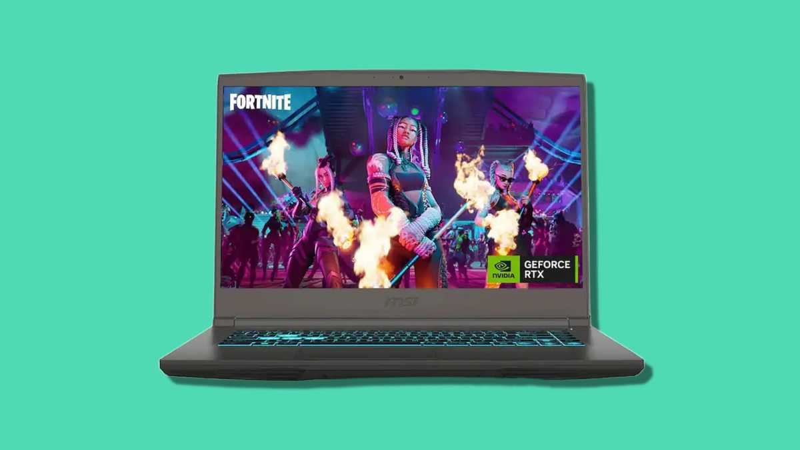

El segundo elemento en importancia es un monitor portátil Arzopa, que el autor usa tanto fuera de casa como tercera pantalla en su escritorio. El modelo equivalente actual es el Arzopa A1 Gamut: panel IPS de 15,6 pulgadas a 1080p, perfil ultrafino, peana integrada y conexión por USB-C o Mini HDMI. Quien prueba una segunda pantalla en movilidad, asegura, ya no vuelve atrás.

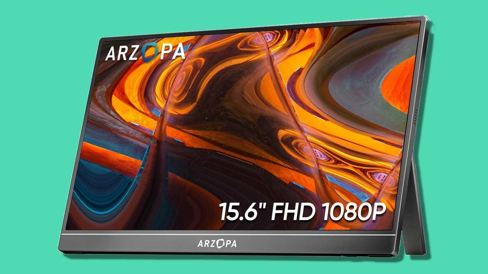

Completa el puesto de trabajo un ratón Logitech M705 Marathon inalámbrico, un modelo sencillo con rueda de desplazamiento ultrarrápida que funciona con un par de pilas AA durante años: el fabricante declara hasta tres años de autonomía.

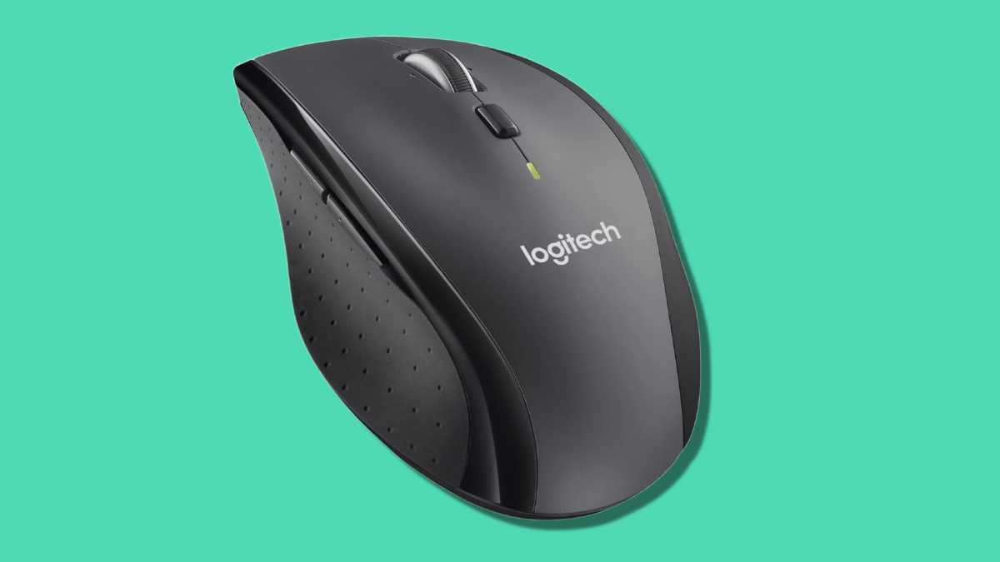

## Energía y conectividad para no quedarse tirado

La autonomía eléctrica corre a cargo de dos piezas de Ugreen. La primera es la batería externa Nexode de 25.000 mAh con 145 W de potencia, dos puertos USB-C y uno USB-A, capaz de cargar el portátil y a la vez el móvil o los auriculares. La segunda es el cargador Nexode X de 160 W con tecnología GaN, que sustituyó al voluminoso adaptador original del portátil y alimenta varios dispositivos a la vez gracias a sus tres puertos USB-C y uno USB-A.

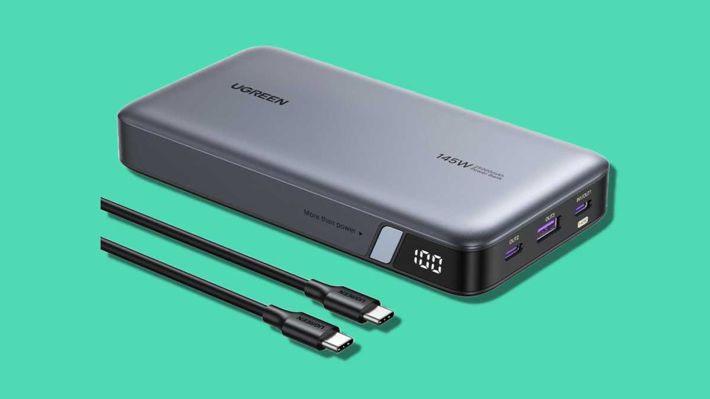

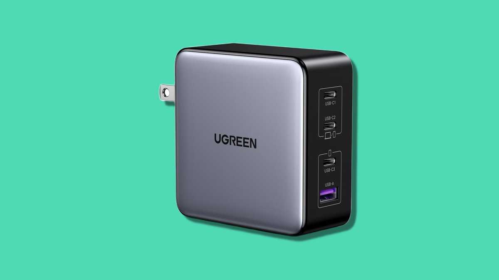

A ello se suma un cable USB-C de Ugreen de 240 W con pantalla digital que muestra la potencia de carga en cada momento, útil como segundo cable para el teléfono o la tableta, y un concentrador Anker 7 en 1 que resuelve la escasez de puertos del portátil: permite cargar el equipo mientras se conectan el monitor, unidades USB y tarjetas SD o microSD.

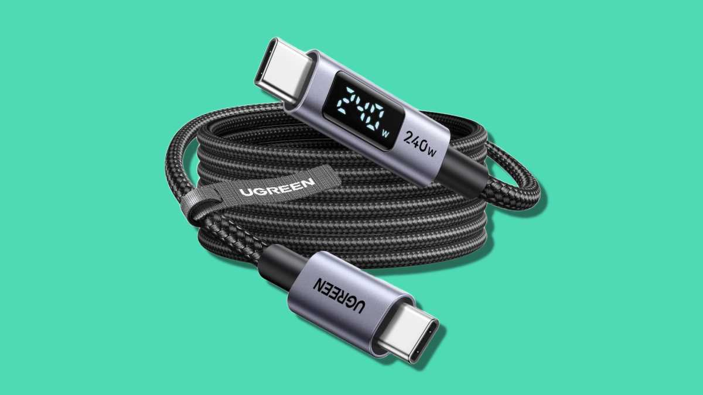

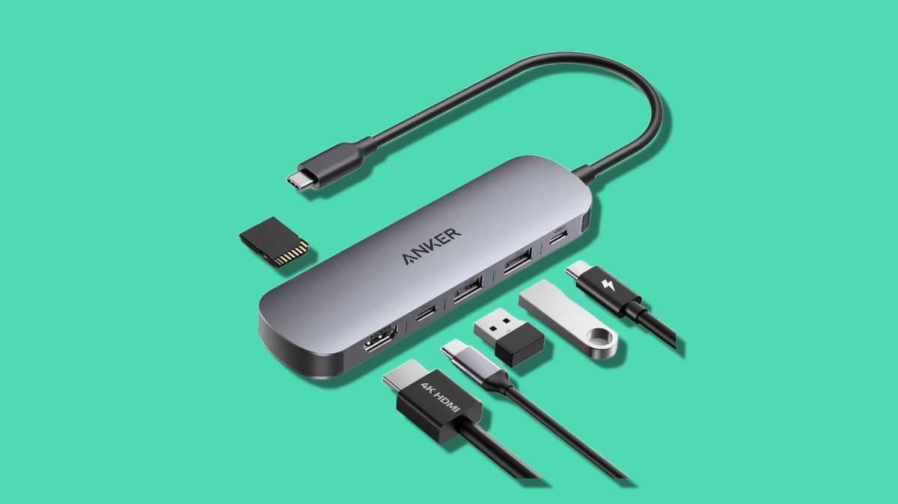

## Confort y tranquilidad fuera de casa

Para concentrarse en espacios ruidosos, el autor lleva unos auriculares de diadema JBL Tune 720BT, cómodos y duraderos aunque sin cancelación activa de ruido. Si buscase silencio total, sus candidatos serían los Sony WH-1000XM5 o los Bose QuietComfort, más caros pero con una cancelación excelente.

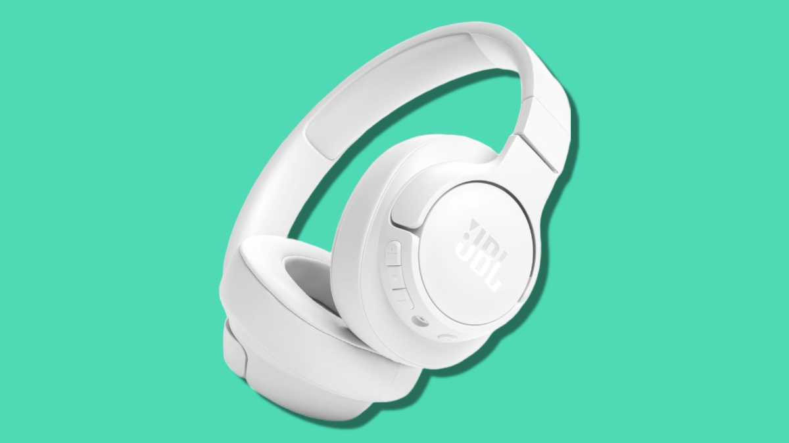

La mochila también guarda un lector Kindle Paperwhite de 2021 para los ratos muertos en el autobús, un localizador Samsung SmartTag2 escondido en un bolsillo interior por si la mochila desaparece —algo que ya salvó la mochila de su hijo olvidada en el metro— y la propia mochila: un modelo básico de Lenovo con interior acolchado y bolsillo frontal con cremallera, más económico y cómodo que un maletín clásico.

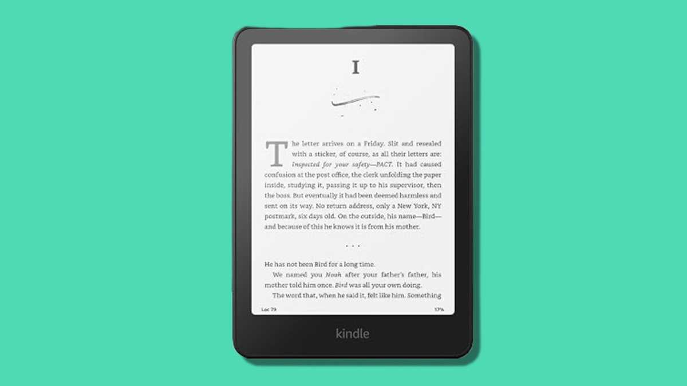

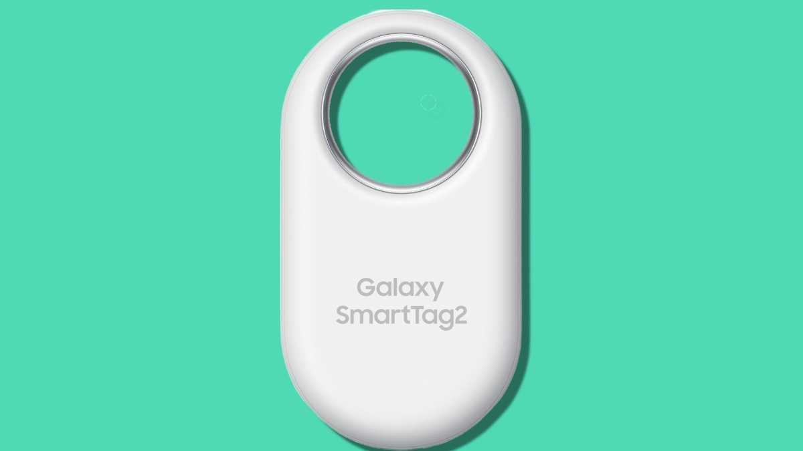

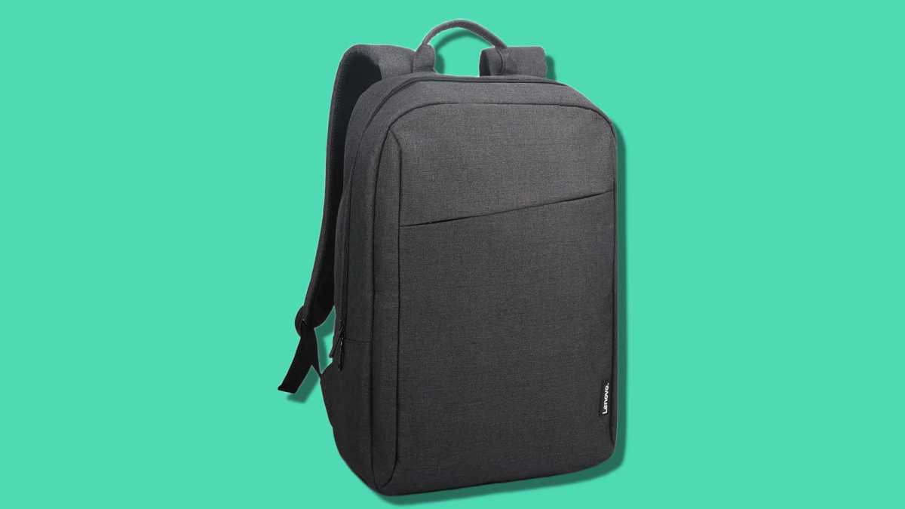

La lección general vale para cualquier lector en España que teletrabaje: el portátil es solo el principio. Una segunda pantalla, energía de sobra con carga rápida y un concentrador USB-C son los tres accesorios que más marcan la diferencia cuando la oficina puede ser cualquier sitio.
