MuyComputer ha publicado una selección de diez reproductores de vídeo para Android pensada para quien quiere reproducir sus archivos sin interrupciones: todas las apps incluidas son gratuitas, no muestran publicidad y traen los códecs necesarios para funcionar sin instalar software adicional.

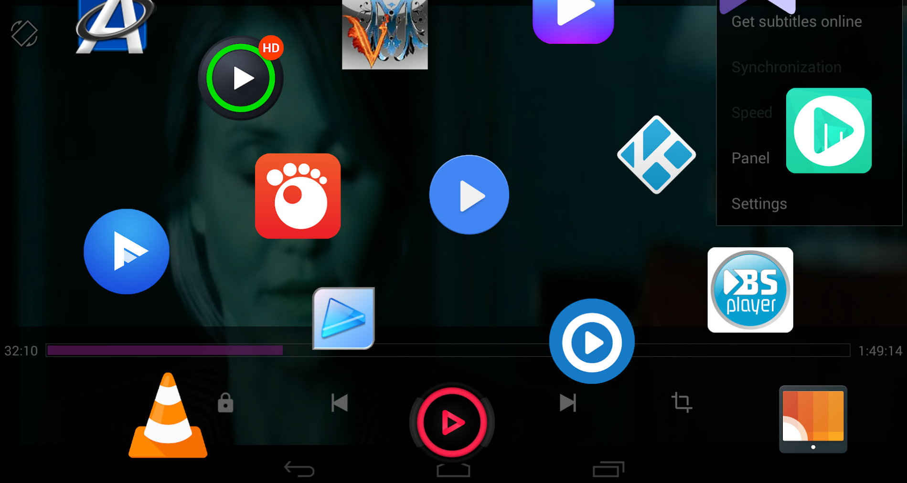

## Por qué merece la pena un reproductor de terceros

Los fabricantes de móviles incluyen en sus interfaces, construidas sobre Android, un reproductor nativo. El problema, según el medio, es que la mayoría de esas apps no alcanza el nivel de prestaciones ni el número de funciones de las soluciones de terceros. Además, las apps de terceros suelen ser multiplataforma, lo que facilita conectarlas con el PC u otros dispositivos.

Todos los seleccionados sirven tanto para el móvil como para la tableta y funcionan sin instalaciones de software adicional. La única salvedad es que algunos ofrecen variantes premium de pago, ya sea mediante una tarifa o a través de compras dentro de la aplicación.

## Los diez reproductores de vídeo para Android seleccionados

### VLC

Imposible empezar por otra: VLC media player es una de las grandes referencias mundiales como reproductor y framework multimedia. Es software libre y de código abierto, se distribuye bajo la licencia GPLv2.1+ y da soporte a múltiples sistemas operativos, tanto de escritorio como móviles. Permite transmitir archivos de audio y vídeo, además de reproducir los guardados en el almacenamiento local.

Su otro punto fuerte es el amplísimo soporte de formatos, con exploración cómoda de la biblioteca multimedia. Incorpora rotación automática, subtítulos, ajustes de relación de aspecto, controles de volumen basados en gestos, un modo día-noche, una interfaz para Android TV y listas de reproducción.

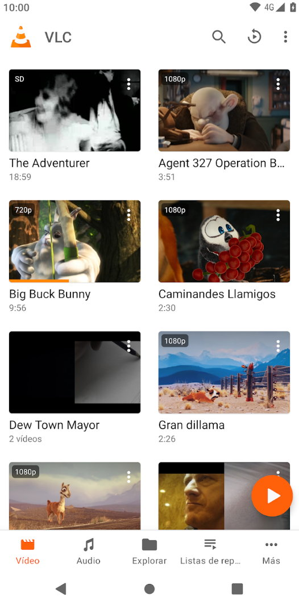

### NOVA Video Player

Otro desarrollo de código abierto, pensado para tabletas, móviles y Android TV. Admite los formatos multimedia más importantes y puede reproducirlos desde cualquier fuente: local, almacenamiento externo, servidores o la nube. Da acceso instantáneo a los vídeos añadidos recientemente a la biblioteca y recupera automáticamente la reproducción desde la última visualización.

Nace del reproductor Archos Video Player, al que su autor añadió más funciones, aunque sigue destacando por su simplicidad. Gratuito, libre y sin publicidad.

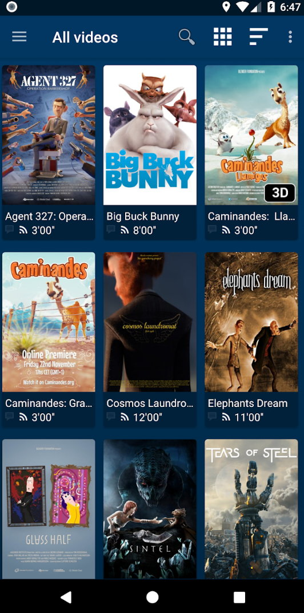

### KMPlayer

También multiplataforma, es compatible con Chromecast, la emisión por URL, las conexiones a servidores privados, la reproducción de música desde la nube y los subtítulos. Permite crear listas de reproducción y ofrece todo tipo de ajustes de visualización.

Se vende como producto comercial si se quieren sus funciones premium —reproducción de torrents, recorte de vídeo y audio y convertidor de MP3—, pero la reproducción de vídeo está disponible de forma gratuita.

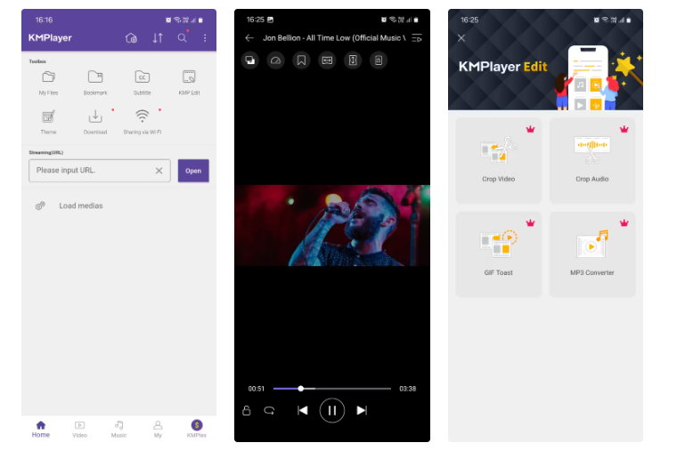

### Visha Video Player

Algunas de las funciones premium de KMPlayer están presentes de manera gratuita aquí, como la conversión de vídeos a archivos MP3 y su organización en un espacio aparte. Su elemento diferenciador es el navegador web integrado, con el que se pueden descargar vídeos de Internet de forma cómoda.

Fuera de eso, destaca por la agilidad de sus funciones de reproducción, su diseño minimalista y su pestaña de Historial, desde la que se retoman los vídeos donde se dejaron. Incluye además una carpeta privada de vídeos.

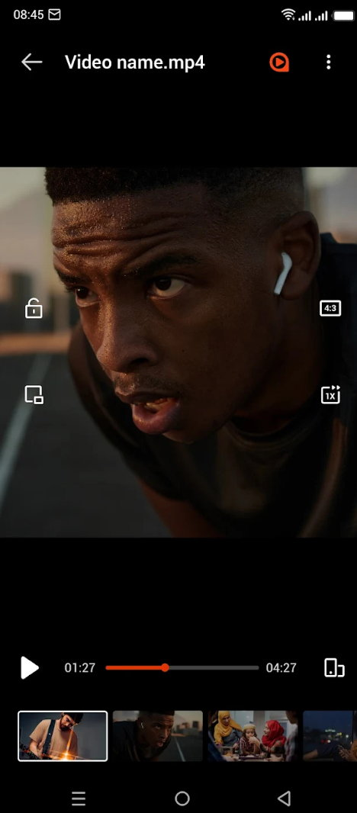

### Night Video Player

Como indica su nombre, está pensado para quien visualiza contenido por la noche o prefiere los modos oscuros. Cuida especialmente el apartado de audio, con mejora del volumen del habla, optimización y normalización del sonido.

Para el resto hace lo que cualquier app de esta lista: escanea y reproduce con facilidad archivos multimedia locales, transmisiones, canales IPTV o m3u, de prácticamente cualquier formato gracias a su soporte para un gran número de códecs.

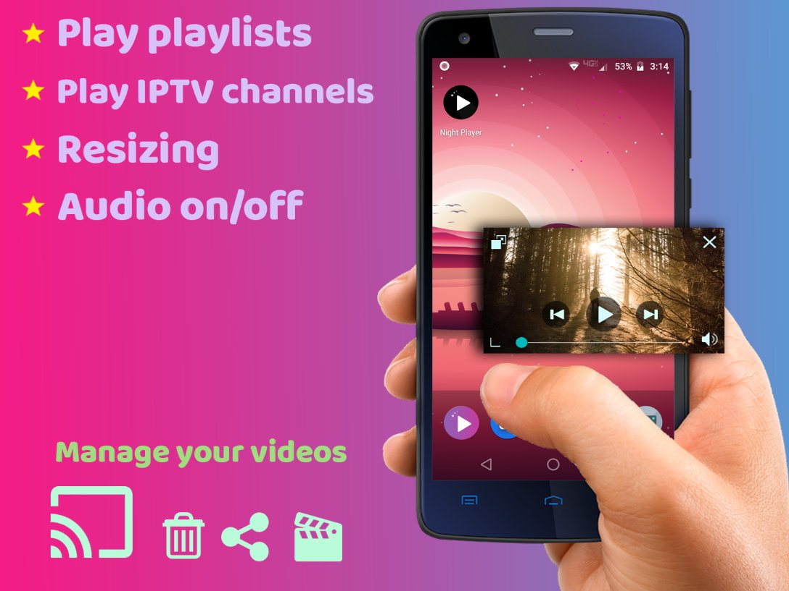

### Just (Video) Player

Destaca por la sencillez, sin funciones complicadas. Reproduce vídeo en cualquier formato, admite añadir subtítulos, controlar la velocidad de reproducción y cambiar el brillo y el tamaño de pantalla mientras se reproduce el archivo. También soporta la transmisión de vídeo.

La app no pide permisos excesivos después de la instalación, algo que siempre se agradece, y no solo es gratuita: es de código abierto.

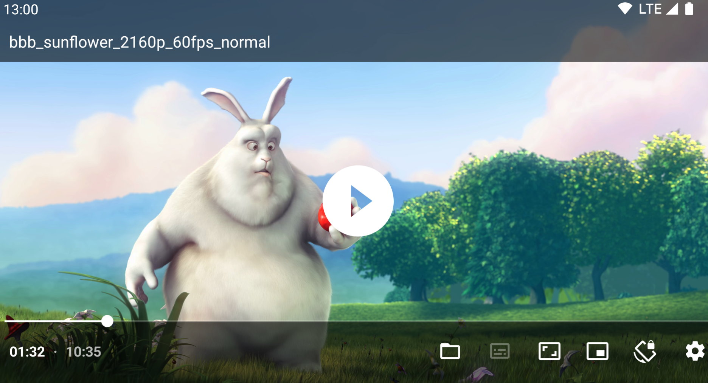

### Video Player KMP

Una versión más ligera y rápida de KMPlayer, completamente gratuita. Una característica muy útil es la posibilidad de marcar un vídeo como favorito para reproducirlo más tarde. Mientras se reproduce un archivo, permite ampliar la pantalla y cambiar la velocidad de reproducción.

Es compatible con Chromecast y con la transmisión de vídeo, añade subtítulos con facilidad desde la propia aplicación y se personaliza con temas y accesos directos en la pantalla de inicio.

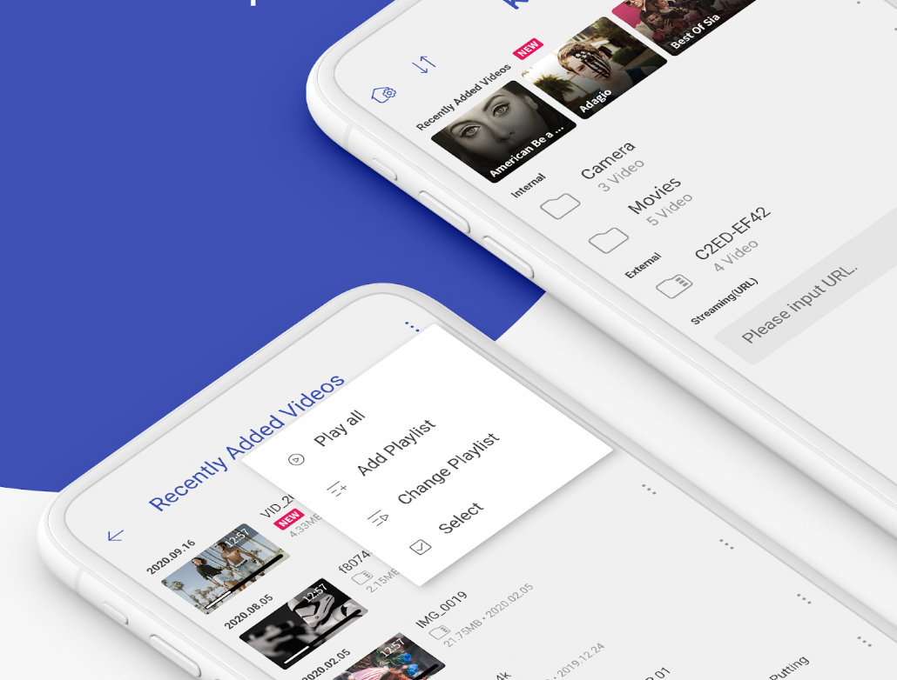

### CM Player

Otro seleccionado que destaca por una interfaz muy sencilla de usar y por cubrir la mayoría de las funciones estándar de este tipo de apps. Se ajustan brillo y volumen con gestos mientras se reproduce un clip, y también se cambia su velocidad de reproducción.

Añade otras opciones, como cambiar el tamaño de la pantalla de vídeo, compatibilidad con varios subtítulos y temas para personalizar la app. También permite compartir vídeos con otras personas a través de una conexión Wi-Fi, y admite una gran variedad de formatos —mp4, mkv o hevc— en calidades de hasta 8K.

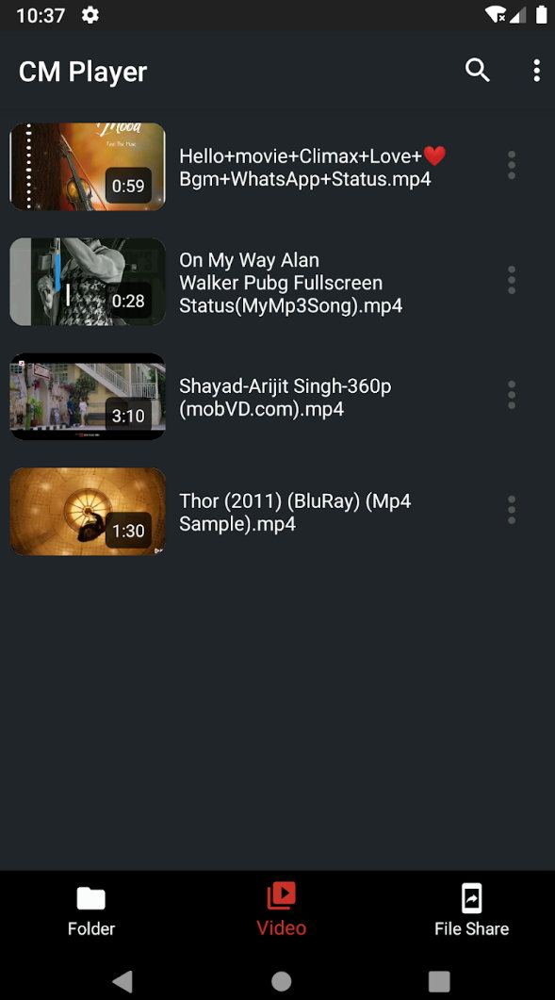

### Lark Video Player

Tiene aspecto y funcionamiento similares a los de Visha, con algunas funciones adicionales. Por ejemplo, identifica y organiza automáticamente los vídeos musicales guardados en el teléfono en una carpeta aparte, sin tener que buscarlos a mano.

Permite poner en cola los vídeos guardados o añadirlos a una lista de reproducción, y puede reproducir en bucle, en una ventana flotante (imagen dentro de imagen) o ajustando su escala. No admite la emisión por URL ni la conversión de vídeo a audio, pero es gratuito como el resto de la lista.

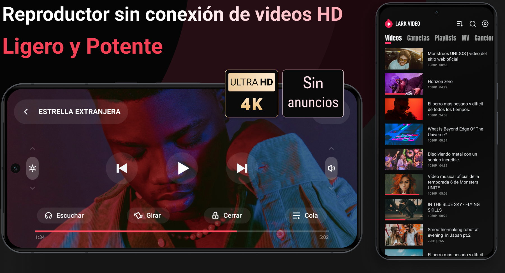

### MPV

Otro gratuito y de código abierto que poco tiene que envidiar a los comerciales. Decodifica vídeo por hardware y por software, soporta libass para obtener subtítulos con estilo, ofrece desplazamiento basado en gestos y control de volumen y brillo.

Su diseño es minimalista y soporta la mayoría de formatos, incluido el códec AV1. Es multiplataforma: además de la versión Android, existe para Windows y Mac.

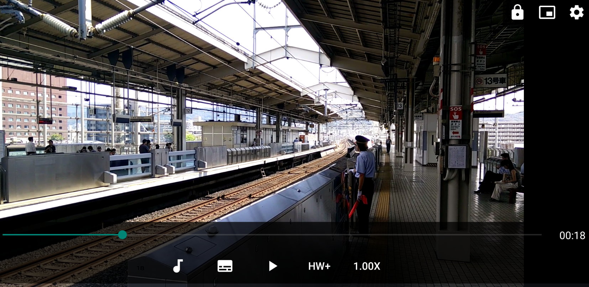

## Qué tener en cuenta antes de elegir

Dos criterios resumen la selección. El primero es la ausencia de publicidad: ninguna de las diez apps interrumpe la reproducción con anuncios, un detalle que se agradece en un uso diario. El segundo es el código abierto, presente en VLC, NOVA, Just (Video) Player y MPV: un criterio que también cubrimos al repasar [cinco apps Android de código abierto que un redactor de XDA prefiere a sus rivales de masas](/noticias/open-source-android-apps/).

Conviene tener presente, eso sí, que varias de ellas monetizan por otra vía: KMPlayer vende funciones premium como la reproducción de torrents o el recorte de audio, y algunas de las opciones del listado ofrecen variantes de pago o compras dentro de la app. La reproducción básica es gratuita en todos los casos.
