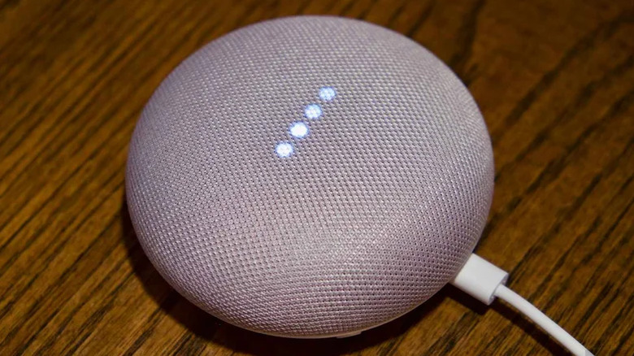

El Google Home Mini lleva casi nueve años en el mercado y Google ya ha dejado de fabricarlo, pero miles de unidades siguen funcionando a diario. Si el altavoz deja de responder a los comandos, da problemas de conexión wifi, se va a cambiar la cuenta de Google asociada o se va a entregar a otro dueño, un restablecimiento a valores de fábrica lo deja como recién salido de la caja. Esta guía explica cómo hacerlo en el Google Home Mini original y en los modelos cercanos de la familia.

## Requisitos previos

- Tener el altavoz enchufado a la corriente durante todo el proceso.
- Identificar el modelo: Home Mini de primera generación, Nest Mini de segunda generación o pantalla Nest Hub.
- No hace falta ninguna herramienta ni conocimiento técnico: el proceso dura unos minutos.

## Pasos para restablecer el Google Home Mini a valores de fábrica

El restablecimiento no se puede activar con comandos de voz ni desde la aplicación Google Home: hay que usar los controles físicos del altavoz.

### Paso 1: Localiza el botón de restablecimiento del Home Mini de primera generación

Dale la vuelta al altavoz y busca en la base el botón de restablecimiento: un pequeño círculo grabado situado justo debajo del cable de alimentación.

### Paso 2: Mantén pulsado el botón hasta escuchar el aviso

Pulsa el botón y mantenlo presionado unos cinco segundos, hasta que empiece el restablecimiento, y sigue sujetándolo unos diez segundos más hasta que suene el tono de confirmación.

### Paso 3: Si tienes un Nest Mini de segunda generación, usa el interruptor de micrófono

En el Nest Mini, de aspecto casi idéntico al original, localiza el interruptor de encendido y apagado del micrófono en el lateral y apágalo: las luces LED parpadearán en naranja. A continuación, mantén pulsado el centro del dispositivo, donde están las luces superiores, unos cinco segundos para iniciar el restablecimiento, y sigue presionando unos diez segundos más hasta que el aviso sonoro confirme que ha terminado.

### Paso 4: Si es una pantalla como el Nest Hub, usa los botones de volumen

En los modelos con pantalla, mantén pulsados a la vez los dos botones de volumen de la parte trasera durante unos diez segundos. La pantalla indicará que el restablecimiento está en marcha. Espera unos instantes a que el equipo se reinicie por completo antes de intentar configurarlo de nuevo.

## Cómo verificar que funcionó

Tras el restablecimiento, el dispositivo vuelve al estado exacto en el que estaba al sacarlo de la caja: se eliminan los datos personales, las credenciales wifi y las cuentas de Google vinculadas, y se desconecta de todos los miembros del hogar. Para volver a usarlo, abre la aplicación Google Home, toca el icono «+» y elige **Configurar dispositivo**; después sigue las indicaciones en pantalla para conectarlo a la red wifi y vincularlo a la cuenta de Google.

## Advertencias

La acción no se puede deshacer: una vez borrado, no hay forma de recuperar los datos del altavoz. Si solo se trata de un fallo menor, prueba primero con un simple reinicio desenchufando el equipo durante un minuto, que resuelve pequeños errores sin borrar nada.
