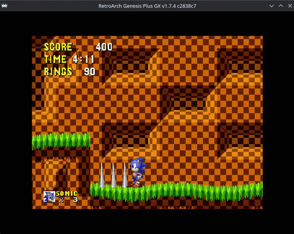
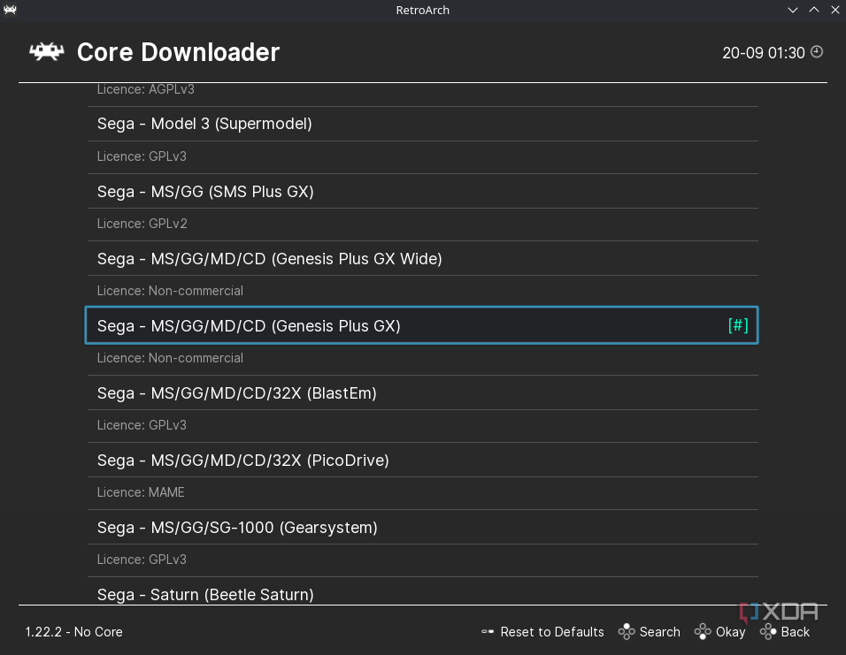
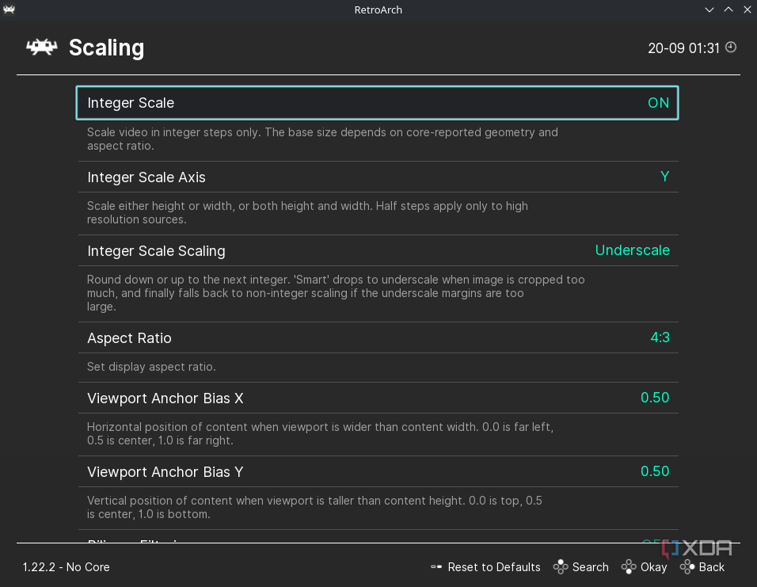
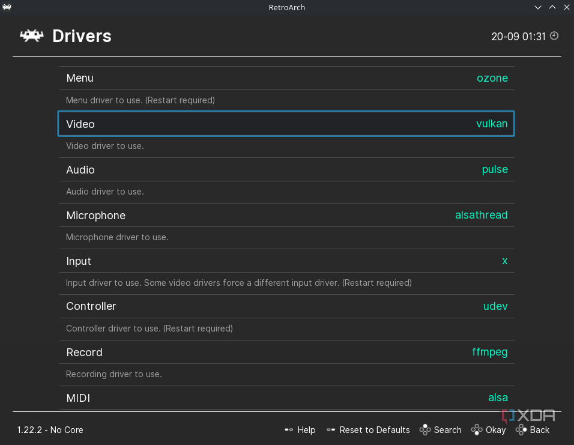
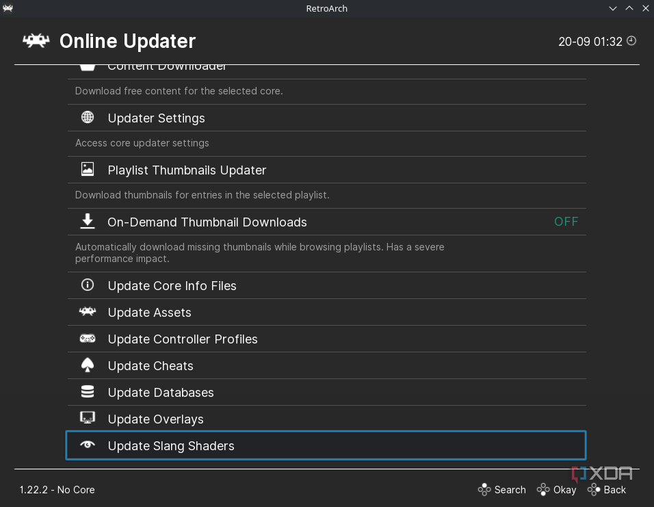
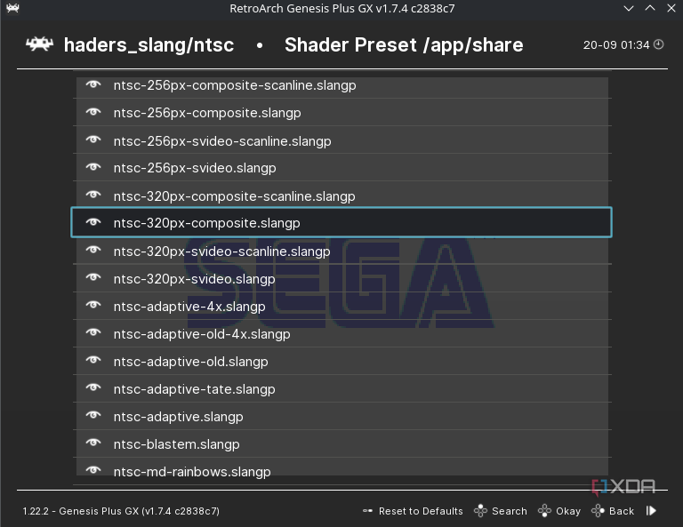
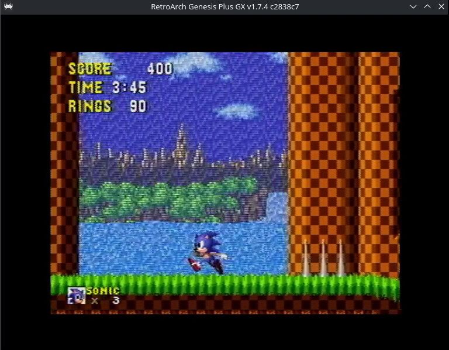

Hay una razón por la que un juego de los años 90 puede verse raro en un monitor actual: no se diseñó para él. Los títulos de la era de los 8 y 16 bits se creaban pensando en un televisor de tubo, y trasladarlos a un panel LCD sin más cambia por completo cómo se perciben los gráficos. El resultado suele ser una imagen demasiado nítida, con parpadeos y patrones que en su día no existían.

La buena noticia es que no hace falta rescatar un televisor antiguo para verlos como se pensaron. Basta con activar un shader en RetroArch, el frontend de emulación más usado, y dejar que imite el comportamiento de una pantalla CRT. Esta guía explica, paso a paso, cómo configurarlo. Está dirigida a quien ya emula en PC y quiere que los clásicos recuperen su aspecto original sin complicarse con hardware antiguo.

## Por qué los juegos de la era CRT se ven peor en un panel moderno

Un televisor de tubo no dibujaba una cuadrícula de píxeles, sino que usaba un haz de electrones que recorría la pantalla. Ese proceso mezclaba unos colores con otros, y los desarrolladores no solo lo aceptaban: lo aprovechaban. Al trabajar con un ancho de banda horizontal limitado, la señal CRT emborronaba los píxeles contiguos, y los equipos de desarrollo explotaban ese efecto para lograr resultados que el hardware no habría permitido de otro modo.

*Sonic the Hedgehog* es un ejemplo claro. A mitad del primer nivel, la cascada de Green Hill Zone debía dejar ver el fondo a través del agua gracias a un efecto de transparencia. En un CRT, el patrón de cuadrícula de la cascada se fundía con el escenario y la ilusión funcionaba. En una pantalla LCD, donde cada píxel es nítido, esa mezcla no ocurre: el resultado es una cascada con rejilla visible y un parpadeo constante al jugar.

El truco, por tanto, no es añadir nitidez, sino todo lo contrario: reintroducir de forma controlada el sangrado de color que el monitor moderno elimina. Eso es exactamente lo que hacen los shaders NTSC disponibles en RetroArch.

## Requisitos previos

- RetroArch instalado y en funcionamiento.
- Una ROM del juego que se quiera probar. La guía original usa *Sonic the Hedgehog* de Mega Drive.
- Conexión a internet, necesaria para descargar el core y los shaders.
- Un equipo con soporte para el controlador de vídeo Vulkan, ya que el procedimiento cambia a ese controlador.

## Pasos

### 1. Descargar el core de Mega Drive

Abre RetroArch y dirígete a **Main Menu > Load Core > Download a Core**. En la lista, selecciona el core **Sega - MS/GG/MD/CD (Genesis Plus GX)**, el que permite ejecutar el juego del ejemplo.

### 2. Ajustar el escalado a 4:3 y activar Integer Scale

Entra en **Settings > Video > Scaling** y fija el **Aspect Ratio (relación de aspecto) en 4:3**. Después activa **Integer Scale** en **On**, para que los píxeles se escalen en múltiplos enteros y la imagen no quede deformada.

### 3. Cambiar el controlador de vídeo a Vulkan

Vuelve al menú principal y abre **Settings > Drivers**. En la opción **Video**, cambia el valor de **gl** a **Vulkan**.

### 4. Reiniciar RetroArch y actualizar los shaders Slang

Reinicia la aplicación para que el cambio de controlador tenga efecto. De vuelta en el menú principal, entra en **Main Menu > Online Updater**, desplázate hacia abajo y pulsa **Update Slang Shaders**. Así se descargan los presets de shaders que instalarás en los pasos siguientes.

### 5. Abrir el Quick Menu durante el juego

Arranca el juego y, una vez cargado, pulsa **F1** para abrir el **Quick Menu**.

### 6. Activar los shaders de vídeo

Dentro del Quick Menu, baja hasta la opción **Shaders** y pon **Video Shaders** en **On**. Este interruptor es el que habilita el uso de presets de shaders.

### 7. Cargar el preset NTSC

Pulsa **Load Preset** y navega hasta la carpeta **shaders_slang > ntsc**. Dentro de ella, abre el archivo **ntsc-320px-composite.slangp**. Con eso queda aplicado el filtro tipo composite.

## Cómo verificar que funcionó

Pulsa **F1** de nuevo para cerrar el menú y vuelve a jugar. El cambio debería notarse de inmediato en la cascada de Green Hill Zone: donde antes había una rejilla que parpadeaba, ahora el patrón se funde con el fondo y aparece el efecto de transparencia tal como se diseñó. En la comparación de abajo, el agua deja ver el escenario sin el parpadeo incómodo.

Si no ves ninguna diferencia, comprueba que **Video Shaders** siga en **On** y que el preset cargado sea el correcto; el efecto solo se aplica mientras la opción esté activa.

## Limitaciones y notas

- La carpeta de presets incluye un shader para prácticamente cada situación. Merece la pena explorarla y buscar el que mejor encaje con la pantalla y el sistema que quieras recrear.
- El objetivo de un shader NTSC no es dar una imagen más nítida, sino más fiel a como se veía en un tubo. Es un efecto deliberado de sangrado de color, no un defecto.
- El paso 3 requiere que el equipo y sus controladores admitan Vulkan. Si no es el caso, la opción no aparecerá y habrá que quedarse en el controlador anterior.
- La combinación de relación de aspecto 4:3 e Integer Scale deja franjas negras a los lados en pantallas panorámicas. Es el precio de reproducir la geometría original.
- Los shaders se procesan en la GPU, así que en equipos muy modestos pueden restar algo de rendimiento.
