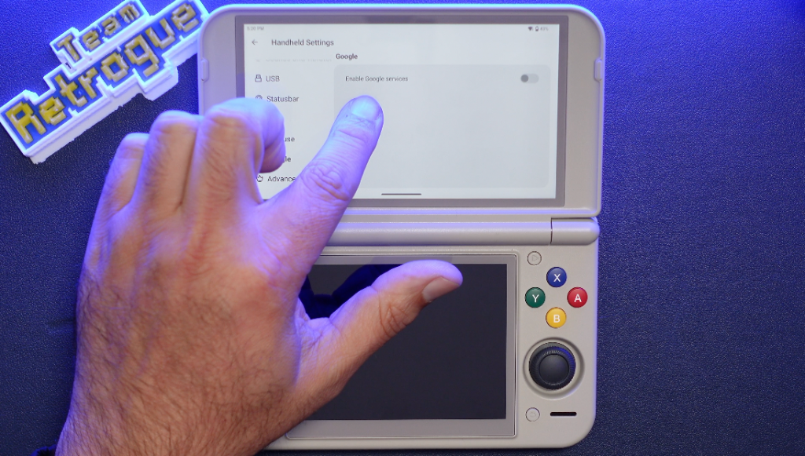
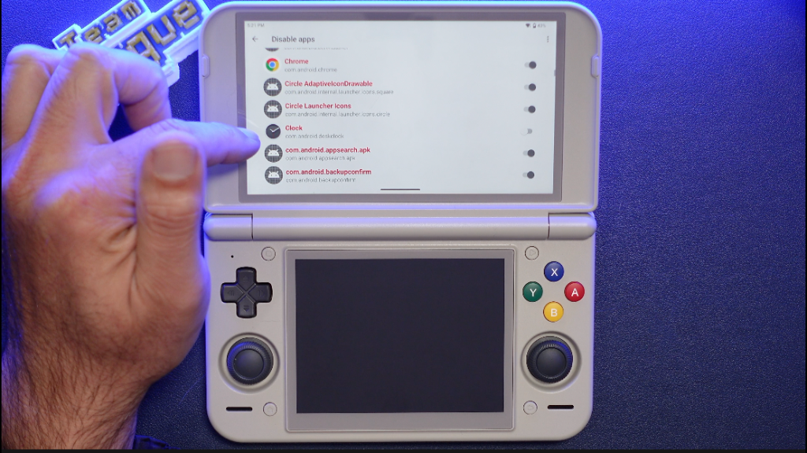
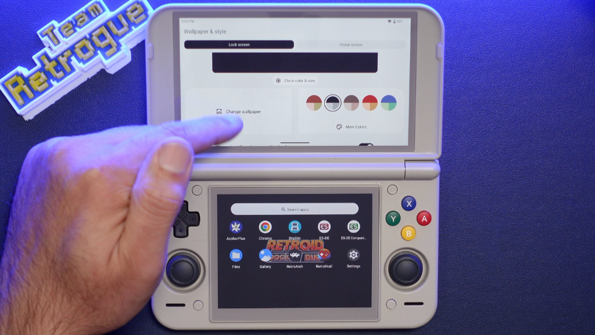
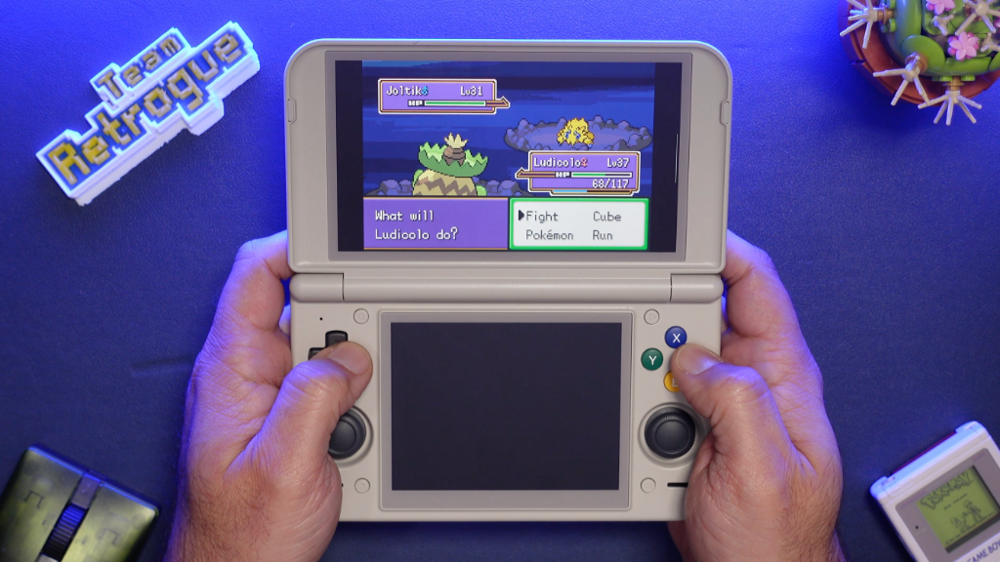
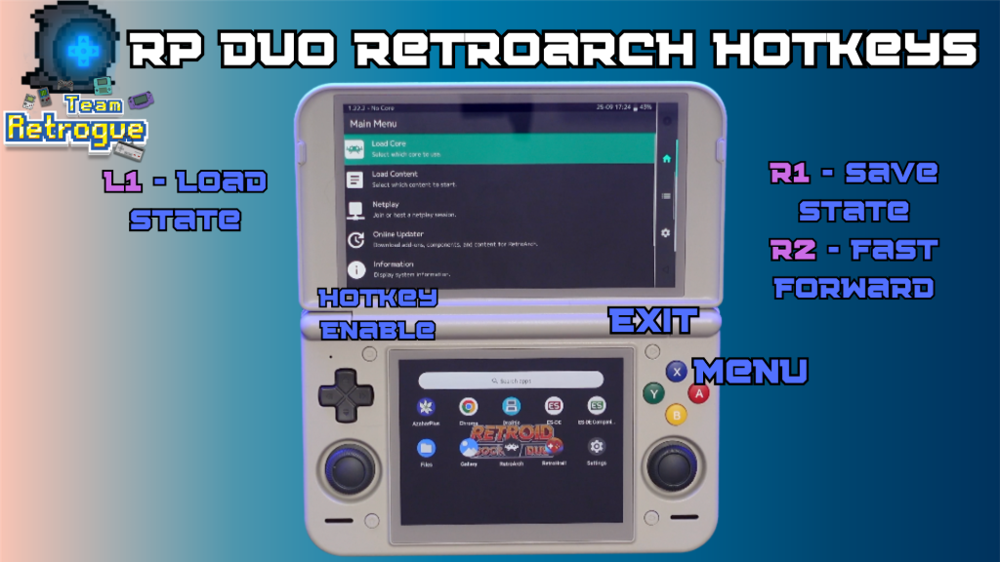
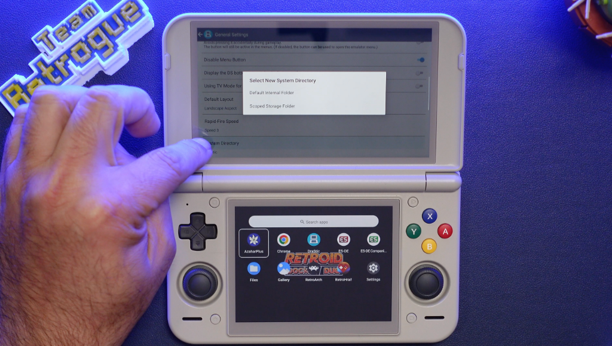
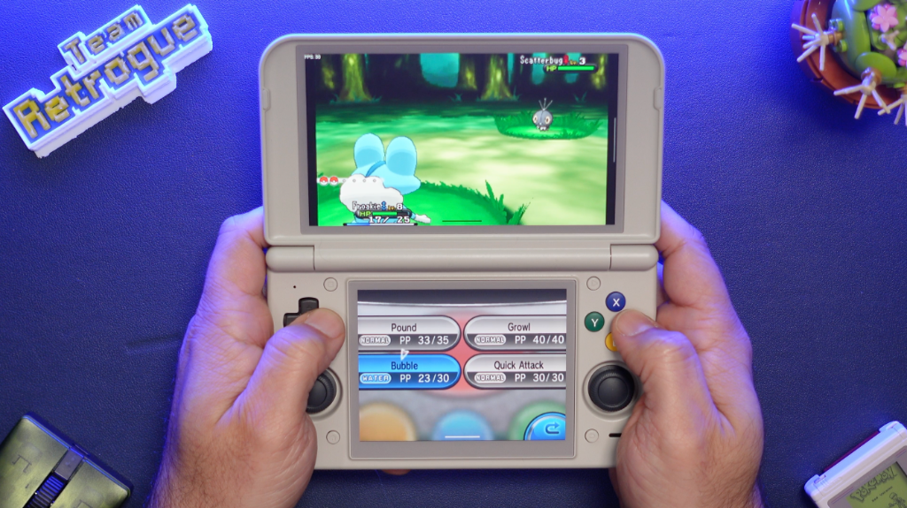
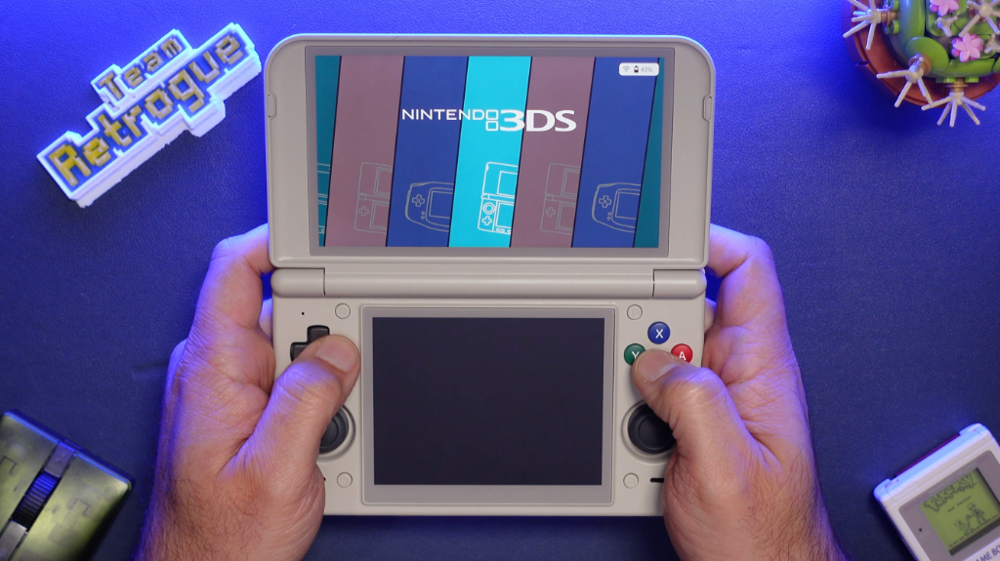

La Retroid Pocket Duo Lite es una portátil de doble pantalla con un chipset modesto que rinde bien en Game Boy Advance, Nintendo DS y Nintendo 3DS, siempre que se afinen algunos ajustes. Esta guía recoge, paso a paso, cómo liberar memoria, corregir el tono de pantalla, colocar los juegos en el almacenamiento interno y configurar los emuladores RetroArch, DraStic y AzaharPlus en la Duo Lite.

## Requisitos previos

- Una Retroid Pocket Duo Lite con su configuración inicial completada.
- Conexión a internet para descargar los emuladores y los controladores gráficos.
- Copias de los juegos que se vayan a utilizar, organizadas a mano en el almacenamiento interno.
- Un rato para instalar aplicaciones fuera de la tienda, ya que parte del proceso consiste en descargar APK por separado.

## Paso 1: Deshabilitar los servicios de Google para liberar memoria

Los servicios de Google Play permanecen activos en segundo plano y consumen memoria RAM. En consolas potentes compensa mantenerlos por el acceso a la tienda y a la cuenta de Google, pero en un dispositivo modesto que no va a ejecutar juegos nativos exigentes conviene desactivarlos y dedicar esos recursos a la emulación. Las aplicaciones necesarias se pueden instalar por separado.

Se puede desactivar durante las preguntas de la configuración inicial o más tarde desde los ajustes de la consola, en los ajustes específicos del dispositivo. Conviene tener presente que, al hacerlo, las aplicaciones de Google como YouTube y la tienda dejan de funcionar.

En el mismo impulso se pueden desactivar aplicaciones preinstaladas de Android que no sean necesarias, desde la siguiente ruta:

- *Settings –> Handheld Settings –> Advanced –> Disable Apps* –> *Show System Apps* en el menú superior derecho.

Desde ahí se desactivan las que se conozcan con seguridad, como el calendario, el reloj o la grabadora de sonido.

## Paso 2: Corregir el tono marrón de la pantalla

El fondo de pantalla predeterminado del sistema tiñe la pantalla con un tono marrón poco atractivo. Se corrige cambiando el estilo del fondo con esta ruta:

- *Settings –> Wallpaper –>* Wallpaper & Style

Al desplazarse hacia abajo aparece una segunda opción de color, mayormente blanca con la parte superior en negro o azul. Al seleccionarla desaparece el tono marrón y las pantallas quedan con un aspecto limpio.

## Paso 3: Guardar los juegos en el almacenamiento interno

El siguiente paso consiste en guardar los archivos de juego en el almacenamiento interno en lugar de en la tarjeta microSD, porque la lectura es más rápida. En las pruebas originales, los juegos de 3DS cargados desde la tarjeta tardaban mucho en arrancar y sufrían más tirones durante la partida; al ejecutarlos desde la memoria interna, esos problemas se reducen porque el emulador lee los datos con mayor rapidez.

Con la aplicación de archivos, basta con entrar en la carpeta de documentos, crear una carpeta titulada «roms» y colocar dentro los juegos en sus subcarpetas correspondientes. En el equipo de referencia se guardó una colección pequeña de juegos de DS, 3DS y Game Boy Advance pensada para esta consola.

## Paso 4: Configurar los emuladores de Game Boy Advance, DS y 3DS

Con los juegos ya colocados, hay que instalar por separado los emuladores. La guía se centra en tres sistemas: Game Boy Advance, Nintendo DS y Nintendo 3DS. El planteamiento es tratar la consola como una Nintendo DS Lite con extras: la ranura clásica de GBA equivale a la pantalla superior panorámica de 16:9, y la 3DS queda como sistema adicional porque no todos sus juegos rendirán bien en este hardware.

### Game Boy Advance con RetroArch

Para Game Boy Advance se utiliza RetroArch, que también cubre otros sistemas clásicos como Nintendo, Super Nintendo y Genesis. Se descarga desde la web oficial de RetroArch y requiere una pequeña configuración inicial.

Tras instalarlo, hay que entrar en el actualizador en línea (*Online Updater*) e instalar los núcleos que se vayan a usar. También conviene actualizar los perfiles de mando y los sombreadores, además de dejar que se actualicen el resto de las opciones inferiores.

Después, en ajustes, entrada y teclas rápidas (*settings, input, hotkeys*), se configura una tecla de activación (*hotkey enable*): un botón que se mantiene pulsado para acceder a las funciones rápidas de RetroArch.

Para la imagen se emplea el sombreado *Sharp Shimmerless*, que resalta en la pantalla panorámica. Hay que descargarlo e instalarlo a mano: con la aplicación de archivos se traslada a la carpeta de sombreadores de RetroArch y luego se selecciona como preajuste desde el menú rápido, en el apartado de sombreadores. Para profundizar en la imagen, también existe una guía para [devolver el aspecto CRT a los juegos retro con un sombreador NTSC en RetroArch](/noticias/retroarch-ntsc-shader/).

### Nintendo DS con DraStic_rev-i18n

Para Nintendo DS se instala una variante moderna del emulador DraStic, denominada DraStic_rev-i18n, cuyo objetivo es hacer traducible una mayor parte de los textos estáticos e incorporar la base de datos de trucos en chino o inglés según el idioma del sistema.

Una vez instalado, dentro de los ajustes se activan las texturas en alta definición (*HD Textures*) en los ajustes gráficos. Los ajustes recomendados son los siguientes:

- *Settings –> General –> Default Layout –> Landscape Aspect*
- *Settings –> Video –> High Resolution 3D Rendering + 16 Bit Rendering On*
- *Settings –> Video –> External Display Mode –> Fullscreen*
- *Settings –> Video –> External Display Screen –> Bottom Screen*
- *Settings –> Video –> External Display Border –> 0%*

Además, conviene configurar la aplicación para que use una carpeta concreta de almacenamiento en lugar de la carpeta interna predeterminada. Es una preferencia práctica: facilita trasladar las partidas guardadas desde otro dispositivo a la carpeta de copias y moverlas en ambos sentidos.

### Nintendo 3DS con AzaharPlus y controladores personalizados

Para 3DS se utiliza el emulador AzaharPlus, que permite aprovechar controladores gráficos personalizados. Los tres controladores que la comunidad estaba probando son el Turnip T19 de Mr. Purple y los controladores v805 y v615.50 de Qualcomm.

Los controladores se instalan desde los ajustes de Azahar, en la sección del gestor de controladores gráficos (*GPU Driver Manager*): basta con pulsar instalar y buscar la carpeta donde estén los archivos descargados, que será la de descargas si se bajaron con Chrome en el propio dispositivo.

Los ajustes recomendados para optimizar Azahar son estos:

- *Settings –> Graphics –> Graphics API –> Vulkan*
- *Settings –> Graphics –> Enable Asynchronous Shader Compilation*
- *Settings –> Graphics –> Disable Right Eye Render*

La desactivación del renderizado del ojo derecho no sienta bien a algunos juegos, así que puede ser necesario reactivarla juego por juego, aunque la mayor parte del catálogo no la necesita. El proyecto evoluciona con frecuencia: [la versión 2126.1.2 de Azahar corrigió el cuelgue de RetroArch al salir de un juego de 3DS](/noticias/azahar-2126-1-2/). La compilación asíncrona de sombreadores reduce los tirones por el almacenamiento en caché de sombreadores, a cambio de posibles fallos gráficos menores o aparición tardía de elementos. Aun así, la recomendación es ceñirse a juegos ligeros en 2D, aunque varios usuarios informan de un rendimiento estable en los Pokémon 3D experimentando con controladores y estos dos ajustes.

## Paso 5: Montar un frontend solo en la pantalla superior

El último paso es instalar un frontend, y la combinación que mejor funciona es EmulationStation Desktop Edition (ES-DE) únicamente en la pantalla superior. Se trata de una aplicación de pago mediante una suscripción puntual a su Patreon, tras la cual se siguen recibiendo las actualizaciones por correo aunque se vuelva al nivel gratuito.

El motivo de limitarlo a la pantalla superior es que usar un frontend en ambas pantallas altera la resolución de la inferior al lanzar el emulador. El problema se repitió tanto con ES-DE como con RetroHrai, sin que se encontrara forma de corregirlo.

Cualquiera de los dos frontend permite lanzar los juegos de doble pantalla en ambas y organizar la biblioteca por sistemas con carátulas descargadas. Con este hardware conviene además apagar la pantalla inferior al jugar a Game Boy Advance para ahorrar recursos. Una vez elegido el frontend, se puede fijar como aplicación de inicio predeterminada desde ajustes y aplicaciones para lograr un aspecto de consola.

## Cómo verificar que la Retroid Pocket Duo Lite quedó optimizada

La mejora se nota en varios puntos: el sistema responde con más soltura sin los servicios de Google en segundo plano, la pantalla pierde el tono marrón tras cambiar el estilo del fondo, los juegos de 3DS cargan más rápido desde la memoria interna, y cada emulador arranca sus juegos con los ajustes indicados sin tirones anómalos. En el frontend, la biblioteca aparece organizada por sistemas con sus carátulas y los juegos de doble pantalla activan la segunda pantalla al lanzarse.

## Advertencias y limitaciones

Desactivar aplicaciones del sistema puede romper el dispositivo si se tocan procesos de fondo desconocidos: conviene limitarse a las que se reconozcan. La 3DS sigue siendo un sistema adicional en este hardware, no una garantía: muchos títulos exigentes no ofrecerán una buena experiencia. Los controladores gráficos personalizados son experimentales y su resultado varía por juego. Y al fijar el frontend como inicio predeterminado, conviene recordar cómo volver a los ajustes normales por si alguna configuración falla.
