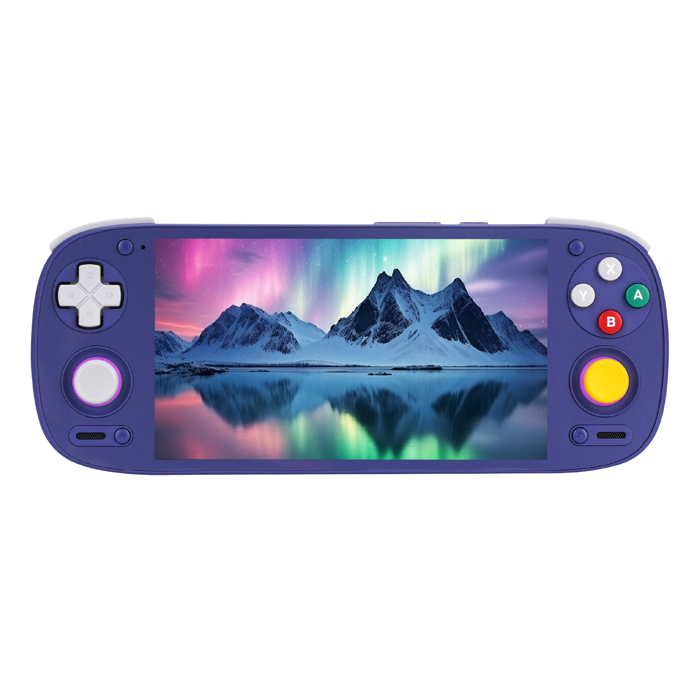
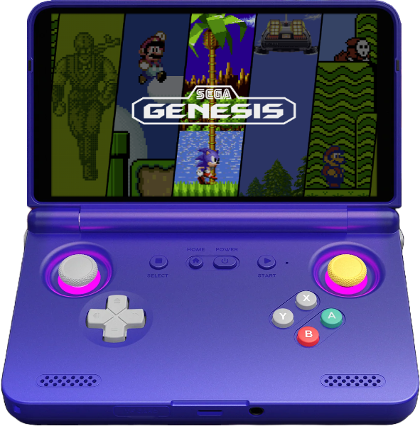

Retroid anunció en julio que dejaría de vender la variante de 8 GB de sus consolas portátiles **Retroid Pocket 5** y **Pocket Flip 2** para pasar a una configuración de **12 GB de RAM**, con un aumento de precio de apenas 10 dólares. Según los propios usuarios, la memoria adicional no habría sido el único cambio: las unidades nuevas parecen montar una **pantalla de 120 Hz** que el software de fábrica mantiene desactivada.

## Qué han detectado los usuarios de las Retroid Pocket 5 y Flip 2

La pista apareció hace casi una semana en el subforo **r/SBCGaming**, donde un propietario de una Retroid Pocket 5 comprobó que su equipo informaba de una pantalla de 120 Hz. La medición se hizo primero con la aplicación **PULSE**, de Kei's Retro Gaming, y después se confirmó mediante comandos **ADB**. Anoche llegó una segunda publicación, esta vez en **r/Retroid**, en la que otro usuario mostraba que su **Pocket Flip 2** —comprada durante una rebaja— también incorporaba un panel de 120 Hz.

Conviene ser prudente: de momento se trata de un hallazgo de la comunidad, no de un cambio anunciado oficialmente por la marca. Retroid no ha emitido confirmación pública al respecto, de modo que no está claro si todas las unidades fabricadas desde la actualización de memoria incorporan este panel, ni desde qué lote empezó a hacerlo.

## Por qué importa: panel de 120 Hz limitado por software

Hay un matiz que rebaja la euforia. Aunque el panel sea capaz de refrescar a 120 Hz, **algo en el software de Retroid impide que se use a esa frecuencia**. El resultado es que, al moverse por la interfaz de Android, el usuario no percibirá diferencia alguna frente a un modelo anterior. La frecuencia alta no está disponible de serie.

La vía para aprovecharla pasa por la aplicación **PULSE**, que permite activar los 120 Hz **aplicación por aplicación**. No es tan cómodo como un ajuste global activado de fábrica, pero sí es una forma de sacar partido al panel. La propia escena de emulación en Android lleva tiempo peinando este tipo de limitaciones: es el mismo terreno en el que [Qualcomm estudia mejorar la emulación de juegos de PC con controladores oficiales](/noticias/qualcomm-pc-game-emulation-android/), un recordatorio de que en estos equipos el software pesa tanto como el hardware.

## Qué cambia para el comprador

El detalle llega en un momento delicado para el catálogo de Retroid. A comienzos de mes, la compañía anunció que **descontinuaría la Pocket 5, la Pocket Flip 2 y la Pocket Classic**, de modo que las unidades actuales son las últimas que se podrán comprar. Las rebajas en vigor aplican un descuento de 30 dólares: la Pocket Flip 2 con Snapdragon 865 queda en **189 dólares** y la Pocket 5 en **179 dólares**. Cuando se agote el stock, la marca ya ha confirmado que no volverán a fabricarse.

En la práctica, quien haya comprado recientemente una de estas consolas o lo haga ahora puede encontrarse con el panel de 120 Hz, pero tendrá que habilitarlo manualmente con PULSE para notarlo en juegos compatibles. Y quien valore esa fluidez debería moverse rápido, porque el inventario disponible ya no se repone.
