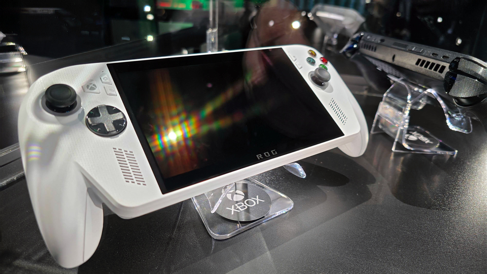
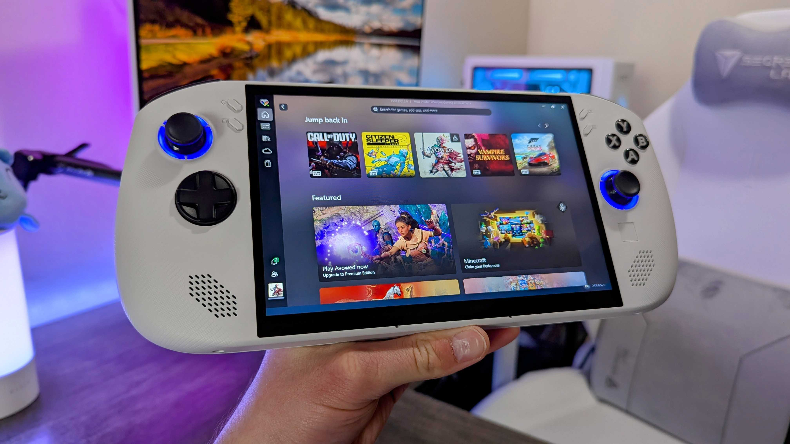

La ROG Xbox Ally ha dejado de ser la opción cara del segmento. Un análisis firmado por Ben Wilson en Windows Central sostiene que la handheld fruto de la alianza entre Microsoft y ASUS se ha convertido en la compra más razonable entre los PC gaming portátiles de 2026, justo cuando la Steam Deck de Valve ha perdido el argumento que la definió durante años: el precio.

## La ROG Xbox Ally mantiene su precio y da la vuelta a la brecha con la Steam Deck

El punto de partida del análisis es una comparación directa de tarifas. La ROG Xbox Ally blanca se vende por 599,99 dólares en Best Buy, el mismo precio con el que llegó al mercado, y mantiene una valoración media de 4,4 sobre 5 entre más de 930 reseñas de clientes en ese mismo listado. La Steam Deck más asequible, en cambio, arranca en 789 dólares para el modelo de 512 GB.

Conviene recordar qué hay dentro de cada una. La ROG Xbox Ally blanca monta el procesador AMD Ryzen Z2 A, un chip de arquitectura Zen 2 cuyo rendimiento el medio sitúa más cerca de la Steam Deck que de su hermana mayor, la ROG Xbox Ally X negra. No es, por tanto, una máquina de gama alta, sino una propuesta de entrada construida para competir en el tramo bajo.

Cada una conserva una ventaja concreta. Valve mantiene la del panel OLED, con mayor contraste, mientras que la ROG Xbox Ally puede alcanzar los 120 Hz frente a los 90 Hz de la Steam Deck OLED, siempre que el juego sea lo bastante ligero para aprovecharlos, y suma compatibilidad con tasa de refresco variable (VRR) para reducir el desgarro de imagen y las inconsistencias de cadencia.

## El precio ya no es la única baza de SteamOS

Durante los primeros años de la categoría, el sistema operativo fue un factor de peso: la licencia de Windows encarecía cada dispositivo y SteamOS aparecía como la alternativa económica. Ese relato se ha desdibujado. El análisis señala que la Lenovo Legion Go S con Ryzen Z2 Go, concebida precisamente alrededor de SteamOS, ronda ahora los 989,99 dólares, muy por encima de los 599,99 dólares de su precio de lanzamiento, y que la variante con Ryzen Z1 Extreme llegó a los 1.579,99 dólares, con rebajas puntuales hasta los 999,99.

La razón que repite el medio es la crisis de memoria empujada por la infraestructura de hardware para inteligencia artificial, que no da señales de frenar y que está [encareciendo componentes en toda la industria](/noticias/amd-ryzen-price-hike-2026/). En ese escenario, el sobrecoste de Windows pesa menos que la factura del resto del equipo.

A ello se añade un detalle técnico que desarma parte de la objeción: nada impide instalar SteamOS en una ROG Xbox Ally, como en cualquier otra handheld basada en Windows. La experiencia puede variar según el dispositivo, pero el medio subraya que ningún fabricante relevante ha bloqueado sus productos a Windows 11 de forma deliberada. Si la Ally conserva su precio, podría instalarse como la opción mayoritaria.

## Qué cambia para el comprador

El análisis no solo mira el precio, también la disponibilidad. El modelo blanco de la ROG Xbox Ally mantiene existencias razonables, a diferencia de variantes de gama muy alta como la MSI Claw 8 EX AI+, de 1.799 dólares, que se agotó pronto y llegó a revenderse mucho más cara. Para quien busca gastar bastante menos de 1.000 dólares, el terreno del gasto sensato, Microsoft y ASUS estarían batiendo a Valve.

Para el lector español hay dos matices que conviene no perder de vista. Los precios citados son dólares y de comercio estadounidense, de modo que la conversión a euros y la disponibilidad en Europa no siguen automáticamente ese guion. Y el texto es un análisis de opinión, no un veredicto cerrado: la propia Valve no ha aclarado [cómo ni cuándo llegará la Steam Deck 2](/noticias/steam-deck-2-how-when/), un lanzamiento que podría reordenar por completo esta comparación.
