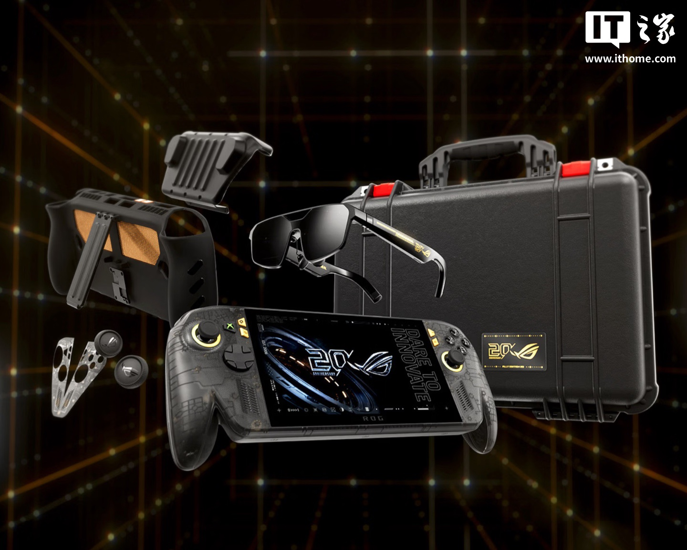
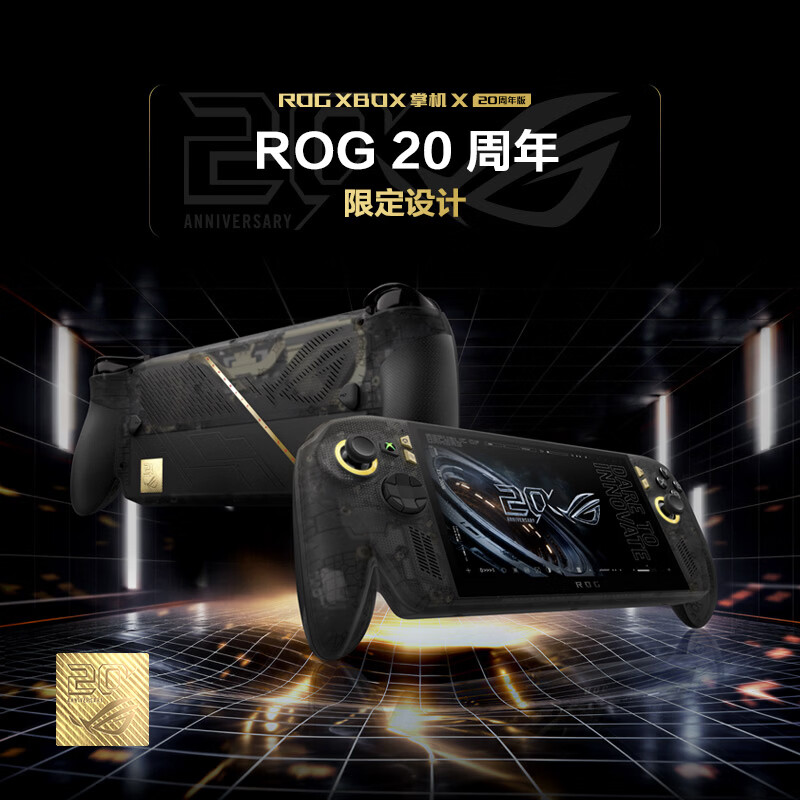
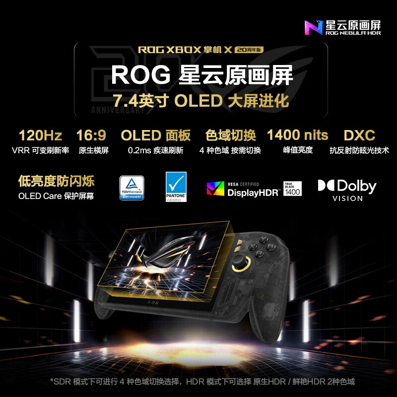
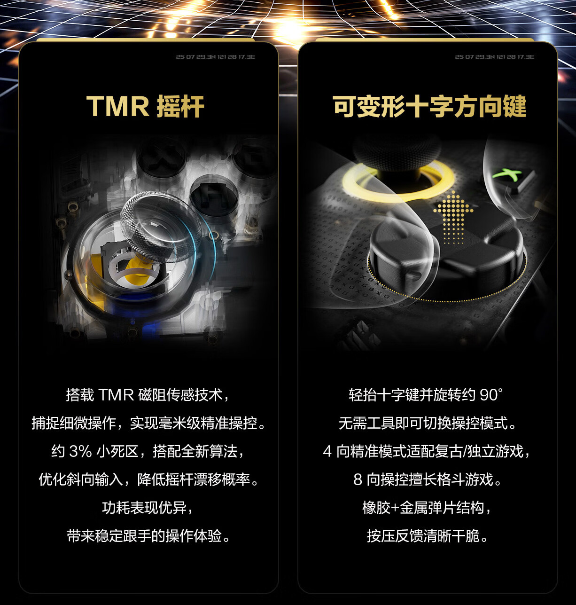
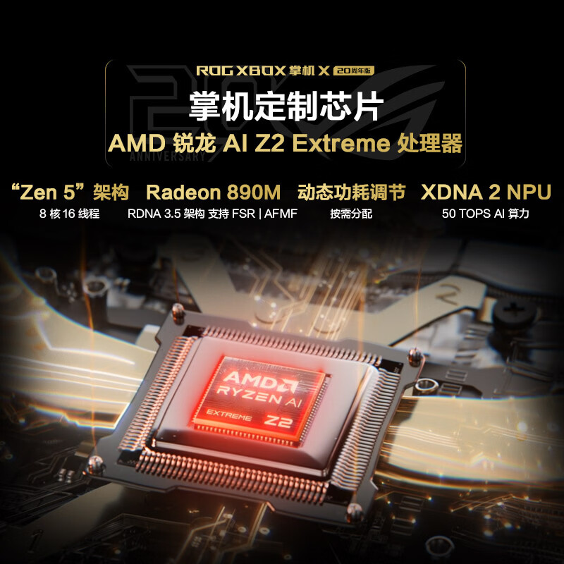
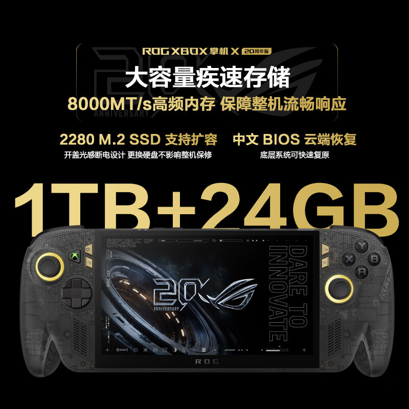
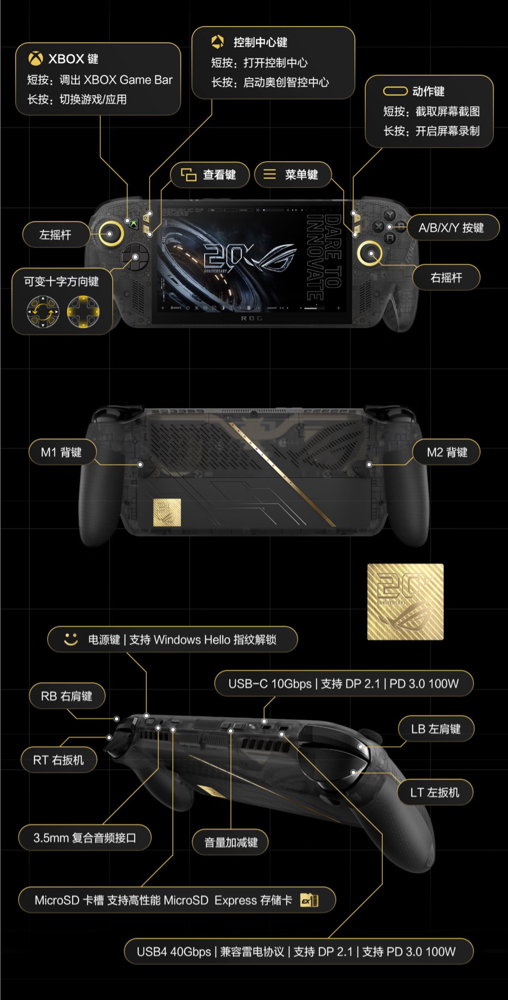

ASUS ha puesto a la venta en China la ROG Xbox Ally X 20.º aniversario, una edición conmemorativa de su consola portátil desarrollada junto a Xbox. La reserva ya aparece en las tiendas en línea del país y la venta arranca el 15 de octubre, con dos configuraciones: la edición estándar por 9.999 yuanes y un conjunto completo por 18.999 yuanes. Por ahora no hay anuncio de precio ni fecha para Europa.

El conjunto de 18.999 yuanes amplía el contenido con unas gafas de realidad aumentada ROG XREAL R1 en versión 20.º aniversario, un kit de protección dbrand Killswitch (funda con soporte, tapa de viaje, capuchones antideslizantes personalizados para los sticks y protector de pantalla) y una maleta rígida Pelican a medida con la insignia dorada del aniversario y los cierres rojos de ROG.

## Diseño de aniversario y pantalla OLED de 7,4 pulgadas

La edición luce un chasis semitransparente con detalles en negro y dorado y una placa dorada exclusiva del 20.º aniversario, una estética pensada para coleccionistas más que para pasar desapercibida.

El gran salto técnico está en la pantalla: un panel OLED de 7,4 pulgadas con resolución de 1920 × 1080, frecuencia de 120 Hz con tasa de refresco variable (VRR) y un brillo máximo de 1.400 nits. Incluye tratamiento antirreflejos DXC y certificaciones Dolby Vision y DisplayHDR True Black 1400, una combinación que apunta directamente a jugar al aire libre y en habitaciones luminosas sin perder contraste.

En los controles, ASUS apuesta por sticks TMR con sensores magnetorresistivos: prometen una zona muerta de apenas el 3 %, una respuesta diagonal más precisa y menor probabilidad de deriva. La cruceta es convertible: basta con levantarla y girarla unos 90 grados para alternar entre control de 4 y 8 direcciones según el género del juego.

## La Ally X por dentro: Ryzen AI Z2 Extreme, 24 GB de memoria y batería de 80 Wh

El corazón del equipo es el Ryzen AI Z2 Extreme de AMD, un chip personalizado para consolas portátiles con 8 núcleos y 16 hilos, gráficos integrados Radeon 890M con arquitectura RDNA 3.5 y compatibilidad con las tecnologías de reescalado FSR y generación de fotogramas AFMF. La NPU con arquitectura XDNA 2 aporta hasta 50 TOPS de potencia para tareas de inteligencia artificial.

La memoria es de 24 GB a 8.000 MT/s junto a un SSD de 1 TB en formato M.2 2280 ampliable por el usuario. ASUS destaca un detalle tranquilizador: el equipo incorpora un diseño de desconexión por sensor de luz al abrir la carcasa, de modo que cambiar el disco no anula la garantía.

La batería alcanza los 80 Wh y el software corre a cargo de la interfaz de Xbox a pantalla completa, ajustada entre ROG y Xbox: el centro de control Armoury Crate SE se integra con la Game Bar de Xbox, que se invoca con el botón dedicado para consultar el rendimiento, capturar pantalla o ajustar el sistema sin salir del juego.

## Precio, disponibilidad y qué esperar en España

La información publicada detalla también los botones e interfaces del equipo, que mantienen el esquema habitual de la familia Ally con los accesos directos de Xbox.

Para el lector español, la clave es el calendario: se trata de la versión china, a la venta el 15 de octubre desde 9.999 yuanes, sin confirmación por ahora de su llegada a Europa ni de su precio en euros. Quien siga de cerca las portátiles para jugar en PC puede repasar [cómo queda la ROG Xbox Ally frente a una Steam Deck que ya no es la opción barata](/noticias/rog-xbox-ally-vs-steam-deck/) mientras ASUS confirma sus planes internacionales.
