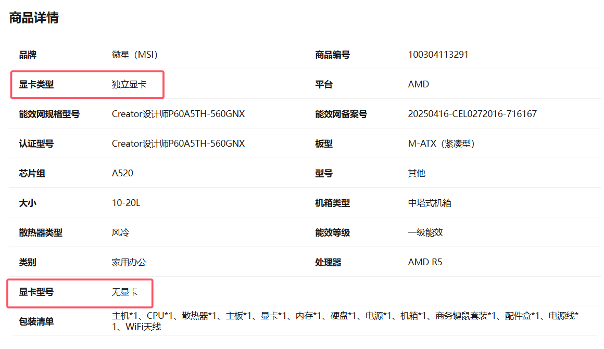
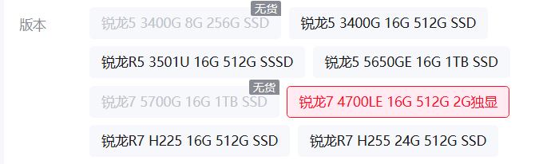
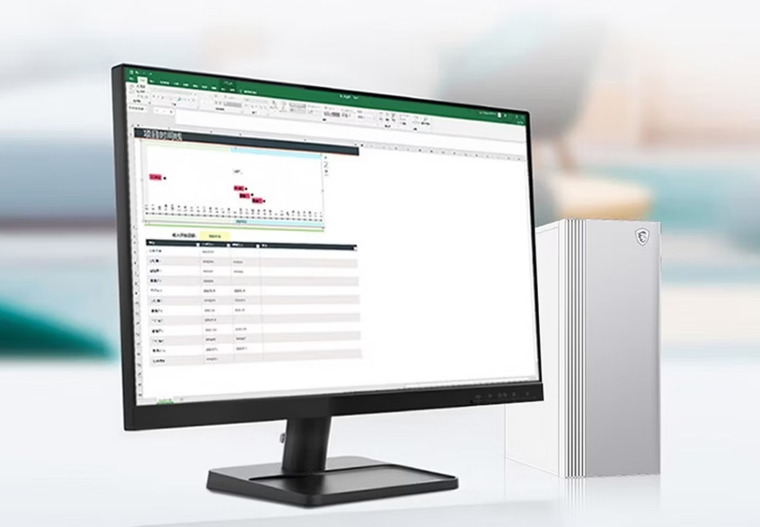

MSI ha puesto a la venta en una plataforma de comercio electrónico china una versión del sobremesa Creator P60 equipada con el procesador AMD Ryzen 7 4700LE. El precio anunciado es de 2799 yuanes e incluye 16 GB de memoria DDR4 y un SSD de 512 GB. Hasta ahí, una configuración de gama de entrada sin mayor misterio. El problema aparece en el apartado gráfico: el material promocional del fabricante describe la máquina como portadora de una «tarjeta gráfica RTX 2G», es decir, una GPU de la familia RTX con 2 GB de memoria de vídeo.

El detalle descoloca porque no existe ninguna RTX con esa cantidad de VRAM. La propia NVIDIA no comercializa un modelo de ese tipo: la tarjeta profesional de acceso RTX A400 parte de 4 GB de GDDR6, y la opción de consumo más modesta, la RTX 2050, también arranca en 4 GB. La compañía sí tiene una GPU de 2 GB, la T400, pero pertenece a la serie T y no forma parte de la marca RTX ni ofrece trazado de rayos. La etiqueta, por tanto, describe un producto que no encaja en el catálogo oficial.

## Una lista de especificaciones contradictoria

La confusión no se limita al cartel publicitario. En la página de detalle del producto, el tipo de gráfica se etiqueta como «gráfica dedicada», pero el campo reservado al modelo concreto reza «sin gráfica». El selector de versiones, en cambio, vuelve a coincidir con la imagen de MSI y marca «2G dedicada». Con estos datos, resulta imposible determinar qué tarjeta incorpora realmente el equipo.

## El procesador obliga a montar una GPU aparte

El Ryzen 7 4700LE es un procesador exclusivo del canal OEM que AMD presentó este año. Se apoya en la arquitectura Zen 2, suma 8 núcleos y 16 hilos y funciona a 3,6 GHz de base con 4,2 GHz de aceleración. Lo relevante para esta historia es que carece de gráficos integrados, de modo que el Creator P60 necesita una tarjeta dedicada para dar imagen. Esa dependencia explica por qué MSI detalla una GPU en la ficha, pero no aclara cuál.

Ante la información disponible, caben dos lecturas. La primera es un error de los materiales promocionales, que habrían rebautizado como RTX una tarjeta de 2 GB ajena a esa familia. La segunda es que el equipo monte de verdad una gráfica de 2 GB, pero que la tienda no haya especificado su modelo real.

## Qué significa para quien compra un preensamblado

Más allá de la anécdota, el caso ilustra un problema recurrente en el mercado de los equipos preensamblados económicos: las fichas de producto no siempre describen con precisión el hardware que llevan dentro. Cuando una denominación comercial no se corresponde con ningún modelo verificable, el comprador se queda sin una referencia clara para comparar rendimiento, consumo o soporte de funciones como el trazado de rayos.

Para el lector hispanohablante que se plantee adquirir un sobremesa de este tipo, la recomendación es la de siempre: exigir el modelo exacto de la tarjeta gráfica antes de pagar y desconfiar de etiquetas genéricas como «2G» o «RTX» sin apellido. Un error de marketing puede acabar traduciéndose en un equipo con menos capacidades de las esperadas.
