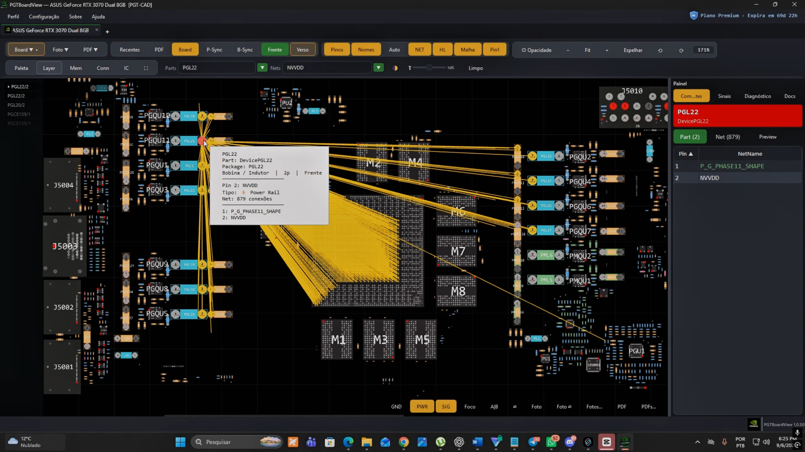
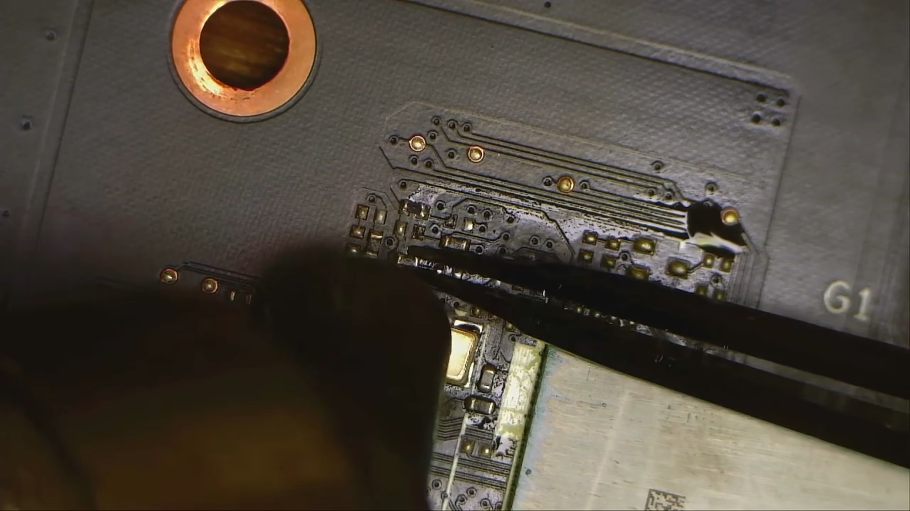
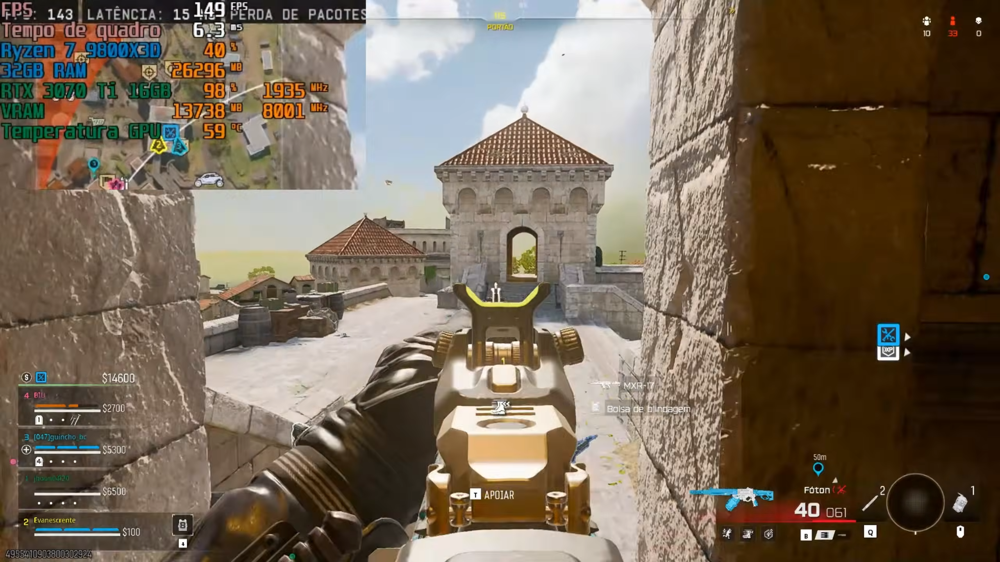

Hace unos años, Nvidia tenía previsto lanzar una RTX 3070 Ti con 16 GB de VRAM, pero el mercado acabó recibiendo una versión de 8 GB. De aquella variante solo quedaron listados en bases de datos y un prototipo físico que nunca llegó a verse funcionando. Ahora, el creador brasileño Fabian, del canal de YouTube fmklab, ha construido su propia versión y la ha puesto en marcha.

## Un Frankenstein con piezas de dos generaciones

El experimento parte de una decisión técnica muy concreta. Fabian tomó un PCB de RTX 3070 y le injertó el núcleo de una RTX 3070 Ti. El motivo es que la 3070 de serie usa memoria GDDR6, mientras que la 3070 Ti de tienda emplea GDDR6X: esa diferencia le permitió trabajar sobre una base con chips GDDR6 más asequibles.

Con la tarjeta desnuda hasta el PCB y el chip original retirado, sustituyó los módulos Samsung HC14 de 8 Gb que ya venían soldados por otros HC16 de 16 Gb. El resultado, en teoría, doblaba la capacidad de 8 GB a 16 GB.

El problema apareció al arrancar: GPU-Z solo reconocía 8 GB. Para que la tarjeta usara todo el espacio había que reconfigurar los straps de memoria del PCB. Fabian recurrió a la herramienta Nvidia BIOS Reader para localizar exactamente qué parámetros ajustar y completó la soldadura. Después, la utilidad MATS reconoció los 16 GB completos sin errores, y GPU-Z mostró una RTX 3070 Ti con 16 GB de GDDR6, muy parecida al prototipo que se filtró años atrás.

## De reconocer la memoria a usarla de verdad

Detectar los 16 GB era solo el primer paso; el siguiente era comprobar que servían para algo. Fabian ejecutó un modelo de lenguaje local y comprobó que la GPU reservaba casi todo el espacio disponible, muy por encima de los 8 GB habituales. También probó *Call of Duty: Warzone* junto a un Ryzen 7 9800X3D: el juego consumió más de 13 GB de VRAM sin mostrar inestabilidad.

El propio autor enlazó una prueba de Unigine Superposition como evidencia. La puntuación fue de 5.367 puntos, por debajo de la mayoría de las 3070 Ti de serie. La explicación está en el propio montaje: la GDDR6 tiene menos ancho de banda que la GDDR6X original, y ese es el principal precio a pagar por duplicar la capacidad.

## Contexto: cuándo compensa más memoria

El experimento es un ejercicio de ingeniería admirable y, según su autor, probablemente la única 3070 Ti de 16 GB funcional del mundo. Pero conviene leerlo con perspectiva. Una RTX 3070 Ti sigue siendo una tarjeta solvente, aunque queda por detrás de las opciones Blackwell actuales incluso cuando estas llevan menos memoria. Para quien necesite rendimiento y algo de margen de cara al futuro, hoy tiene más sentido una RTX 5060 Ti de 16 GB, con mejor eficiencia, más funciones y soporte posventa.

La conclusión es que la memoria extra no convierte por sí sola a una GPU antigua en una solución moderna. El valor de este tipo de modificaciones está en demostrar hasta dónde se puede estirar el hardware, no en presentarse como una alternativa de compra realista.
