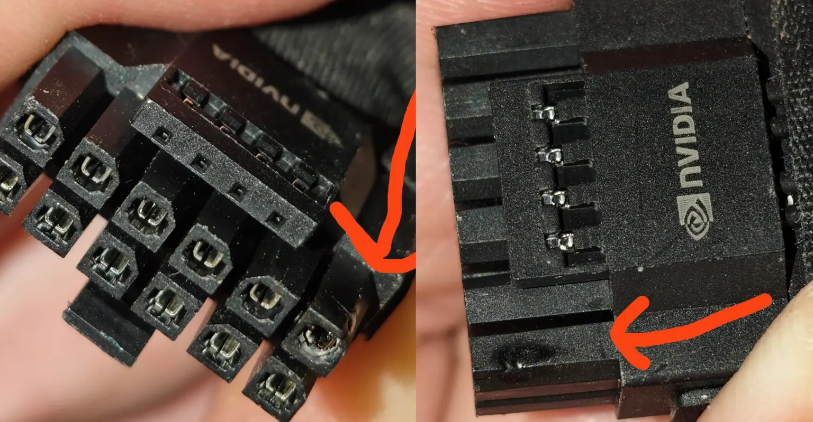
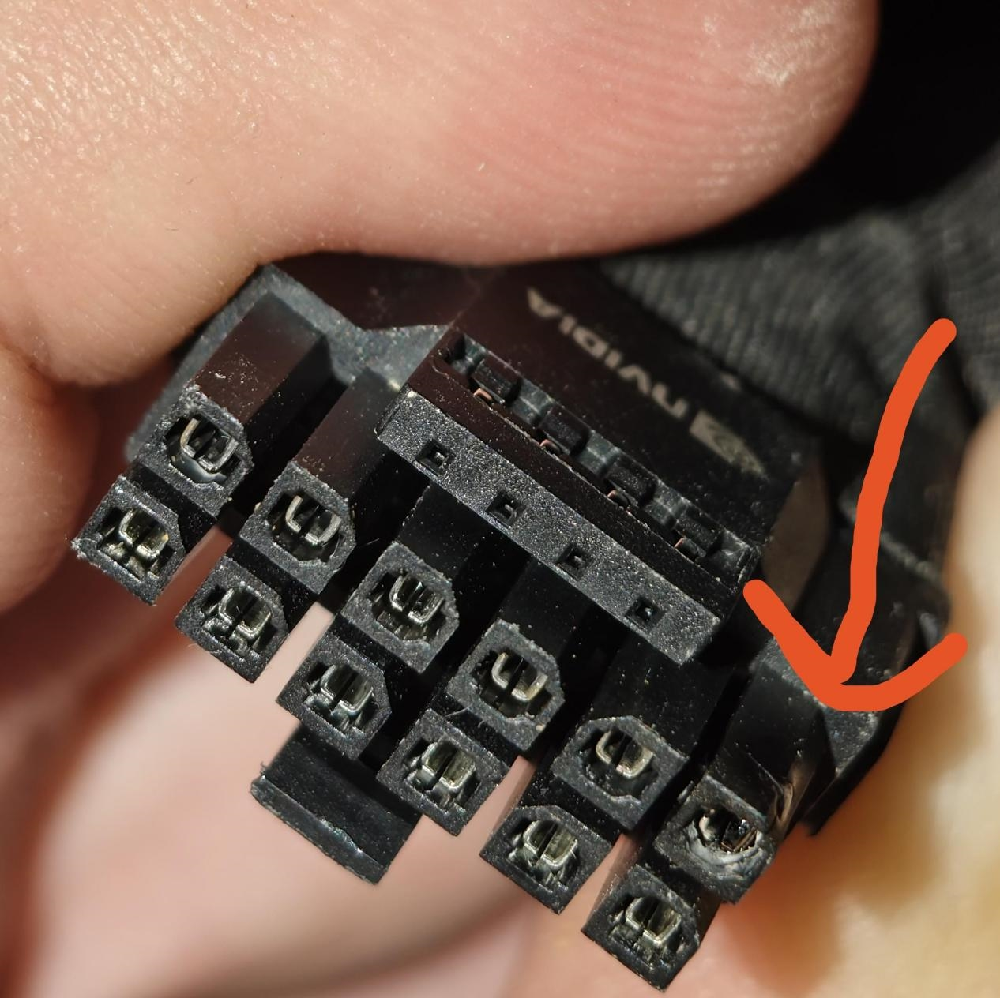
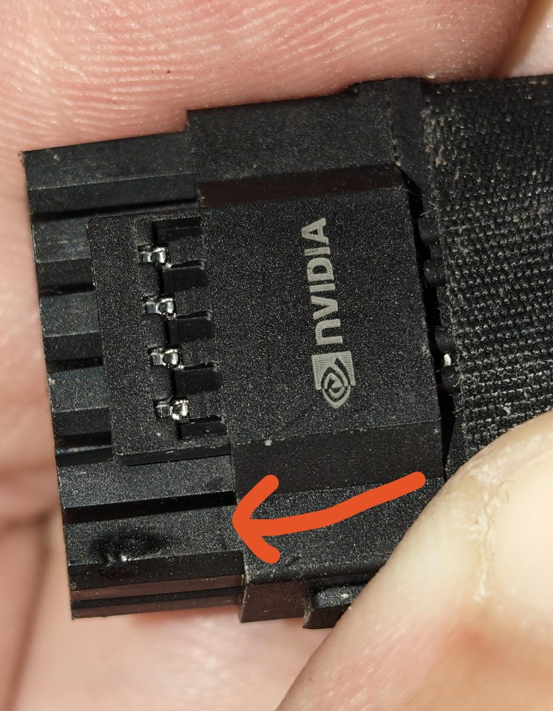

Un nuevo caso de fusión del conector de alimentación de una **RTX 4090** destaca justo por lo que no cumplía las condiciones que suelen señalarse como causas de estos incidentes: la tarjeta trabajaba con el límite de potencia ajustado al 80 % y se alimentaba mediante el adaptador multiconector de 16 pines que se entrega en la caja, no con un cable de terceros. El caso lo compartió Uniko's Hardware y lo recogió MyDrivers.

## Cómo se detectó la quemadura del conector

Según el relato del propio usuario, la primera señal no fue olor a quemado ni un apagado total, sino pantallazos negros intermitentes: la imagen desaparecía mientras el audio seguía sonando. MyDrivers señala que ese síntoma suele ser uno de los primeros avisos de una anomalía en el conector de alimentación, tanto en la RTX 4090 como en la RTX 5090.

Al revisar la interfaz de alimentación, el usuario encontró marcas de quemadura evidentes en el plástico alrededor de uno de los contactos del adaptador original, y también marcas blancas visibles dentro del conector del lado de la GPU. Como la revisión llegó a tiempo, la tarjeta probablemente se ha librado de daños mayores.

## Por qué el adaptador original de la RTX 4090 se fundió igual

El usuario confirmó que la RTX 4090 llevaba un tiempo funcionando con un límite de potencia del 80 %, una medida que adoptó para bajar temperaturas, reducir el consumo y dejar un margen de seguridad adicional. Como el objetivo de potencia por defecto de este modelo es de 450 W, ese recorte equivale aproximadamente a 360 W.

La fuente de alimentación era una Corsair RM1000x de 2021, un modelo sin conector nativo de 16 pines, de modo que la tarjeta se servía mediante el adaptador de varios PCIe de 8 pines a 16 pines incluido con la propia gráfica. El usuario asegura que tanto el lado de la fuente como los conectores PCIe de 8 pines estaban en buen estado y que el daño visible se limitaba al adaptador de fábrica.

En los anteriores casos de fusión de conectores, la explicación más habitual apuntaba a cables no oficiales o a repartir la carga en cadena sobre un mismo conector. Aquí concurren, en cambio, las dos defensas que suelen esgrimirse para evitar el problema, y aun así no bastaron. El incidente se suma a una lista reciente de avisos sobre la misma zona de la tarjeta: [la temperatura del conector de una RTX 5090 con DLSS 5 llegó a 91,7 ºC](/noticias/rtx-5090-dlss5-connector-91c/), y [un adaptador WireView de Thermal Grizzly acabó ardiendo en una RX 7900 XTX](/noticias/thermal-grizzly-wireview-melted-rx-7900-xtx/).

## Qué debería revisar el lector con una RTX 4090

Este caso no demuestra que todo adaptador de fábrica vaya a fallar, pero sí que limitar la potencia no es una red de seguridad infalible. Varios puntos prácticos se desprenden de lo ocurrido:

- **Volver a asentar el cable con regularidad.** Un conector de 16 pines mal insertado genera resistencia en la unión y calor en un único punto de contacto.
- **Inspeccionar la interfaz ante el primer síntoma.** Pantalla negra con audio en marcha, pérdida intermitente de imagen o deformidad en el plástico del conector son motivos suficientes para parar y revisar.
- **No dar por válido el adaptador original solo por ser original.** El desgaste también afecta a las piezas de fábrica después de muchos ciclos de uso.
- **Comprobar el estado de los conectores de la fuente.** En este incidente el usuario revisó ambos lados antes de confirmar que el daño se limitaba al adaptador.

La conclusión operativa es que la prevención sigue siendo manual: ninguna configuración de software sustituye a una revisión física periódica del punto de alimentación de la tarjeta.
