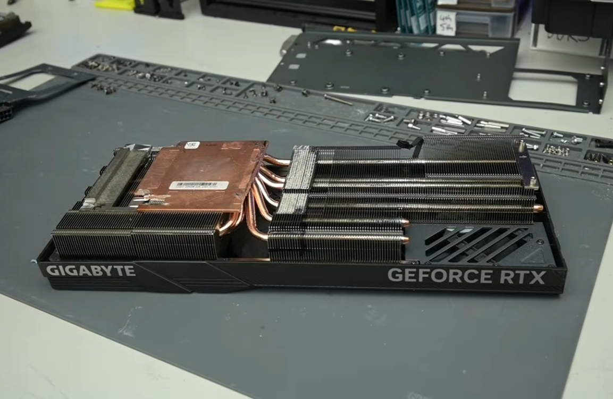
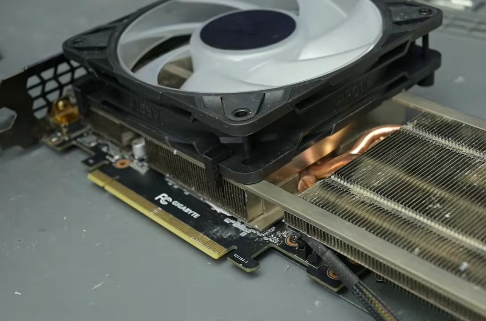

Poner la refrigeración de una tarjeta de gama alta sobre una de gama media parece, sobre el papel, una forma sencilla de ganar margen térmico. El canal de YouTube **TrashBench**, conocido por sus experimentos poco convencionales con hardware, ha querido comprobar si ese margen se traduce en rendimiento real: ha montado el disipador de una RTX 4090 sobre una RTX 3060 y ha medido qué ocurre. La respuesta, según el medio chino MyDrivers, es que la tarjeta trabaja más fría pero rinde prácticamente igual.

## Un ensamblaje a base de sierra y palanca

El obstáculo de partida es puramente físico. La base del disipador de una RTX 4090 es mucho más grande que la placa de una RTX 3060, de modo que las dos piezas no encajan sin forzar. Para que llegaran a encontrarse, el autor tuvo que recurrir a una sierra y a una palanca y retirar buena parte de los soportes de fijación, las aletas de refrigeración y las láminas térmicas del módulo de alimentación.

Solo después de ese recorte agresivo el disipador logró salvar los condensadores y demás componentes de la placa y apoyarse con firmeza sobre el núcleo.

El resultado estético es tan desproporcionado como cabe esperar: la delgada placa de la RTX 3060 queda completamente sepultada bajo el enorme disipador de tres ventiladores de la RTX 4090. Tras un ajuste fino de los bordes y de la zona de los puertos, el acabado resulta lo bastante natural como para que un usuario no advierta el injerto a simple vista, siempre que no mire la parte trasera de la tarjeta.

## 8 °C menos y dos fotogramas de más

En las pruebas a plena carga, la RTX 3060 con el disipador de la RTX 4090 pasó de 59 °C con su refrigeración original a 51 °C, un descenso de alrededor del 13,5 %. Es la parte del experimento que sale según lo previsto: más superficie de disipación, menos calor acumulado.

El problema es lo que ocurre con ese margen. Ni siquiera con la tarjeta trabajando tan fría aparece una ganancia apreciable de rendimiento. Con overclock manual y los ventiladores forzados al 100 %, la versión modificada solo logró 50 MHz más de frecuencia de núcleo que con el disipador de serie. Trasladado a los juegos, varias pruebas con títulos exigentes mejoraron apenas dos fotogramas, una variación que entra de lleno en el margen de error de la propia medición.

## Por qué el disipador no marca el techo

El experimento deja una conclusión que va más allá del taller casero. El límite de rendimiento de una tarjeta de gama media moderna lo fijan la calidad del propio núcleo, el ancho de banda de memoria y el tope de consumo predefinido, no la capacidad de evacuación de calor. En un chip de consumo contenido como el de la RTX 3060, el disipador original ya es capaz de asumir el calor que genera a frecuencias altas.

Para el lector, la lectura práctica es que ampliar la refrigeración solo tiene sentido cuando la temperatura es la que está frenando las frecuencias. Si el límite viene del silicio o del tope de potencia de fábrica, ningún disipador, por grande que sea, va a añadir fotogramas.
