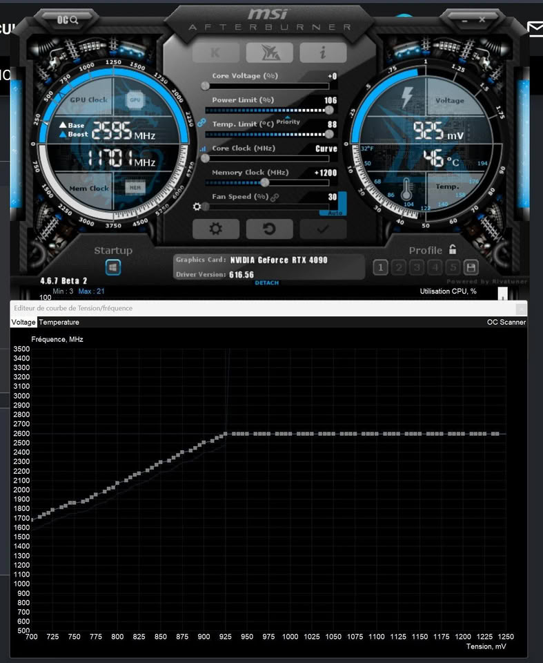

El consumo de las tarjetas gráficas de gama alta volvió al centro de la discusión por los episodios de conectores 12V-2×6 que se han derretido bajo cargas elevadas, un problema que distintos análisis vinculan con los picos de potencia asociados a DLSS 5. En ese contexto, el usuario de Reddit **u/om_the_best** publicó una prueba con su propia GeForce RTX 4090 que apunta a una conclusión práctica: ajustar el voltaje permite conservar los fotogramas por segundo de DLSS 5 gastando bastante menos energía.

## Qué se probó

La prueba se realizó en *Hogwarts Legacy* con la GPU configurada a **925 mV y 2.595 MHz de reloj base**, un perfil de undervolt que, como recuerda el propio autor, no se puede trasladar tal cual a otra unidad: cada ejemplar de una misma tarjeta tolera un margen de voltaje distinto. El escenario compara el rendimiento con DLSS 5 activado y desactivado, con y sin generación de fotogramas múltiple (MFG 4X), siempre midiendo el consumo total de la gráfica.

## Los números del ajuste

Los datos recogidos muestran reducciones de entre 47 y 75 W según la configuración, sin una caída apreciable de FPS:

| Configuración | Consumo | Fotogramas |
| --- | --- | --- |
| DLSS 5 desactivado, MFG 4X, sin undervolt | 386 W | 360 FPS |
| DLSS 5 desactivado, MFG 4X, con undervolt | 311 W | 355 FPS (−75 W) |
| DLSS 5 activado, MFG 4X, sin undervolt | 435 W | 175 FPS |
| DLSS 5 activado, MFG 4X, con undervolt | 388 W | 175 FPS (−47 W) |
| DLSS 5 activado, MFG desactivado, sin undervolt | 426 W | 51 FPS |
| DLSS 5 activado, MFG desactivado, con undervolt | 387 W | 52 FPS (−49 W) |

El autor sostiene que el undervolt permite usar DLSS 5 con un consumo de energía similar al de jugar sin DLSS 5 y sin ajustar el voltaje. La evidencia gráfica compartida es limitada, por lo que la comparación fina de calidad de imagen no puede darse por cerrada; el propio material sugiere que no hay cambios importantes en el resultado de DLSS 5.

## Por qué importa

DLSS 5 eleva de forma notable la carga sobre la GPU, y en la RTX 4090 esa carga se traduce en picos que en la prueba superan los 400 W. Con los conectores de 12V-2×6 bajo escrutinio por casos de fusión —incluido un episodio reciente con una RTX 5090 en el que la potencia superó los 600 W—, cualquier margen de consumo que se recorte sin perder rendimiento deja de ser un detalle de entusiastas para convertirse en una medida de seguridad razonable.

Conviene ser prudente: se trata de un único sistema, con una unidad concreta y un solo juego, no de un estudio controlado. Aun así, el ejercicio refuerza una idea que la comunidad repite desde hace años y que la propia evolución del hardware vuelve a poner sobre la mesa: el undervolt bien ajustado mejora la eficiencia por vatio, enfría la tarjeta y reduce la exigencia sobre el cableado. Para quien juega con una gráfica de alto consumo, dedicar una tarde a encontrar su curva de voltaje puede rendir más que cualquier accesorio.
