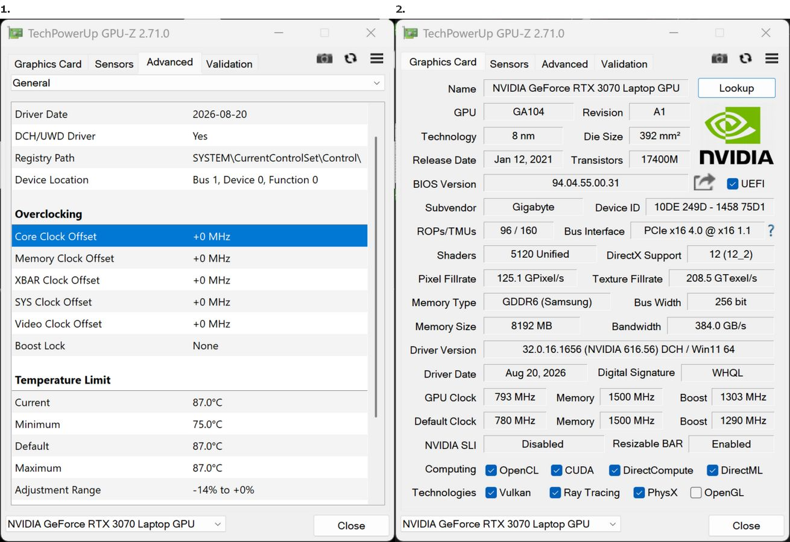

TechPowerUp ha publicado la versión **2.71.0** de **GPU-Z**, su utilidad de
diagnóstico para tarjetas gráficas. La actualización devuelve una lectura que los
propietarios de una GeForce RTX 50 esperaban desde el estreno de la arquitectura
Blackwell: la temperatura del **hotspot**. Llega después de que otras
herramientas, como HWiNFO y HWMonitor, encontraran su propia vía para acceder al
sensor, y suma varios añadidos de monitorización para quien quiera seguir de
cerca el comportamiento de su GPU.

## Qué es el hotspot y por qué NVIDIA dejó de exponerlo

El hotspot —punto caliente— es la temperatura más alta registrada entre los
sensores repartidos por el die de la GPU. Frente al dato general del núcleo, que
suele ser un valor representativo del conjunto, el hotspot señala el punto exacto
que más calor acumula y por eso va por delante. Es una referencia útil para
detectar un contacto deficiente del disipador, pasta térmica reseca o zonas del
chip que trabajan más que otras, y es la cifra que consultan quienes ajustan
voltajes y frecuencias.

El problema llegó con Blackwell. Al intentar medir el hotspot, GPU-Z mostraba
unos **255 °C** completamente erróneos: NVIDIA había dejado de exponer ese dato a
través de la interfaz pública que usaban estos programas. Las herramientas
internas de diagnóstico de la compañía sí podían leer el sensor, pero para el
público general quedó bloqueado, lo que obligó a los desarrolladores a retirar
el apartado de forma temporal.

## Qué más trae GPU-Z 2.71.0

Además del hotspot, la actualización añade la monitorización de la temperatura
del **chip de memoria más caliente**, con el desglose completo disponible al
pasar el cursor por encima. Es un dato relevante en tarjetas que montan GDDR6X y
GDDR7, memorias que se calientan de forma notable bajo carga.

La versión 2.71.0 también incorpora una pestaña **Advanced** con datos de
overclocking para NVIDIA, donde se pueden consultar relojes específicos como SYS,
L2 y Video clock, además del estado del **boost lock**. A esto se suma un sensor
nuevo que mide el ancho de banda del PCIe en GB/s en tiempo real, un valor
interesante para comprobar a qué velocidad negocia el enlace una tarjeta, como ya
analizamos al preguntarnos [si una ranura PCIe 3.0 lastra a una GPU moderna](/noticias/gpu-legacy-pcie-slot/).

En el apartado de compatibilidad, GPU-Z añade soporte para hardware reciente: la
**RTX 5060** de sobremesa, la **RTX PRO 4500 Blackwell**, los procesadores
**Intel Panther Lake** y los chips **Snapdragon X2**.

## Qué cambia para el usuario

La lectura del hotspot devuelve a GPU-Z una capacidad que sus rivales ya
ofrecían, y eso importa porque cierra una brecha entre herramientas. Para quien
vigila las temperaturas de su tarjeta, disponer del punto más caliente permite
distinguir un problema real de un dato normal: un hotspot muy por encima de la
temperatura del núcleo puede delatar un disipador mal asentado o una pasta
térmica en mal estado, mientras que un equipo bien refrigerado mantiene esa
diferencia bajo control.

Conviene tener presente que se trata de una utilidad de diagnóstico, no de un
sustituto de un test de estrés ni de una revisión del montaje: ayuda a decidir
cuándo toca limpiar, cambiar la pasta térmica o revisar la ventilación de la
caja. En un contexto en el que las RTX 50 generan bastante calor, contar con el
dato del hotspot sin depender de programas de terceros es una comodidad que
encaja con la misma tendencia que siguió la propia NVIDIA al [mostrar la
temperatura y el consumo de la CPU en su overlay](/noticias/nvidia-app-overlay-cpu/).
