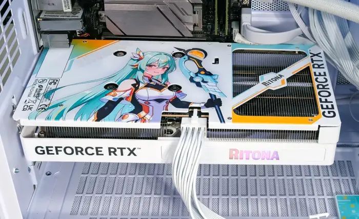
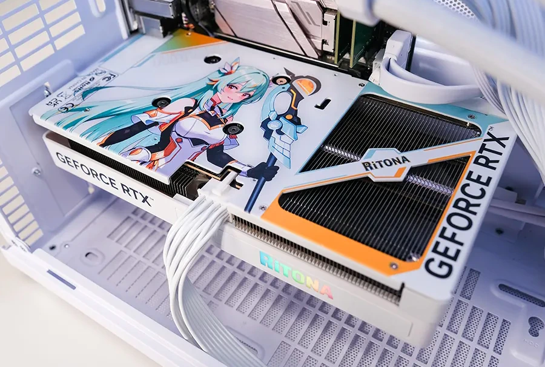

El ensamblador chino Palit (同德) ha presentado la GeForce RTX 5060 Ti 8 GB
RiTONA OC, una edición especial de su tarjeta de gama media que lleva impresa
la imagen de RiTONA, la mascota anime que la compañía usa como embajadora
digital desde 2022. No es una simple campaña de marketing: es el primer
producto de hardware de venta al público en el que la firma traslada a su
personaje directamente al diseño físico de la tarjeta.

La pieza se apoya en la arquitectura Blackwell de NVIDIA y mantiene las
características técnicas de la RTX 5060 Ti convencional. La diferencia está,
sobre todo, en el acabado y en el peso que la marca quiere darle a su
identidad visual.

## Una mascota que pasa del marketing al circuito impreso

RiTONA no es nueva. Palit lleva años utilizándola como imagen en sus
campañas, pero hasta ahora no había aparecido integrada en un producto que se
venda en tiendas. El movimiento responde a una demanda que la industria china
de hardware conoce bien: los montajes temáticos y personalizados, con fuentes,
memorias, ventiladores y cajas coordinados, mueven un volumen creciente de
ventas entre el público aficionado.

Al llevar su personaje al propio producto, el fabricante se suma a una
tendencia en la que varias marcas están convirtiendo sus mascotas en
argumento de compra. Para el comprador hispanohablante la relevancia es
indirecta: estas ediciones especiales suelen lanzarse primero en el mercado
chino y, cuando llegan a Europa, lo hacen con sobreprecio y disponibilidad
limitada.

## Diseño y especificaciones

El rasgo más llamativo es el backplate. Palit cubre toda la cara posterior de
la tarjeta con una chapa metálica a todo color con la ilustración de RiTONA,
un elemento poco habitual en esta gama de precio, donde lo normal son
superficies lisas o con grabados discretos. La cubierta frontal (el shroud)
adopta una base blanca que contrasta con el resto de la gama del fabricante.

En el plano técnico, la tarjeta no introduce cambios en el silicio:

| Especificación | Valor |
| --- | --- |
| GPU | NVIDIA Blackwell |
| Núcleos CUDA | 4608 |
| Frecuencia de boost | 2587 MHz |
| Memoria | 8 GB GDDR7 a 28 Gbps |
| Alimentación | 1 conector de 8 pines |
| Consumo nominal | 180 W |
| Dimensiones | 233,9 × 125,8 × 40 mm |
| Vídeo | 3× DisplayPort 2.1b, 1× HDMI 2.1b |

El sistema de refrigeración recurre a dos ventiladores de 102 mm con
tecnología de parada a baja carga (0 dB): por debajo de cierto umbral de
temperatura o con el equipo en tareas ligeras, los ventiladores se detienen
por completo y la tarjeta queda en silencio. La iluminación ARGB de la parte
lateral es configurable, un detalle coherente con el enfoque personalizable
del producto.

En conectividad, Palit incluye tres salidas DisplayPort 2.1b y una HDMI 2.1b,
además de soporte para DLSS 4 en su vertiente de superresolución, Reflex 2
para reducir la latencia y codificación/decodificación AV1. El conector único
de 8 pines y los 180 W de consumo la sitúan en el rango de fuentes modestas,
sin necesidad de adaptadores ni cables de alta potencia.

## Precio y disponibilidad

La tarjeta ya figura en la página de producto oficial de Palit, pero la
compañía no ha anunciado todavía ni el precio de venta ni los mercados en los
que se distribuirá. Esa ausencia de datos es habitual en los lanzamientos de
ediciones temáticas: primero se publica la ficha, y las condiciones
comerciales llegan más tarde según la región.

Para quien esté armando un equipo con esta GPU, conviene recordar que se trata
de la variante de 8 GB y no de la de 16 GB, un punto relevante si el objetivo
es jugar a resoluciones altas con texturas exigentes. La decisión de compra
dependerá, en buena medida, de cuánto más cueste esta edición especial frente
a un modelo estándar de la misma RTX 5060 Ti.
