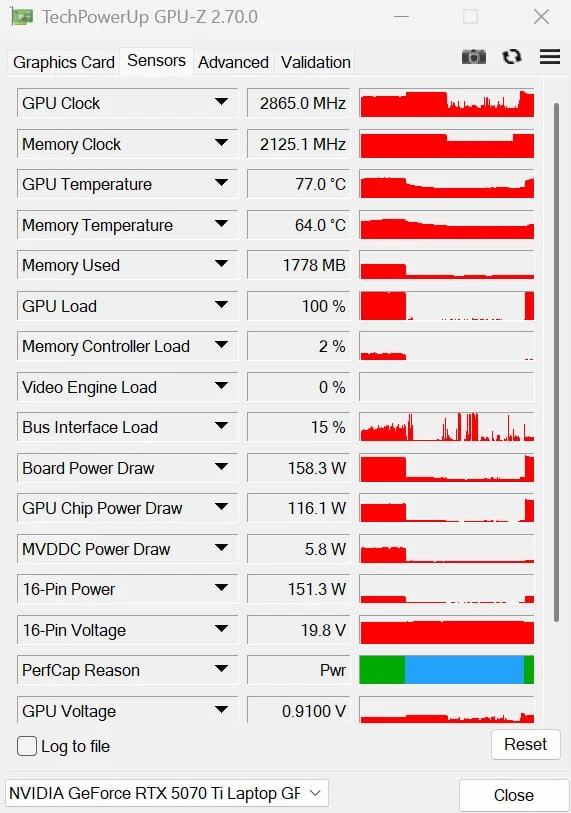
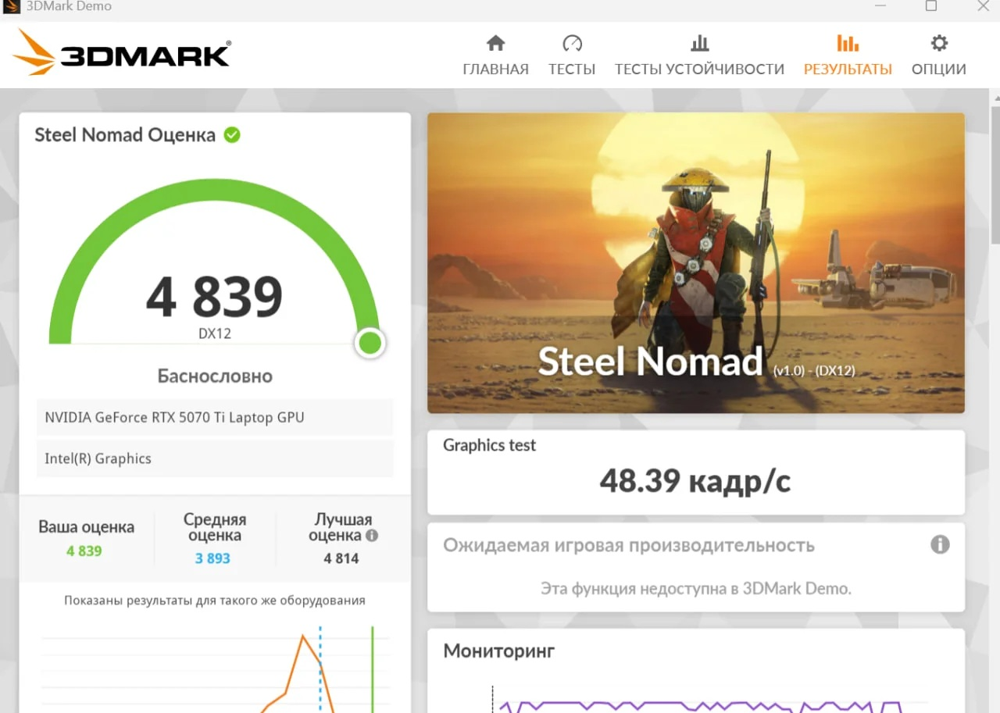
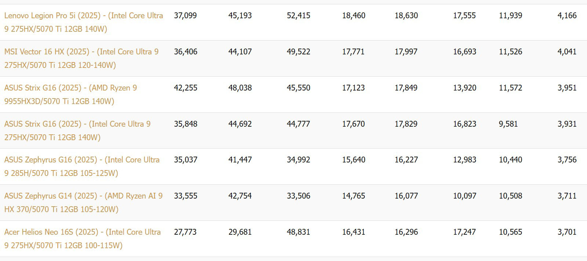

NVIDIA limita la GeForce RTX 5070 Ti de portátil a un consumo máximo de 140 W (un TGP de 115 W más otros 25 W aportados por Dynamic Boost). Un usuario de Reddit, identificado como Ecstatic_Hamster2208, ha conseguido saltarse ese techo y hacer funcionar la GPU a 160 W, lo que se traduce en una mejora notable del rendimiento en 3DMark Steel Nomad. La hazaña, difundida por Wccftech a partir de la publicación original del foro, se logró sin recurrir al modding de shunts, pero no está exenta de riesgos.

## Cómo se saltó el límite de 140 W

La base del experimento es un Lenovo Legion Pro 5 Gen 10, un portátil que de fábrica entrega la RTX 5070 Ti a 115 W de TGP más 25 W de Dynamic Boost. Para romper ese techo, el autor combinó el flasheo del VBIOS con el bloqueo de la curva de voltaje, dos técnicas que evitan la necesidad de modificar físicamente los shunts de la placa. Según su propia descripción, construyó «una implementación experimental capaz de cambiar el comportamiento de la política de energía y apuntar a 160 W en lugar del techo de fábrica de 140 W».

El método tiene dos condicionantes importantes. Por un lado, depende de la versión del controlador: el autor lo probó con el driver 616.92 y advierte de que las estructuras y rutas internas de NVIDIA pueden cambiar tras una actualización, por lo que considera obligatorio comprobar la compatibilidad antes de publicar una herramienta. Por otro, la implementación ya está subida a GitHub, pero con carácter experimental.

## Un 16 % más de rendimiento, con riesgos incluidos

El resultado del ajuste es una puntuación de 4.839 puntos en 3DMark Steel Nomad, un 16 % superior a la del portátil con RTX 5070 Ti más rápido que había probado Jarrod's Tech en esa misma prueba. El salto es coherente con la subida de consumo: pasar de 140 W a 160 W supone un incremento de potencia del 14,3 %.

Sin embargo, el autor y el propio medio advierten de que no se trata de un mod inocuo. Cada portátil usa un diseño de PCB distinto, y solo los modelos más premium montan un sistema de alimentación (VRM) más robusto capaz de sostener 160 W; la refrigeración, además, suele estar dimensionada para el límite de 140 W. A eso se suman dos riesgos mayores: la pérdida de la garantía si algo falla y la posibilidad de que el ajuste provoque un error de comunicación con el chip EC (controlador embebido) y deje el equipo permanentemente inservible.

Para el usuario hispanohablante, la conclusión es doble. Por un lado, demuestra que el techo de 140 W de la RTX 5070 Ti de portátil no es una limitación física del silicio, sino una decisión de NVIDIA por estabilidad y consumo, y que hay margen de rendimiento sin tocar la placa. Por otro, subraya por qué los fabricantes no lo ofrecen de fábrica: el sobreconsumo exige VRM y refrigeración sobredimensionados, y en la mayoría de equipos el riesgo de dañar el hardware supera con creces la mejora de un 16 % en un benchmark sintético. Es una curiosidad técnica interesante, no una recomendación.
