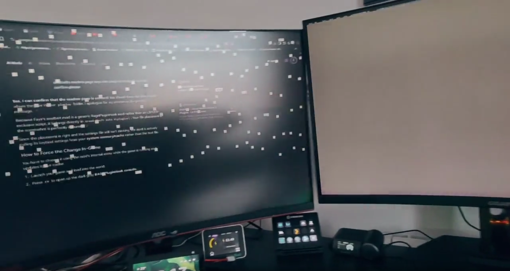
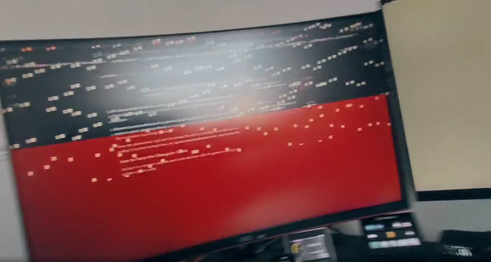

Un usuario de Reddit ha compartido el que describe como el final prematuro de su **GeForce RTX 5080**, una tarjeta que había comprado apenas un mes antes. El equipo empezó a mostrar artefactos en pantalla y acabó por no arrancar después de que su dueño forzara DLSS 5 en *Grand Theft Auto V* mediante una herramienta de terceros. El relato, recogido por el medio chino MyDrivers, procede de un único caso y su propio autor evita señalar a la tecnología de NVIDIA como causa directa de la avería.

## Un mod para ejecutar DLSS 5 en GTA 5

DLSS 5 Neural Rendering todavía no está disponible de forma oficial en *Grand Theft Auto V*. Para probarlo, el protagonista del relato recurrió a una herramienta externa que **inyecta la función en el juego al margen del soporte del fabricante**. No se trata de un ajuste escondido ni de una opción desbloqueada: es una modificación no oficial que se salta la validación de NVIDIA y del propio estudio, y que además somete a la tarjeta a una carga de trabajo que ni el juego ni el controlador esperan por defecto.

Ese contexto importa para leer lo que vino después, porque sitúa el episodio fuera de cualquier escenario validado por el fabricante.

## Cómo falló la RTX 5080

El sistema afectado era un equipo de unos **4.000 dólares**, con un procesador **AMD Ryzen 9 9950X3D** y una **RTX 5080 de 16 GB**. Según el relato, el fallo se manifestó al día siguiente de instalar el mod: durante una partida, con la calidad gráfica al máximo y el juego rondando los **80 FPS**, la pantalla comenzó a parpadear con violencia tras apenas unos cinco minutos, aparecieron artefactos graves y el equipo terminó congelándose. A partir de ahí, el ordenador ya no volvió a arrancar con normalidad.

En el diagnóstico posterior, el usuario retiró la RTX 5080 y arrancó el equipo con la **gráfica integrada del procesador Ryzen**, con la que el sistema funcionó sin problemas. Al reinstalar la tarjeta, en cambio, la iluminación de los periféricos se apagaba y no conseguía ni entrar en la BIOS de la placa base.

Tras varias semanas de proceso de posventa, el usuario recibió una **RTX 5080 idéntica** y el equipo volvió a funcionar con normalidad. Es decir, el problema iba y venía con esa unidad concreta.

## Qué dice la garantía y por qué el mod cambia el panorama

El desenlace es un reemplazo en garantía, pero el episodio deja una lección práctica sobre las modificaciones no oficiales. Los fabricantes suelen excluir de la cobertura los daños derivados de software no autorizado, porque un mod queda fuera del uso previsto del producto. En este caso el usuario sí completó el proceso de posventa y obtuvo una tarjeta nueva, aunque el relato no detalla las condiciones exactas del reemplazo.

Conviene ser explícito con lo que **no** dice el caso: el propio usuario reconoce que no hay pruebas de que DLSS 5 haya quemado la tarjeta. Su hipótesis principal es otra: que la RTX 5080 **tuviera un defecto de hardware oculto** que solo se manifestó al someterla a la carga elevada de DLSS 5. Es un matiz importante, porque invierte la relación causa-efecto que sugiere el titular: la técnica no habría roto la tarjeta, sino que habría destapado una avería latente.

## Un caso aislado que no conviene extrapolar

Este episodio no es una tasa de fallos ni una confirmación de que DLSS 5 dañe las gráficas: es el relato de un solo usuario, sobre una sola unidad y sin reproducir. El propio afectado ha decidido no repetir el experimento con la tarjeta de reemplazo y esperar a que DLSS 5 llegue de forma oficial a los juegos que le interesan, en lugar de volver a inyectarlo con herramientas de terceros.

Para quien tenga una GPU de gama alta, la conclusión razonable es prudencia con las modificaciones que se saltan el soporte oficial. DLSS 5 ya genera picos de consumo notables en las RTX 50, como muestra [el caso de una RTX 4090 que recorta vatios sin perder FPS](/noticias/rtx-4090-undervolt-dlss-5/), y llevarlo a hardware no soportado es terreno inexplorado. De hecho, no es la primera vez que un mod empuja la técnica [a una GPU para la que no estaba pensada](/noticias/dlss-5-intel-arc-140v-mod/). Cuando el rendimiento depende de exprimir la tarjeta al límite, cualquier componente defectuoso tiene más probabilidades de delatarse.

*Imágenes: MyDrivers.*
