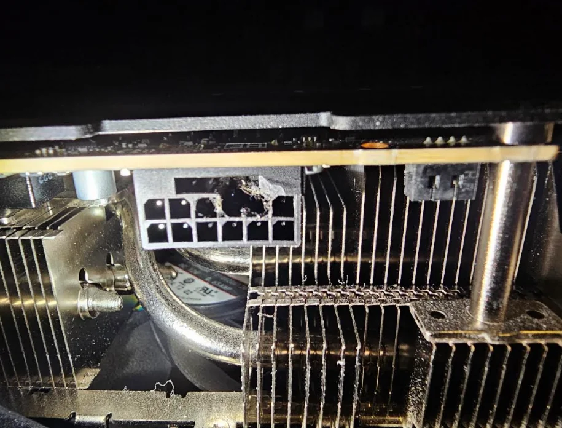
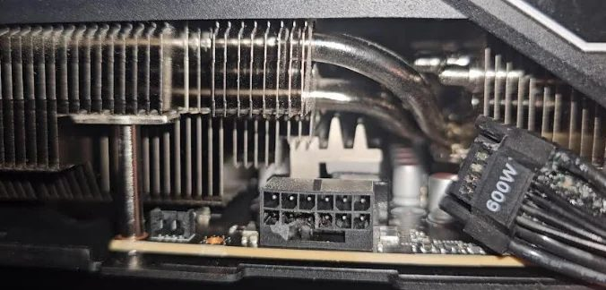

Los problemas del conector de alimentación de 16 pines en las GeForce RTX 50 siguen dando sorpresas, y esta vez el incidente no llegó jugando a un título exigente. Un usuario de Reddit descubrió un gran agujero en el conector de su RTX 5090 después de jugar a *Crypt of the NecroDancer*, un juego independiente con más de una década a sus espaldas que corre sin despeinarse en un PC modesto.

## El conector, fundido sin llegar al límite

Según el relato publicado en r/pcmasterrace por el usuario u/UnpluggedUnfettered, la situación comenzó por una decisión que él mismo califica de imprudente con ironía: subir los gráficos del juego al ajuste «ultra». Tras cerca de una hora de partida, notó un olor a quemado y decidió revisar el conector de alimentación de la tarjeta.

Al desmontarlo, se encontró con una porción considerable de plástico derretido. El daño dejó un agujero tan grande que terminó uniendo dos puertos individuales de la fila superior en uno solo. La tarjeta, a juzgar por la historia, es un modelo de PNY, aunque se han documentado conectores fundidos en RTX 5090 de prácticamente todas las marcas.

## Por qué llama la atención

Lo desconcertante del caso es que una GPU como la RTX 5090 no debería acercarse a su consumo máximo con un juego tan ligero. Lo habitual es ver este tipo de daños cuando la tarjeta se empuja al límite: a plena carga puede rondar los 600 W, y el conector llega a fundirse si no está insertado correctamente. Aquí, en cambio, el accidente se produjo sin que la gráfica tirara de tanta potencia.

## El 12V-2x6 sigue dando guerra

El incidente se suma a una larga lista de episodios de conectores derretidos en la generación actual, pese a que el conector 12V-2x6 se revisó precisamente para mejorar su fiabilidad. En el propio artículo, Wccftech recomienda a los propietarios de una RTX 5090 monitorizar la alimentación con herramientas específicas antes que confiar en alternativas más económicas, y apunta a que este tipo de fallos se ha repetido en modelos de casi todos los fabricantes.
